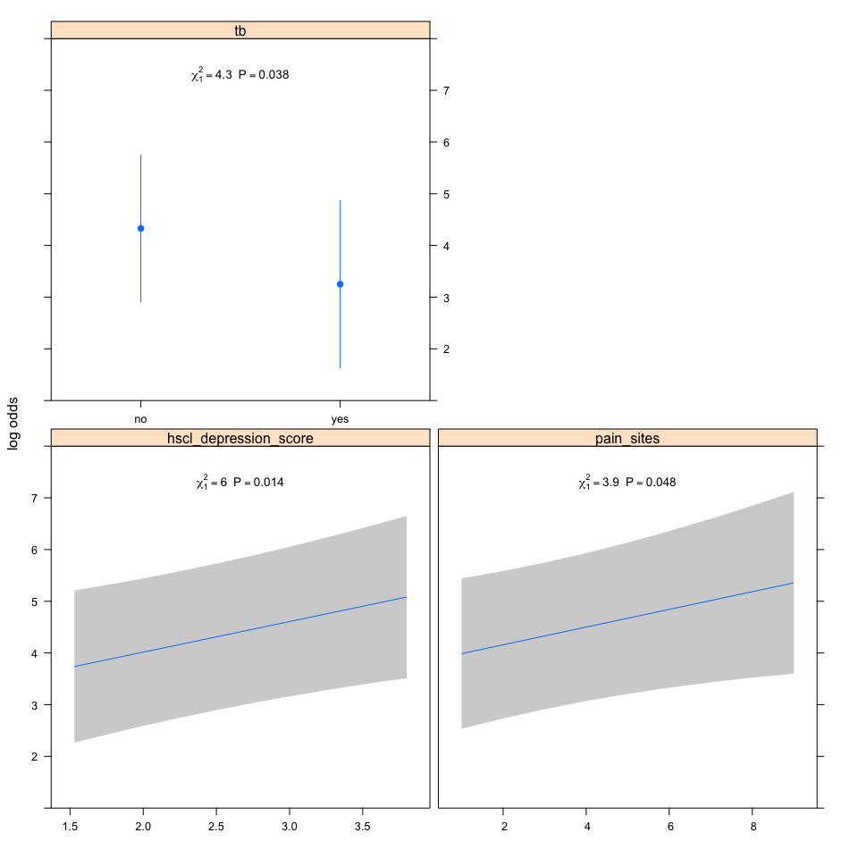

Two signs of neuropathy data only
=================================

Factors associated with having greater pain in patients with painful HIV-SN
---------------------------------------------------------------------------

### Authors

Peter Kamerman, Antonia Wadley, Prinisha Pillay

**Date: November 19, 2016**

------------------------------------------------------------------------

Session setup
-------------

Load data
---------

``` r
data <- read_csv('./data/2SignsOnly_pain-intensity.csv')
```

Quick look
----------

``` r
dim(data)
```

    ## [1] 125   6

``` r
names(data)
```

    ## [1] "pain_intensity"        "pain_sites"            "hscl_depression_score"
    ## [4] "hscl_anxiety_score"    "pcs"                   "tb"

``` r
head(data)
```

    ## # A tibble: 6 × 6
    ##   pain_intensity pain_sites hscl_depression_score hscl_anxiety_score   pcs
    ##            <int>      <int>                 <dbl>              <dbl> <dbl>
    ## 1             10          3                  3.27                1.5  2.77
    ## 2             10          8                  2.87                2.9  0.77
    ## 3             10          5                  2.60                3.5  4.00
    ## 4             10          4                  3.13                3.6  3.38
    ## 5             10          7                  2.33                1.9  0.92
    ## 6              5          3                  1.67                1.1  1.38
    ## # ... with 1 more variables: tb <chr>

``` r
tail(data)
```

    ## # A tibble: 6 × 6
    ##   pain_intensity pain_sites hscl_depression_score hscl_anxiety_score   pcs
    ##            <int>      <int>                 <dbl>              <dbl> <dbl>
    ## 1             10          5                  2.73                3.1  3.69
    ## 2             10          3                  2.87                2.3  3.54
    ## 3              5          9                  2.00                1.7  1.77
    ## 4             10          8                  2.60                3.3  3.23
    ## 5              8          5                  3.20                2.6  1.85
    ## 6             10          4                  3.00                3.6  3.38
    ## # ... with 1 more variables: tb <chr>

``` r
glimpse(data)
```

    ## Observations: 125
    ## Variables: 6
    ## $ pain_intensity        <int> 10, 10, 10, 10, 10, 5, 7, 10, 5, 5, 10, ...
    ## $ pain_sites            <int> 3, 8, 5, 4, 7, 3, 7, 6, 7, 1, 3, 2, 9, 3...
    ## $ hscl_depression_score <dbl> 3.27, 2.87, 2.60, 3.13, 2.33, 1.67, 2.87...
    ## $ hscl_anxiety_score    <dbl> 1.5, 2.9, 3.5, 3.6, 1.9, 1.1, 1.8, 2.4, ...
    ## $ pcs                   <dbl> 2.77, 0.77, 4.00, 3.38, 0.92, 1.38, 2.85...
    ## $ tb                    <chr> "no", "no", "no", "yes", "no", "no", "ye...

``` r
summary(data)
```

    ##  pain_intensity     pain_sites    hscl_depression_score hscl_anxiety_score
    ##  Min.   : 1.000   Min.   :1.000   Min.   :1.200         Min.   :1.100     
    ##  1st Qu.: 5.000   1st Qu.:2.000   1st Qu.:2.000         1st Qu.:2.100     
    ##  Median : 8.000   Median :3.000   Median :2.530         Median :2.600     
    ##  Mean   : 7.056   Mean   :3.344   Mean   :2.607         Mean   :2.721     
    ##  3rd Qu.:10.000   3rd Qu.:4.000   3rd Qu.:3.130         3rd Qu.:3.400     
    ##  Max.   :10.000   Max.   :9.000   Max.   :4.000         Max.   :4.000     
    ##       pcs             tb           
    ##  Min.   :0.000   Length:125        
    ##  1st Qu.:1.690   Class :character  
    ##  Median :2.690   Mode  :character  
    ##  Mean   :2.402                     
    ##  3rd Qu.:3.230                     
    ##  Max.   :4.000

Process data
------------

``` r
data.olr <- data %>%
    mutate(pain_intensity = factor(pain_intensity, ordered = TRUE), # Convert 'pain_intensity' to an ordered factor
           tb = factor(tb)) %>% # Convert 'tb' to a factor
    filter(complete.cases(.)) # Retain complete cases only

# Check dimensions
dim(data.olr)
```

    ## [1] 125   6

Build model
-----------

### Ordinal logistic regression

``` r
# Ordinal logistic regression on full model (all variables p<0.1 on univariate analysis, 
# number of pain sites, mean depression score, mean anxiety score, PCS score, and 
# whether currently on treatment for TB).
# Pain intensity as an ordinal measure ("data" data.frame).
# Select best model using Akaike's information criterion (AIC).

# Model
## Use MASS::polr for this step because output is compatible with MuMIn
mod.olr <- polr(pain_intensity ~ pain_sites + 
               hscl_depression_score +
               hscl_anxiety_score +
               pcs +
               tb, 
           data = data.olr,
           Hess=T)
# Model summary 
summary(mod.olr)
```

    ## Call:
    ## polr(formula = pain_intensity ~ pain_sites + hscl_depression_score + 
    ##     hscl_anxiety_score + pcs + tb, data = data.olr, Hess = T)
    ## 
    ## Coefficients:
    ##                          Value Std. Error t value
    ## pain_sites             0.15578    0.09185  1.6960
    ## hscl_depression_score  0.49012    0.29138  1.6821
    ## hscl_anxiety_score     0.04768    0.25552  0.1866
    ## pcs                    0.17112    0.16601  1.0308
    ## tbyes                 -0.96808    0.52988 -1.8270
    ## 
    ## Intercepts:
    ##      Value   Std. Error t value
    ## 1|2  -2.1159  0.9963    -2.1237
    ## 2|3  -0.4338  0.7720    -0.5619
    ## 3|4   0.3308  0.7487     0.4419
    ## 4|5   0.6451  0.7481     0.8623
    ## 5|6   1.7140  0.7639     2.2437
    ## 6|7   2.0087  0.7724     2.6006
    ## 7|8   2.2293  0.7805     2.8563
    ## 8|9   2.5926  0.7933     3.2681
    ## 9|10  2.7004  0.7964     3.3906
    ## 
    ## Residual Deviance: 450.3036 
    ## AIC: 478.3036

``` r
# Use "dredge" to select best models based on AIC
dredge.olr <- dredge(mod.olr, beta = FALSE, evaluate = TRUE, rank = "AIC")

# Build a model selection table
mod.olr.sel <- model.sel(dredge.olr)

# Subset those models that show an change in AIC 
# of 2 or less (not different from each other)
get.mod.olr <- get.models(mod.olr.sel, subset = delta < 2)
get.mod.olr
```

    ## $`23`
    ## Call:
    ## polr(formula = pain_intensity ~ hscl_depression_score + pain_sites + 
    ##     tb + 1, data = data.olr, Hess = T)
    ## 
    ## Coefficients:
    ## hscl_depression_score            pain_sites                 tbyes 
    ##             0.5919272             0.1711266            -1.0801641 
    ## 
    ## Intercepts:
    ##        1|2        2|3        3|4        4|5        5|6        6|7 
    ## -2.3188669 -0.6385611  0.1216833  0.4327460  1.4878148  1.7777098 
    ##        7|8        8|9       9|10 
    ##  1.9949877  2.3548044  2.4617289 
    ## 
    ## Residual Deviance: 451.4312 
    ## AIC: 475.4312 
    ## 
    ## $`31`
    ## Call:
    ## polr(formula = pain_intensity ~ hscl_depression_score + pain_sites + 
    ##     pcs + tb + 1, data = data.olr, Hess = T)
    ## 
    ## Coefficients:
    ## hscl_depression_score            pain_sites                   pcs 
    ##             0.5173420             0.1609888             0.1733682 
    ##                 tbyes 
    ##            -0.9634556 
    ## 
    ## Intercepts:
    ##        1|2        2|3        3|4        4|5        5|6        6|7 
    ## -2.1495009 -0.4681031  0.2965225  0.6110200  1.6789735  1.9734361 
    ##        7|8        8|9       9|10 
    ##  2.1940558  2.5572928  2.6649990 
    ## 
    ## Residual Deviance: 450.3384 
    ## AIC: 476.3384 
    ## 
    ## $`24`
    ## Call:
    ## polr(formula = pain_intensity ~ hscl_anxiety_score + hscl_depression_score + 
    ##     pain_sites + tb + 1, data = data.olr, Hess = T)
    ## 
    ## Coefficients:
    ##    hscl_anxiety_score hscl_depression_score            pain_sites 
    ##            0.06688304            0.55217566            0.16334935 
    ##                 tbyes 
    ##           -1.08426443 
    ## 
    ## Intercepts:
    ##        1|2        2|3        3|4        4|5        5|6        6|7 
    ## -2.2698462 -0.5885793  0.1716566  0.4824587  1.5391309  1.8294267 
    ##        7|8        8|9       9|10 
    ##  2.0466368  2.4065806  2.5136099 
    ## 
    ## Residual Deviance: 451.3623 
    ## AIC: 477.3623 
    ## 
    ## attr(,"rank")
    ## function (x) 
    ## do.call("rank", list(x))
    ## <environment: 0x7fb0111684e8>
    ## attr(,"rank")attr(,"call")
    ## AIC(x)
    ## attr(,"rank")attr(,"class")
    ## [1] "function"     "rankFunction"
    ## attr(,"beta")
    ## [1] "none"

``` r
# Average across the subsetted models
mod.avg.olr <- model.avg(get.mod.olr)
summary(mod.avg.olr)
```

    ## 
    ## Call:
    ## model.avg(object = get.mod.olr)
    ## 
    ## Component model call: 
    ## polr(formula = pain_intensity ~ <3 unique rhs>, data = data.olr, 
    ##      Hess = T)
    ## 
    ## Component models: 
    ##      df  logLik    AIC delta weight
    ## 235  12 -225.72 475.43  0.00   0.50
    ## 2345 13 -225.17 476.34  0.91   0.32
    ## 1235 13 -225.68 477.36  1.93   0.19
    ## 
    ## Term codes: 
    ##    hscl_anxiety_score hscl_depression_score            pain_sites 
    ##                     1                     2                     3 
    ##                   pcs                    tb 
    ##                     4                     5 
    ## 
    ## Model-averaged coefficients:  
    ## (full average) 
    ##                       Estimate Std. Error Adjusted SE z value Pr(>|z|)   
    ## hscl_depression_score  0.56092    0.25607     0.25881   2.167  0.03022 * 
    ## pain_sites             0.16646    0.08805     0.08900   1.870  0.06144 . 
    ## tbyes                 -1.04416    0.52632     0.53199   1.963  0.04967 * 
    ## 1|2                   -2.25624    0.97996     0.99055   2.278  0.02274 * 
    ## 2|3                   -0.57541    0.74908     0.75715   0.760  0.44728   
    ## 3|4                    0.18622    0.72364     0.73142   0.255  0.79903   
    ## 4|5                    0.49831    0.72252     0.73028   0.682  0.49501   
    ## 5|6                    1.55775    0.73538     0.74327   2.096  0.03610 * 
    ## 6|7                    1.84916    0.74306     0.75103   2.462  0.01381 * 
    ## 7|8                    2.06747    0.75091     0.75897   2.724  0.00645 **
    ## 8|9                    2.42839    0.76346     0.77165   3.147  0.00165 **
    ## 9|10                   2.53558    0.76647     0.77469   3.273  0.00106 **
    ## pcs                    0.05463    0.12298     0.12375   0.441  0.65887   
    ## hscl_anxiety_score     0.01263    0.11381     0.11499   0.110  0.91253   
    ##  
    ## (conditional average) 
    ##                       Estimate Std. Error Adjusted SE z value Pr(>|z|)   
    ## hscl_depression_score  0.56092    0.25607     0.25881   2.167  0.03022 * 
    ## pain_sites             0.16646    0.08805     0.08900   1.870  0.06144 . 
    ## tbyes                 -1.04416    0.52632     0.53199   1.963  0.04967 * 
    ## 1|2                   -2.25624    0.97996     0.99055   2.278  0.02274 * 
    ## 2|3                   -0.57541    0.74908     0.75715   0.760  0.44728   
    ## 3|4                    0.18622    0.72364     0.73142   0.255  0.79903   
    ## 4|5                    0.49831    0.72252     0.73028   0.682  0.49501   
    ## 5|6                    1.55775    0.73538     0.74327   2.096  0.03610 * 
    ## 6|7                    1.84916    0.74306     0.75103   2.462  0.01381 * 
    ## 7|8                    2.06747    0.75091     0.75897   2.724  0.00645 **
    ## 8|9                    2.42839    0.76346     0.77165   3.147  0.00165 **
    ## 9|10                   2.53558    0.76647     0.77469   3.273  0.00106 **
    ## pcs                    0.17337    0.16556     0.16737   1.036  0.30027   
    ## hscl_anxiety_score     0.06688    0.25487     0.25766   0.260  0.79519   
    ## ---
    ## Signif. codes:  0 '***' 0.001 '**' 0.01 '*' 0.05 '.' 0.1 ' ' 1
    ## 
    ## Relative variable importance: 
    ##                      hscl_depression_score pain_sites tb   pcs 
    ## Importance:          1.00                  1.00       1.00 0.32
    ## N containing models:    3                     3          3    1
    ##                      hscl_anxiety_score
    ## Importance:          0.19              
    ## N containing models:    1

``` r
# Made a priori choice to only take variables that occur in >50% of models
# OUTCOME: 'hscl_depression_score', 'pain_sites', and 'tb'occur in all 3 models
# OUTCOME: Take 'hscl_depression_score, pain_sites, tb through to 
# next stage of analysis

# New model
## Use rms::lrm for this stage because better fit 
## indicators than MASS::polr
attach(data.olr)
d <- datadist(hscl_depression_score, 
              pain_sites, 
              tb)
detach(data.olr)
options(datadist = "d")
mod.olr.new<-lrm(pain_intensity ~ hscl_depression_score +
                     pain_sites + 
                     tb, 
              data = data.olr, 
              x = TRUE, y = TRUE, 
              linear.predictors = TRUE)

# Model summary
mod.olr.new
```

    ##  1  2  3  4  5  6  7  8  9 10 
    ##  2  8  9  5 24  8  6 10  3 50 
    ## Logistic Regression Model
    ##  
    ##  lrm(formula = pain_intensity ~ hscl_depression_score + pain_sites + 
    ##      tb, data = data.olr, x = TRUE, y = TRUE, linear.predictors = TRUE)
    ##  
    ##  Frequencies of Responses
    ##  
    ##  2
    ##  8
    ##  9
    ##  5
    ##  24
    ##  8
    ##  6
    ##  10
    ##  3
    ##  50
    ##  
    ##                       Model Likelihood     Discrimination    Rank Discrim.    
    ##                          Ratio Test           Indexes           Indexes       
    ##  Obs           125    LR chi2     12.79    R2       0.100    C       0.636    
    ##  max |deriv| 1e-11    d.f.            3    g        0.690    Dxy     0.273    
    ##                       Pr(> chi2) 0.0051    gr       1.994    gamma   0.274    
    ##                                            gp       0.155    tau-a   0.214    
    ##                                            Brier    0.220                     
    ##  
    ##                        Coef    S.E.   Wald Z Pr(>|Z|)
    ##  y>=2                   2.3187 0.9708  2.39  0.0169  
    ##  y>=3                   0.6385 0.7365  0.87  0.3860  
    ##  y>=4                  -0.1217 0.7097 -0.17  0.8638  
    ##  y>=5                  -0.4328 0.7080 -0.61  0.5410  
    ##  y>=6                  -1.4878 0.7187 -2.07  0.0384  
    ##  y>=7                  -1.7777 0.7257 -2.45  0.0143  
    ##  y>=8                  -1.9950 0.7332 -2.72  0.0065  
    ##  y>=9                  -2.3548 0.7454 -3.16  0.0016  
    ##  y>=10                 -2.4618 0.7484 -3.29  0.0010  
    ##  hscl_depression_score  0.5919 0.2420  2.45  0.0144  
    ##  pain_sites             0.1711 0.0867  1.97  0.0485  
    ##  tb=yes                -1.0802 0.5207 -2.07  0.0380  
    ## 

``` r
summary(mod.olr.new)
```

    ##              Effects              Response : pain_intensity 
    ## 
    ##  Factor                Low High Diff. Effect   S.E.    Lower 0.95
    ##  hscl_depression_score 2   3.13 1.13   0.66888 0.27342  0.1329900
    ##   Odds Ratio           2   3.13 1.13   1.95210      NA  1.1422000
    ##  pain_sites            2   4.00 2.00   0.34226 0.17345  0.0022978
    ##   Odds Ratio           2   4.00 2.00   1.40810      NA  1.0023000
    ##  tb - yes:no           1   2.00   NA  -1.08020 0.52068 -2.1007000
    ##   Odds Ratio           1   2.00   NA   0.33954      NA  0.1223700
    ##  Upper 0.95
    ##   1.204800 
    ##   3.336000 
    ##   0.682220 
    ##   1.978300 
    ##  -0.059641 
    ##   0.942100

``` r
# Plot outcome with anova results
plot(Predict(mod.olr.new), 
     anova = anova(mod.olr.new),
     pval = TRUE)
```



``` r
# OUTCOME: Model is significantly better than null model (p = 0.007), 
# OUTCOME: Poor predictive value: Nagelkerke R^2 = 0.09, C (AUROC) = 0.63
# OUTCOME: hscl_depression_score, pain_sites, and tb were all 
# independent risk factors
# OUTCOME: Increasing depression score => increased pain intensity
# OUTCOME: Increasing number of pain sites  => increased pain intenisty. 
# OUTCOME: Being treated for TB => reduced pain intensity

# Validate measures of fit using bootstrap sampling (B=999)
validate(mod.olr.new, 
         method = "boot", 
         B=999, 
         group = data.olr$pain_intensity)
```

    ##           index.orig training    test optimism index.corrected   n
    ## Dxy           0.2729   0.2953  0.2620   0.0333          0.2396 999
    ## R2            0.0997   0.1243  0.0863   0.0380          0.0617 999
    ## Intercept     0.0000   0.0000  0.0511  -0.0511          0.0511 999
    ## Slope         1.0000   1.0000  0.8702   0.1298          0.8702 999
    ## Emax          0.0000   0.0000  0.0396   0.0396          0.0396 999
    ## D             0.0944   0.1231  0.0800   0.0430          0.0513 999
    ## U            -0.0160  -0.0160 -2.3552   2.3392         -2.3552 999
    ## Q             0.1104   0.1391  2.4352  -2.2962          2.4065 999
    ## B             0.2205   0.2157  0.2241  -0.0085          0.2290 999
    ## g             0.6903   0.7607  0.6275   0.1333          0.5571 999
    ## gp            0.1546   0.1652  0.1412   0.0240          0.1306 999

``` r
# OUTCOME: see "index.corrected" for bootstrapped measures

# Test for multicolinearity using variance inflation factor (vif)
vif(mod.olr.new) # >4 is a problem
```

    ## hscl_depression_score            pain_sites                tb=yes 
    ##              1.009309              1.015109              1.010795

``` r
# OUTCOME: No evidence of multicolinearity between predictors
```

Session information
-------------------

``` r
sessionInfo()
```

    ## R version 3.3.1 (2016-06-21)
    ## Platform: x86_64-apple-darwin13.4.0 (64-bit)
    ## Running under: OS X 10.12.1 (Sierra)
    ## 
    ## locale:
    ## [1] en_GB.UTF-8/en_GB.UTF-8/en_GB.UTF-8/C/en_GB.UTF-8/en_GB.UTF-8
    ## 
    ## attached base packages:
    ## [1] stats     graphics  grDevices utils     datasets  methods   base     
    ## 
    ## other attached packages:
    ##  [1] gdtools_0.1.3   rms_5.0-0       SparseM_1.74    Hmisc_4.0-0    
    ##  [5] ggplot2_2.2.0   Formula_1.2-1   survival_2.40-1 lattice_0.20-34
    ##  [9] MuMIn_1.15.6    MASS_7.3-45     tidyr_0.6.0     dplyr_0.5.0    
    ## [13] readr_1.0.0     svglite_1.2.0   knitr_1.15     
    ## 
    ## loaded via a namespace (and not attached):
    ##  [1] zoo_1.7-13          splines_3.3.1       colorspace_1.3-0   
    ##  [4] htmltools_0.3.5     stats4_3.3.1        yaml_2.1.14        
    ##  [7] chron_2.3-47        foreign_0.8-67      DBI_0.5-1          
    ## [10] RColorBrewer_1.1-2  multcomp_1.4-6      plyr_1.8.4         
    ## [13] stringr_1.1.0       MatrixModels_0.4-1  munsell_0.4.3      
    ## [16] gtable_0.2.0        mvtnorm_1.0-5       codetools_0.2-15   
    ## [19] evaluate_0.10       latticeExtra_0.6-28 quantreg_5.29      
    ## [22] htmlTable_1.7       TH.data_1.0-7       Rcpp_0.12.8        
    ## [25] acepack_1.4.1       scales_0.4.1        backports_1.0.4    
    ## [28] gridExtra_2.2.1     digest_0.6.10       stringi_1.1.2      
    ## [31] polspline_1.1.12    grid_3.3.1          rprojroot_1.1      
    ## [34] tools_3.3.1         sandwich_2.3-4      magrittr_1.5       
    ## [37] lazyeval_0.2.0      tibble_1.2          cluster_2.0.5      
    ## [40] Matrix_1.2-7.1      data.table_1.9.6    assertthat_0.1     
    ## [43] rmarkdown_1.1.9017  R6_2.2.0            rpart_4.1-10       
    ## [46] nnet_7.3-12         nlme_3.1-128
