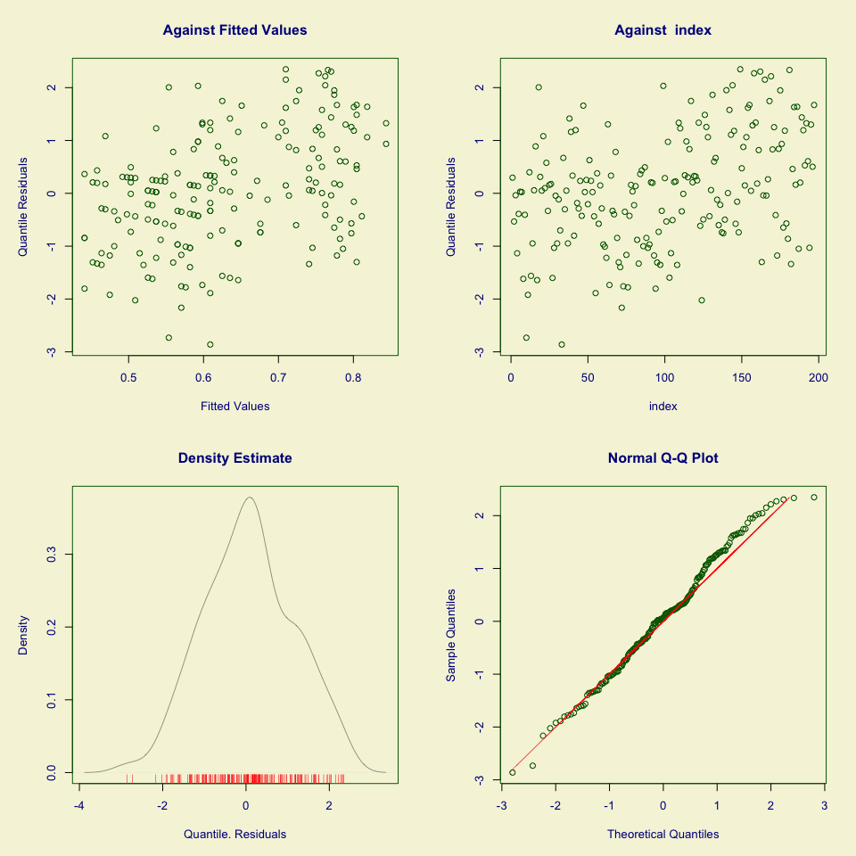
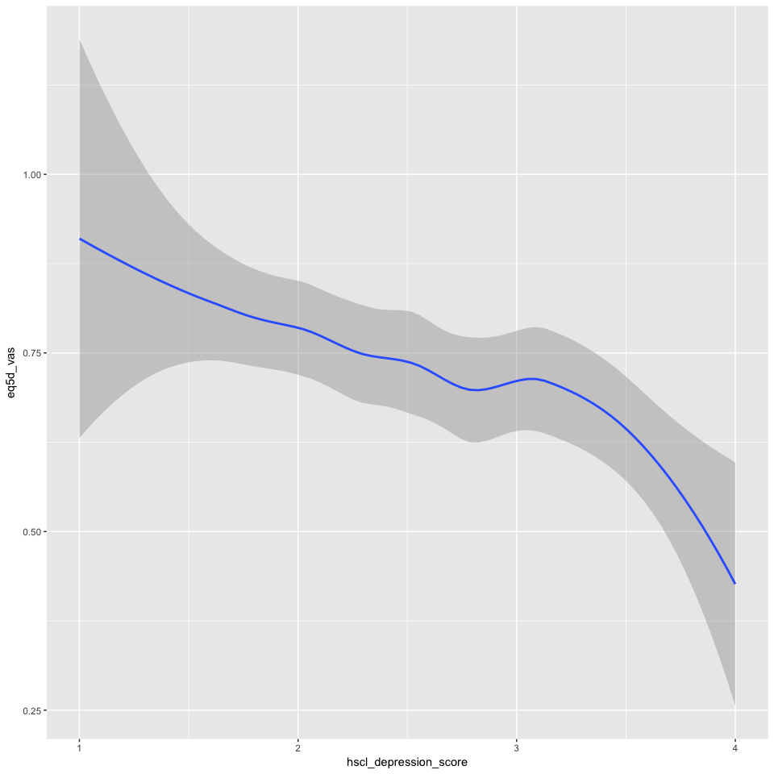
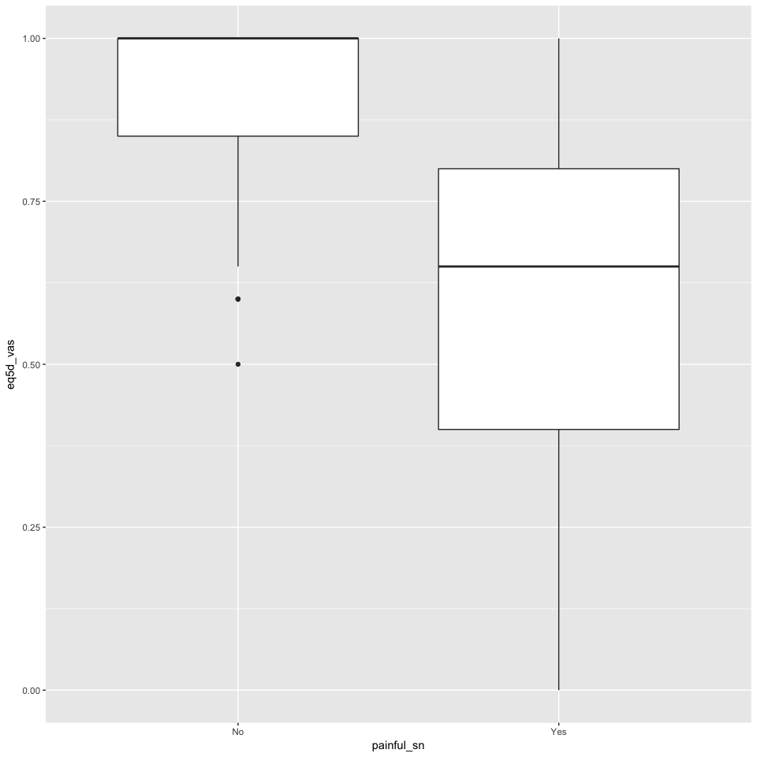

Two signs of neuropathy data only
=================================

Factors associated with having reduced quality of life in patients with HIV-SN
------------------------------------------------------------------------------

*(painful or non-painful HIV-SN)*

### Authors

Peter Kamerman, Antonia Wadley, Prinisha Pillay

**Date: November 19, 2016**

------------------------------------------------------------------------

Session setup
-------------

Load data
---------

``` r
data <- read_csv('./data/2SignsOnly_qol-pain-vs-no-pain.csv')
```

Quick look
----------

``` r
dim(data)
```

    ## [1] 197   8

``` r
names(data)
```

    ## [1] "eq5d_vas"              "age"                   "painful_sn"           
    ## [4] "other_pain_sites"      "sex"                   "education"            
    ## [7] "hscl_anxiety_score"    "hscl_depression_score"

``` r
head(data)
```

    ## # A tibble: 6 × 8
    ##   eq5d_vas   age painful_sn other_pain_sites    sex education
    ##      <int> <int>      <chr>            <chr>  <chr>     <int>
    ## 1       80    44        Yes              yes female         5
    ## 2       50    46        Yes              yes   male         6
    ## 3       70    67        Yes              yes female         4
    ## 4       30    47        Yes              yes female         6
    ## 5       60    61        Yes              yes   male         5
    ## 6       80    48        Yes              yes   male         6
    ## # ... with 2 more variables: hscl_anxiety_score <dbl>,
    ## #   hscl_depression_score <dbl>

``` r
tail(data)
```

    ## # A tibble: 6 × 8
    ##   eq5d_vas   age painful_sn other_pain_sites    sex education
    ##      <int> <int>      <chr>            <chr>  <chr>     <int>
    ## 1      100    56         No              yes   male         5
    ## 2      100    37         No               no female         6
    ## 3       60    45         No               no female         6
    ## 4      100    40         No               no female         8
    ## 5      100    55         No               no female         5
    ## 6      100    34         No               no female         7
    ## # ... with 2 more variables: hscl_anxiety_score <dbl>,
    ## #   hscl_depression_score <dbl>

``` r
glimpse(data)
```

    ## Observations: 197
    ## Variables: 8
    ## $ eq5d_vas              <int> 80, 50, 70, 30, 60, 80, 70, 20, 60, 0, 1...
    ## $ age                   <int> 44, 46, 67, 47, 61, 48, 44, 48, 32, 40, ...
    ## $ painful_sn            <chr> "Yes", "Yes", "Yes", "Yes", "Yes", "Yes"...
    ## $ other_pain_sites      <chr> "yes", "yes", "yes", "yes", "yes", "yes"...
    ## $ sex                   <chr> "female", "male", "female", "female", "m...
    ## $ education             <int> 5, 6, 4, 6, 5, 6, 5, 6, 6, 5, 0, 3, 5, 4...
    ## $ hscl_anxiety_score    <dbl> 1.5, 2.9, 3.5, 3.6, 1.9, 1.1, 1.8, 2.4, ...
    ## $ hscl_depression_score <dbl> 3.27, 2.87, 2.60, 3.13, 2.33, 1.67, 2.87...

``` r
summary(data)
```

    ##     eq5d_vas           age         painful_sn        other_pain_sites  
    ##  Min.   :  0.00   Min.   :20.00   Length:197         Length:197        
    ##  1st Qu.: 50.00   1st Qu.:35.00   Class :character   Class :character  
    ##  Median : 80.00   Median :42.00   Mode  :character   Mode  :character  
    ##  Mean   : 72.55   Mean   :43.23                                        
    ##  3rd Qu.:100.00   3rd Qu.:52.00                                        
    ##  Max.   :100.00   Max.   :74.00                                        
    ##      sex              education      hscl_anxiety_score
    ##  Length:197         Min.   : 0.000   Min.   :1.00      
    ##  Class :character   1st Qu.: 5.000   1st Qu.:2.10      
    ##  Mode  :character   Median : 6.000   Median :2.60      
    ##                     Mean   : 6.127   Mean   :2.72      
    ##                     3rd Qu.: 8.000   3rd Qu.:3.40      
    ##                     Max.   :10.000   Max.   :4.00      
    ##  hscl_depression_score
    ##  Min.   :1.000        
    ##  1st Qu.:2.000        
    ##  Median :2.530        
    ##  Mean   :2.584        
    ##  3rd Qu.:3.070        
    ##  Max.   :4.000

Process data
------------

``` r
data.gam <- data %>%
    mutate(eq5d_vas = eq5d_vas/100, # Convert to a proportion
           painful_sn = factor(painful_sn), # Convert to a factor
           other_pain_sites = factor(other_pain_sites), # Convert to a factor
           sex = factor(sex)) %>% # Convert to a factor
    filter(complete.cases(.)) # Retain complete cases only

# Check dimensions after removing incomplete cases
dim(data.gam)
```

    ## [1] 197   8

Build model
-----------

### Generalized Additive Model

*(with extended beta inflated distribution)*

``` r
# GAM on full model (all variables p<0.1 on univariate analysis: age, painful_sn, 
# other_pain_sites, sex, education, depression, anxiety).
# Use beta-inflated distribution [0, 1] for VAS data
# Select best model using generalized Akaike's information criterion (AIC).

# Model
mod.gam <- gamlss(eq5d_vas ~ 
                      painful_sn +
                      other_pain_sites +
                      age +
                      sex +
                      hscl_depression_score +
                      hscl_anxiety_score +
                      education, 
           data = data.gam,
           family = BEINF())
```

    ## GAMLSS-RS iteration 1: Global Deviance = 202.2598 
    ## GAMLSS-RS iteration 2: Global Deviance = 201.3574 
    ## GAMLSS-RS iteration 3: Global Deviance = 201.3548 
    ## GAMLSS-RS iteration 4: Global Deviance = 201.3548

``` r
# Model summary 
summary(mod.gam)
```

    ## ******************************************************************
    ## Family:  c("BEINF", "Beta Inflated") 
    ## 
    ## Call:  gamlss(formula = eq5d_vas ~ painful_sn + other_pain_sites +  
    ##     age + sex + hscl_depression_score + hscl_anxiety_score +  
    ##     education, family = BEINF(), data = data.gam) 
    ## 
    ## Fitting method: RS() 
    ## 
    ## ------------------------------------------------------------------
    ## Mu link function:  logit
    ## Mu Coefficients:
    ##                        Estimate Std. Error t value Pr(>|t|)   
    ## (Intercept)            2.019464   0.756187   2.671  0.00824 **
    ## painful_snYes         -0.833296   0.405376  -2.056  0.04122 * 
    ## other_pain_sitesyes   -0.086110   0.440888  -0.195  0.84536   
    ## age                    0.001877   0.008917   0.210  0.83353   
    ## sexmale                0.053379   0.184195   0.290  0.77230   
    ## hscl_depression_score -0.298269   0.126831  -2.352  0.01973 * 
    ## hscl_anxiety_score    -0.059806   0.113454  -0.527  0.59873   
    ## education             -0.002123   0.049003  -0.043  0.96550   
    ## ---
    ## Signif. codes:  0 '***' 0.001 '**' 0.01 '*' 0.05 '.' 0.1 ' ' 1
    ## 
    ## ------------------------------------------------------------------
    ## Sigma link function:  logit
    ## Sigma Coefficients:
    ##             Estimate Std. Error t value Pr(>|t|)    
    ## (Intercept) -0.32154    0.08106  -3.967 0.000104 ***
    ## ---
    ## Signif. codes:  0 '***' 0.001 '**' 0.01 '*' 0.05 '.' 0.1 ' ' 1
    ## 
    ## ------------------------------------------------------------------
    ## Nu link function:  log 
    ## Nu Coefficients:
    ##             Estimate Std. Error t value Pr(>|t|)    
    ## (Intercept)  -4.1821     0.7125   -5.87 1.97e-08 ***
    ## ---
    ## Signif. codes:  0 '***' 0.001 '**' 0.01 '*' 0.05 '.' 0.1 ' ' 1
    ## 
    ## ------------------------------------------------------------------
    ## Tau link function:  log 
    ## Tau Coefficients:
    ##             Estimate Std. Error t value Pr(>|t|)    
    ## (Intercept)  -0.7163     0.1525  -4.697 5.12e-06 ***
    ## ---
    ## Signif. codes:  0 '***' 0.001 '**' 0.01 '*' 0.05 '.' 0.1 ' ' 1
    ## 
    ## ------------------------------------------------------------------
    ## No. of observations in the fit:  197 
    ## Degrees of Freedom for the fit:  11
    ##       Residual Deg. of Freedom:  186 
    ##                       at cycle:  4 
    ##  
    ## Global Deviance:     201.3548 
    ##             AIC:     223.3548 
    ##             SBC:     259.47 
    ## ******************************************************************

``` r
# Use stepGAIC to select best models based on GAIC
step.gam <- stepGAIC(mod.gam)
```

    ## Distribution parameter:  mu 
    ## Start:  AIC= 223.35 
    ##  eq5d_vas ~ painful_sn + other_pain_sites + age + sex + hscl_depression_score +  
    ##     hscl_anxiety_score + education 
    ## 
    ##                         Df    AIC
    ## - education              1 221.36
    ## - other_pain_sites       1 221.39
    ## - age                    1 221.40
    ## - sex                    1 221.44
    ## - hscl_anxiety_score     1 221.63
    ## <none>                     223.35
    ## - painful_sn             1 225.86
    ## - hscl_depression_score  1 226.82
    ## 
    ## Step:  AIC= 221.36 
    ##  eq5d_vas ~ painful_sn + other_pain_sites + age + sex + hscl_depression_score +  
    ##     hscl_anxiety_score 
    ## 
    ##                         Df    AIC
    ## - other_pain_sites       1 219.40
    ## - sex                    1 219.44
    ## - age                    1 219.46
    ## - hscl_anxiety_score     1 219.63
    ## <none>                     221.36
    ## - painful_sn             1 224.03
    ## - hscl_depression_score  1 224.82
    ## 
    ## Step:  AIC= 219.4 
    ##  eq5d_vas ~ painful_sn + age + sex + hscl_depression_score + hscl_anxiety_score 
    ## 
    ##                         Df    AIC
    ## - age                    1 217.47
    ## - sex                    1 217.49
    ## - hscl_anxiety_score     1 217.66
    ## <none>                     219.40
    ## - hscl_depression_score  1 223.04
    ## - painful_sn             1 240.09
    ## 
    ## Step:  AIC= 217.47 
    ##  eq5d_vas ~ painful_sn + sex + hscl_depression_score + hscl_anxiety_score 
    ## 
    ##                         Df    AIC
    ## - sex                    1 215.56
    ## - hscl_anxiety_score     1 215.72
    ## <none>                     217.47
    ## - hscl_depression_score  1 221.22
    ## - painful_sn             1 238.68
    ## 
    ## Step:  AIC= 215.56 
    ##  eq5d_vas ~ painful_sn + hscl_depression_score + hscl_anxiety_score 
    ## 
    ##                         Df    AIC
    ## - hscl_anxiety_score     1 213.85
    ## <none>                     215.56
    ## - hscl_depression_score  1 219.37
    ## - painful_sn             1 237.00
    ## 
    ## Step:  AIC= 213.85 
    ##  eq5d_vas ~ painful_sn + hscl_depression_score 
    ## 
    ##                         Df    AIC
    ## <none>                     213.85
    ## - hscl_depression_score  1 221.44
    ## - painful_sn             1 235.06

``` r
step.gam$anova
```

    ## Stepwise Model Path 
    ## Analysis of Deviance Table
    ## 
    ## Initial
    ## mu
    ##  Model:
    ## eq5d_vas ~ painful_sn + other_pain_sites + age + sex + hscl_depression_score + 
    ##     hscl_anxiety_score + education
    ## 
    ## Final
    ## mu
    ##  Model:
    ## eq5d_vas ~ painful_sn + hscl_depression_score
    ## 
    ## 
    ##                   Step Df    Deviance Resid. Df Resid. Dev      AIC
    ## 1                                           186   201.3548 223.3548
    ## 2          - education  1 0.001870231       187   201.3567 221.3567
    ## 3   - other_pain_sites  1 0.040544033       188   201.3972 219.3972
    ## 4                - age  1 0.069485063       189   201.4667 217.4667
    ## 5                - sex  1 0.095820509       190   201.5625 215.5625
    ## 6 - hscl_anxiety_score  1 0.287777464       191   201.8503 213.8503

``` r
summary(step.gam)
```

    ## ******************************************************************
    ## Family:  c("BEINF", "Beta Inflated") 
    ## 
    ## Call:  gamlss(formula = eq5d_vas ~ painful_sn + hscl_depression_score,  
    ##     family = BEINF(), data = data.gam, trace = FALSE) 
    ## 
    ## Fitting method: RS() 
    ## 
    ## ------------------------------------------------------------------
    ## Mu link function:  logit
    ## Mu Coefficients:
    ##                       Estimate Std. Error t value Pr(>|t|)    
    ## (Intercept)             2.0255     0.3404   5.951 1.25e-08 ***
    ## painful_snYes          -0.9031     0.1879  -4.806 3.10e-06 ***
    ## hscl_depression_score  -0.3397     0.1081  -3.144  0.00193 ** 
    ## ---
    ## Signif. codes:  0 '***' 0.001 '**' 0.01 '*' 0.05 '.' 0.1 ' ' 1
    ## 
    ## ------------------------------------------------------------------
    ## Sigma link function:  logit
    ## Sigma Coefficients:
    ##             Estimate Std. Error t value Pr(>|t|)    
    ## (Intercept) -0.31833    0.08104  -3.928  0.00012 ***
    ## ---
    ## Signif. codes:  0 '***' 0.001 '**' 0.01 '*' 0.05 '.' 0.1 ' ' 1
    ## 
    ## ------------------------------------------------------------------
    ## Nu link function:  log 
    ## Nu Coefficients:
    ##             Estimate Std. Error t value Pr(>|t|)    
    ## (Intercept)  -4.1821     0.7125   -5.87  1.9e-08 ***
    ## ---
    ## Signif. codes:  0 '***' 0.001 '**' 0.01 '*' 0.05 '.' 0.1 ' ' 1
    ## 
    ## ------------------------------------------------------------------
    ## Tau link function:  log 
    ## Tau Coefficients:
    ##             Estimate Std. Error t value Pr(>|t|)    
    ## (Intercept)  -0.7163     0.1525  -4.697 5.04e-06 ***
    ## ---
    ## Signif. codes:  0 '***' 0.001 '**' 0.01 '*' 0.05 '.' 0.1 ' ' 1
    ## 
    ## ------------------------------------------------------------------
    ## No. of observations in the fit:  197 
    ## Degrees of Freedom for the fit:  6
    ##       Residual Deg. of Freedom:  191 
    ##                       at cycle:  4 
    ##  
    ## Global Deviance:     201.8503 
    ##             AIC:     213.8503 
    ##             SBC:     233.5495 
    ## ******************************************************************

``` r
# OUTCOME: Final model retains hscl_depression_score

# Fit reduced model
mod.gam.new <- gamlss(eq5d_vas ~ 
                          painful_sn +
                          hscl_depression_score,
           data = data.gam,
           family = BEINF())
```

    ## GAMLSS-RS iteration 1: Global Deviance = 202.7184 
    ## GAMLSS-RS iteration 2: Global Deviance = 201.8527 
    ## GAMLSS-RS iteration 3: Global Deviance = 201.8503 
    ## GAMLSS-RS iteration 4: Global Deviance = 201.8503

``` r
# Diagnostic plots
plot(mod.gam.new)
```



    ## ******************************************************************
    ##   Summary of the Randomised Quantile Residuals
    ##                            mean   =  0.06602191 
    ##                        variance   =  1.17063 
    ##                coef. of skewness  =  0.001422362 
    ##                coef. of kurtosis  =  2.566465 
    ## Filliben correlation coefficient  =  0.9959578 
    ## ******************************************************************

``` r
# OUTCOME: No pattern in residual vs fitted plot, 
# and residuals normally distributed

# Plot
library(ggplot2)
## hscl_depression_score
ggplot(data.gam, 
       aes(x = hscl_depression_score, y = eq5d_vas)) +
    geom_smooth()
```



``` r
## OUTCOME: As depression score increases, QoL decreases.

## painful_sn
ggplot(data.gam, 
       aes(x = painful_sn, y = eq5d_vas)) +
    geom_boxplot()
```



``` r
## OUTCOME: Presence of painful SN associated with 
## reduced QoL.
```

Session information
-------------------

``` r
sessionInfo()
```

    ## R version 3.3.1 (2016-06-21)
    ## Platform: x86_64-apple-darwin13.4.0 (64-bit)
    ## Running under: OS X 10.12.1 (Sierra)
    ## 
    ## locale:
    ## [1] en_GB.UTF-8/en_GB.UTF-8/en_GB.UTF-8/C/en_GB.UTF-8/en_GB.UTF-8
    ## 
    ## attached base packages:
    ## [1] parallel  splines   stats     graphics  grDevices utils     datasets 
    ## [8] methods   base     
    ## 
    ## other attached packages:
    ##  [1] gdtools_0.1.3     ggplot2_2.2.0     gamlss_5.0-0     
    ##  [4] nlme_3.1-128      gamlss.dist_5.0-0 MASS_7.3-45      
    ##  [7] gamlss.data_5.0-0 tidyr_0.6.0       dplyr_0.5.0      
    ## [10] readr_1.0.0       svglite_1.2.0     knitr_1.15       
    ## 
    ## loaded via a namespace (and not attached):
    ##  [1] Rcpp_0.12.8        magrittr_1.5       munsell_0.4.3     
    ##  [4] colorspace_1.3-0   lattice_0.20-34    R6_2.2.0          
    ##  [7] plyr_1.8.4         stringr_1.1.0      tools_3.3.1       
    ## [10] grid_3.3.1         gtable_0.2.0       DBI_0.5-1         
    ## [13] htmltools_0.3.5    lazyeval_0.2.0     survival_2.40-1   
    ## [16] yaml_2.1.14        assertthat_0.1     rprojroot_1.1     
    ## [19] digest_0.6.10      tibble_1.2         Matrix_1.2-7.1    
    ## [22] evaluate_0.10      rmarkdown_1.1.9017 labeling_0.3      
    ## [25] stringi_1.1.2      scales_0.4.1       backports_1.0.4
