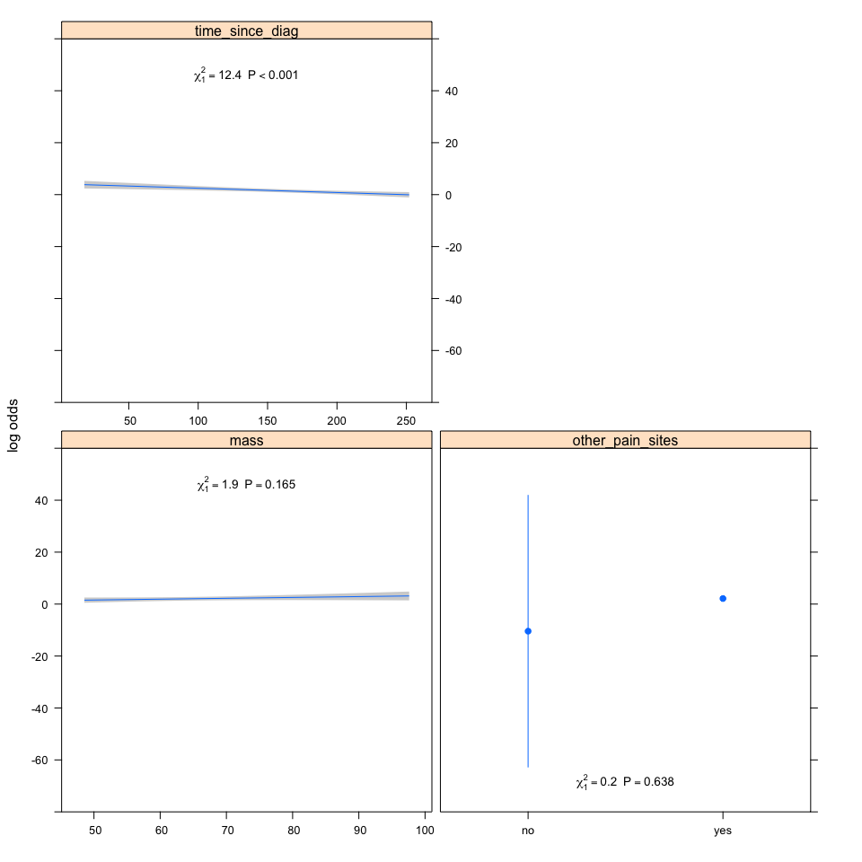

Two signs of neuropathy data only
=================================

Factors associated with having pain in patients with HIV-SN
-----------------------------------------------------------

### Authors

Peter Kamerman, Antonia Wadley, Prinisha Pillay

**Date: January 15, 2017**

------------------------------------------------------------------------

Session setup
-------------

Load data
---------

``` r
data.lr <- read_csv('./data/2Signs_pain-vs-no-pain.csv')
```

Quick look
----------

``` r
dim(data.lr)
```

    ## [1] 197   9

``` r
names(data.lr)
```

    ## [1] "painful_sn"       "height"           "mass"            
    ## [4] "age"              "time_since_diag"  "vitB12"          
    ## [7] "other_pain_sites" "current_cd4"      "sex"

``` r
head(data.lr)
```

    ## # A tibble: 6 × 9
    ##   painful_sn height  mass   age time_since_diag vitB12 other_pain_sites
    ##        <chr>  <dbl> <dbl> <int>           <int>  <chr>            <chr>
    ## 1        Yes  144.5  52.6    44              48     no              yes
    ## 2        Yes  158.2  70.2    46             108     no              yes
    ## 3        Yes     NA  55.1    67              96     no              yes
    ## 4        Yes  156.0  86.0    47             108     no              yes
    ## 5        Yes  156.3  87.1    61             120     no              yes
    ## 6        Yes  161.5  60.8    48              72     no              yes
    ## # ... with 2 more variables: current_cd4 <int>, sex <chr>

``` r
tail(data.lr)
```

    ## # A tibble: 6 × 9
    ##   painful_sn height  mass   age time_since_diag vitB12 other_pain_sites
    ##        <chr>  <dbl> <dbl> <int>           <int>  <chr>            <chr>
    ## 1         No  172.4  88.5    56              NA     no              yes
    ## 2         No     NA  69.8    37              NA     no               no
    ## 3         No     NA 110.0    45              NA     no               no
    ## 4         No     NA 104.9    40              NA     no               no
    ## 5         No     NA  58.5    55              NA     no               no
    ## 6         No     NA  62.9    34              NA     no               no
    ## # ... with 2 more variables: current_cd4 <int>, sex <chr>

``` r
glimpse(data.lr)
```

    ## Observations: 197
    ## Variables: 9
    ## $ painful_sn       <chr> "Yes", "Yes", "Yes", "Yes", "Yes", "Yes", "Ye...
    ## $ height           <dbl> 144.5, 158.2, NA, 156.0, 156.3, 161.5, 152.0,...
    ## $ mass             <dbl> 52.6, 70.2, 55.1, 86.0, 87.1, 60.8, 78.0, 60....
    ## $ age              <int> 44, 46, 67, 47, 61, 48, 44, 48, 32, 40, 58, 4...
    ## $ time_since_diag  <int> 48, 108, 96, 108, 120, 72, 108, 108, 48, 96, ...
    ## $ vitB12           <chr> "no", "no", "no", "no", "no", "no", "no", "no...
    ## $ other_pain_sites <chr> "yes", "yes", "yes", "yes", "yes", "yes", "ye...
    ## $ current_cd4      <int> 343, 572, 826, 980, 206, 311, 742, 495, 231, ...
    ## $ sex              <chr> "female", "male", "female", "female", "male",...

``` r
summary(data.lr)
```

    ##   painful_sn            height           mass             age       
    ##  Length:197         Min.   :144.5   Min.   : 40.30   Min.   :20.00  
    ##  Class :character   1st Qu.:156.3   1st Qu.: 59.20   1st Qu.:35.00  
    ##  Mode  :character   Median :162.0   Median : 69.00   Median :42.00  
    ##                     Mean   :163.3   Mean   : 71.73   Mean   :43.23  
    ##                     3rd Qu.:169.1   3rd Qu.: 79.20   3rd Qu.:52.00  
    ##                     Max.   :190.5   Max.   :173.00   Max.   :74.00  
    ##                     NA's   :15                                      
    ##  time_since_diag    vitB12          other_pain_sites    current_cd4    
    ##  Min.   : 12.0   Length:197         Length:197         Min.   :  20.0  
    ##  1st Qu.: 72.0   Class :character   Class :character   1st Qu.: 256.0  
    ##  Median :120.0   Mode  :character   Mode  :character   Median : 424.0  
    ##  Mean   :120.6                                         Mean   : 486.3  
    ##  3rd Qu.:162.0                                         3rd Qu.: 674.0  
    ##  Max.   :264.0                                         Max.   :1606.0  
    ##  NA's   :38                                                            
    ##      sex           
    ##  Length:197        
    ##  Class :character  
    ##  Mode  :character  
    ##                    
    ##                    
    ##                    
    ## 

Process data
------------

``` r
data.lr <- data.lr[ , -c(4, 9)] # remove 'sex' and 'age' (p > 0.1 on univariate)
data.lr <- data.lr %>%
    mutate(painful_sn = factor(painful_sn), # Convert 'painful_sn' to a factor
           vitB12 = factor(vitB12), # Convert 'vitB12' to a factor
           other_pain_sites = factor(other_pain_sites)) %>% # Convert 'other_pain_sites' to a factor
    filter(complete.cases(.)) # Retain complete cases only

# Check dimensions after removing incomplete cases
dim(data.lr)
```

    ## [1] 151   7

Build model
-----------

### Logistic regression

``` r
# Logistic regression on full model (all variables p<0.1 on univariate analysis,
# time since HIV diagnosis, current CD4 T-cell count, presence of other pain sites, 
# vitamin B12 deficiency, mass, and height).
# Model to include interaction between time since HIV diagnosis 
# and current CD4 T-cell count.
# Select best model using Akaike's information criterion (AIC)

# Model
## Use MASS::polr for this step because output is compatible with MuMIn
mod.full <- glm(painful_sn ~
                    time_since_diag * current_cd4 +
                    other_pain_sites +
                    vitB12 +
                    mass +
                    height,
                data = data.lr, 
                family="binomial")
# Model summary 
summary(mod.full)
```

    ## 
    ## Call:
    ## glm(formula = painful_sn ~ time_since_diag * current_cd4 + other_pain_sites + 
    ##     vitB12 + mass + height, family = "binomial", data = data.lr)
    ## 
    ## Deviance Residuals: 
    ##      Min        1Q    Median        3Q       Max  
    ## -2.55298  -0.00006   0.23096   0.46799   1.30779  
    ## 
    ## Coefficients:
    ##                               Estimate Std. Error z value Pr(>|z|)  
    ## (Intercept)                 -2.064e+01  1.592e+03  -0.013   0.9897  
    ## time_since_diag             -1.541e-02  8.909e-03  -1.730   0.0837 .
    ## current_cd4                 -1.067e-03  2.279e-03  -0.468   0.6398  
    ## other_pain_sitesyes          2.171e+01  1.592e+03   0.014   0.9891  
    ## vitB12yes                   -6.092e-01  8.960e-01  -0.680   0.4966  
    ## mass                         3.051e-02  2.424e-02   1.258   0.2082  
    ## height                       9.638e-03  4.469e-02   0.216   0.8292  
    ## time_since_diag:current_cd4 -1.787e-06  1.394e-05  -0.128   0.8980  
    ## ---
    ## Signif. codes:  0 '***' 0.001 '**' 0.01 '*' 0.05 '.' 0.1 ' ' 1
    ## 
    ## (Dispersion parameter for binomial family taken to be 1)
    ## 
    ##     Null deviance: 198.057  on 150  degrees of freedom
    ## Residual deviance:  72.188  on 143  degrees of freedom
    ## AIC: 88.188
    ## 
    ## Number of Fisher Scoring iterations: 18

``` r
# Use "dredge" to select best models based on AIC
dredge.lr <- dredge(mod.full, beta = FALSE, evaluate = TRUE, rank = "AIC")

# Build a model selection table
mod.lr.sel <- model.sel(dredge.lr)

# Subset those models that show an change in AIC 
# of 2 or less (not different from each other)
get.mod.lr <- get.models(mod.lr.sel, subset = delta < 2)
get.mod.lr
```

    ## $`29`
    ## 
    ## Call:  glm(formula = painful_sn ~ mass + other_pain_sites + time_since_diag + 
    ##     1, family = "binomial", data = data.lr)
    ## 
    ## Coefficients:
    ##         (Intercept)                 mass  other_pain_sitesyes  
    ##           -19.84954              0.03292             21.76278  
    ##     time_since_diag  
    ##            -0.01666  
    ## 
    ## Degrees of Freedom: 150 Total (i.e. Null);  147 Residual
    ## Null Deviance:       198.1 
    ## Residual Deviance: 74.53     AIC: 82.53
    ## 
    ## $`30`
    ## 
    ## Call:  glm(formula = painful_sn ~ current_cd4 + mass + other_pain_sites + 
    ##     time_since_diag + 1, family = "binomial", data = data.lr)
    ## 
    ## Coefficients:
    ##         (Intercept)          current_cd4                 mass  
    ##           -19.28232             -0.00129              0.03486  
    ## other_pain_sitesyes      time_since_diag  
    ##            21.69916             -0.01663  
    ## 
    ## Degrees of Freedom: 150 Total (i.e. Null);  146 Residual
    ## Null Deviance:       198.1 
    ## Residual Deviance: 72.72     AIC: 82.72
    ## 
    ## $`25`
    ## 
    ## Call:  glm(formula = painful_sn ~ other_pain_sites + time_since_diag + 
    ##     1, family = "binomial", data = data.lr)
    ## 
    ## Coefficients:
    ##         (Intercept)  other_pain_sitesyes      time_since_diag  
    ##           -17.57523             21.64023             -0.01613  
    ## 
    ## Degrees of Freedom: 150 Total (i.e. Null);  148 Residual
    ## Null Deviance:       198.1 
    ## Residual Deviance: 76.95     AIC: 82.95
    ## 
    ## $`26`
    ## 
    ## Call:  glm(formula = painful_sn ~ current_cd4 + other_pain_sites + time_since_diag + 
    ##     1, family = "binomial", data = data.lr)
    ## 
    ## Coefficients:
    ##         (Intercept)          current_cd4  other_pain_sitesyes  
    ##          -16.946695            -0.001102            21.588589  
    ##     time_since_diag  
    ##           -0.016269  
    ## 
    ## Degrees of Freedom: 150 Total (i.e. Null);  147 Residual
    ## Null Deviance:       198.1 
    ## Residual Deviance: 75.55     AIC: 83.55
    ## 
    ## $`57`
    ## 
    ## Call:  glm(formula = painful_sn ~ other_pain_sites + time_since_diag + 
    ##     vitB12 + 1, family = "binomial", data = data.lr)
    ## 
    ## Coefficients:
    ##         (Intercept)  other_pain_sitesyes      time_since_diag  
    ##           -17.49513             21.60460             -0.01578  
    ##           vitB12yes  
    ##            -0.75304  
    ## 
    ## Degrees of Freedom: 150 Total (i.e. Null);  147 Residual
    ## Null Deviance:       198.1 
    ## Residual Deviance: 76.17     AIC: 84.17
    ## 
    ## $`61`
    ## 
    ## Call:  glm(formula = painful_sn ~ mass + other_pain_sites + time_since_diag + 
    ##     vitB12 + 1, family = "binomial", data = data.lr)
    ## 
    ## Coefficients:
    ##         (Intercept)                 mass  other_pain_sitesyes  
    ##           -19.61281              0.03020             21.72810  
    ##     time_since_diag            vitB12yes  
    ##            -0.01636             -0.48933  
    ## 
    ## Degrees of Freedom: 150 Total (i.e. Null);  146 Residual
    ## Null Deviance:       198.1 
    ## Residual Deviance: 74.21     AIC: 84.21
    ## 
    ## $`62`
    ## 
    ## Call:  glm(formula = painful_sn ~ current_cd4 + mass + other_pain_sites + 
    ##     time_since_diag + vitB12 + 1, family = "binomial", data = data.lr)
    ## 
    ## Coefficients:
    ##         (Intercept)          current_cd4                 mass  
    ##           -18.96905             -0.00136              0.03177  
    ## other_pain_sitesyes      time_since_diag            vitB12yes  
    ##            21.65362             -0.01628             -0.61831  
    ## 
    ## Degrees of Freedom: 150 Total (i.e. Null);  145 Residual
    ## Null Deviance:       198.1 
    ## Residual Deviance: 72.25     AIC: 84.25
    ## 
    ## $`31`
    ## 
    ## Call:  glm(formula = painful_sn ~ height + mass + other_pain_sites + 
    ##     time_since_diag + 1, family = "binomial", data = data.lr)
    ## 
    ## Coefficients:
    ##         (Intercept)               height                 mass  
    ##           -22.67701              0.01777              0.03114  
    ## other_pain_sitesyes      time_since_diag  
    ##            21.87702             -0.01682  
    ## 
    ## Degrees of Freedom: 150 Total (i.e. Null);  146 Residual
    ## Null Deviance:       198.1 
    ## Residual Deviance: 74.36     AIC: 84.36
    ## 
    ## attr(,"rank")
    ## function (x) 
    ## do.call("rank", list(x))
    ## <environment: 0x7ff265d2f978>
    ## attr(,"rank")attr(,"call")
    ## AIC(x)
    ## attr(,"rank")attr(,"class")
    ## [1] "function"     "rankFunction"
    ## attr(,"beta")
    ## [1] "none"

``` r
# Average across the subsetted models
mod.avg.lr <- model.avg(get.mod.lr)
summary(mod.avg.lr)
```

    ## 
    ## Call:
    ## model.avg(object = get.mod.lr)
    ## 
    ## Component model call: 
    ## glm(formula = painful_sn ~ <8 unique rhs>, family = binomial, data 
    ##      = data.lr)
    ## 
    ## Component models: 
    ##       df logLik   AIC delta weight
    ## 345    4 -37.27 82.53  0.00   0.20
    ## 1345   5 -36.36 82.72  0.19   0.18
    ## 45     3 -38.48 82.95  0.42   0.16
    ## 145    4 -37.78 83.55  1.02   0.12
    ## 456    4 -38.09 84.17  1.64   0.09
    ## 3456   5 -37.10 84.21  1.67   0.09
    ## 13456  6 -36.13 84.25  1.72   0.08
    ## 2345   5 -37.18 84.36  1.83   0.08
    ## 
    ## Term codes: 
    ##      current_cd4           height             mass other_pain_sites 
    ##                1                2                3                4 
    ##  time_since_diag           vitB12 
    ##                5                6 
    ## 
    ## Model-averaged coefficients:  
    ## (full average) 
    ##                       Estimate Std. Error Adjusted SE z value Pr(>|z|)    
    ## (Intercept)         -1.896e+01  1.612e+03   1.625e+03   0.012 0.990693    
    ## mass                 2.066e-02  2.469e-02   2.482e-02   0.832 0.405209    
    ## other_pain_sitesyes  2.169e+01  1.612e+03   1.625e+03   0.013 0.989349    
    ## time_since_diag     -1.640e-02  4.710e-03   4.749e-03   3.454 0.000553 ***
    ## current_cd4         -4.805e-04  8.447e-04   8.481e-04   0.567 0.570989    
    ## vitB12yes           -1.605e-01  5.141e-01   5.171e-01   0.310 0.756262    
    ## height               1.417e-03  1.317e-02   1.327e-02   0.107 0.914931    
    ##  
    ## (conditional average) 
    ##                       Estimate Std. Error Adjusted SE z value Pr(>|z|)    
    ## (Intercept)         -1.896e+01  1.612e+03   1.625e+03   0.012 0.990693    
    ## mass                 3.273e-02  2.390e-02   2.410e-02   1.358 0.174437    
    ## other_pain_sitesyes  2.169e+01  1.612e+03   1.625e+03   0.013 0.989349    
    ## time_since_diag     -1.640e-02  4.710e-03   4.749e-03   3.454 0.000553 ***
    ## current_cd4         -1.247e-03  9.465e-04   9.543e-04   1.307 0.191286    
    ## vitB12yes           -6.210e-01  8.582e-01   8.652e-01   0.718 0.472942    
    ## height               1.777e-02  4.341e-02   4.378e-02   0.406 0.684882    
    ## ---
    ## Signif. codes:  0 '***' 0.001 '**' 0.01 '*' 0.05 '.' 0.1 ' ' 1
    ## 
    ## Relative variable importance: 
    ##                      other_pain_sites time_since_diag mass current_cd4
    ## Importance:          1.00             1.00            0.63 0.39       
    ## N containing models:    8                8               5    3       
    ##                      vitB12 height
    ## Importance:          0.26   0.08  
    ## N containing models:    3      1

``` r
# Made a priori choice to only take variables that occur in >50% of models
# OUTCOME: 'time_since_diag' and 'other_pain_sites' occur in all 8 models
# OUTCOME: 'mass' occurs in 5/8 models
# OUTCOME: 'time_since_diag', 'other_pain_sites' and 'mass' through to 
# next stage of analysis.

# New model
## Use rms::lrm for this stage because better fit 
## indicators than MASS::polr
attach(data.lr)
d <- datadist(other_pain_sites, 
              time_since_diag, 
              mass)
detach(data.lr)
options(datadist = "d")
mod.lr.new<-lrm(painful_sn ~
                    other_pain_sites + 
                    time_since_diag +
                    mass, 
              data = data.lr, 
              x = TRUE, y = TRUE, 
              linear.predictors = TRUE)

# Model summary
mod.lr.new
```

    ## Logistic Regression Model
    ##  
    ##  lrm(formula = painful_sn ~ other_pain_sites + time_since_diag + 
    ##      mass, data = data.lr, x = TRUE, y = TRUE, linear.predictors = TRUE)
    ##  
    ##                      Model Likelihood     Discrimination    Rank Discrim.    
    ##                         Ratio Test           Indexes           Indexes       
    ##  Obs         151    LR chi2     123.52    R2       0.765    C       0.935    
    ##   No          55    d.f.             3    g        5.948    Dxy     0.869    
    ##   Yes         96    Pr(> chi2) <0.0001    gr     383.092    gamma   0.870    
    ##  max |deriv| 0.1                          gp       0.411    tau-a   0.405    
    ##                                           Brier    0.072                     
    ##  
    ##                       Coef     S.E.    Wald Z Pr(>|Z|)
    ##  Intercept            -10.6564 26.7311 -0.40  0.6901  
    ##  other_pain_sites=yes  12.5696 26.6793  0.47  0.6375  
    ##  time_since_diag       -0.0167  0.0047 -3.52  0.0004  
    ##  mass                   0.0329  0.0237  1.39  0.1648  
    ## 

``` r
summary(mod.lr.new)
```

    ##              Effects              Response : painful_sn 
    ## 
    ##  Factor                    Low   High  Diff. Effect      S.E.    
    ##  time_since_diag           72.00 168.0 96.00 -1.5991e+00  0.45414
    ##   Odds Ratio               72.00 168.0 96.00  2.0207e-01       NA
    ##  mass                      58.15  77.5 19.35  6.3707e-01  0.45862
    ##   Odds Ratio               58.15  77.5 19.35  1.8909e+00       NA
    ##  other_pain_sites - no:yes  2.00   1.0    NA -1.2570e+01 26.67900
    ##   Odds Ratio                2.00   1.0    NA  3.4760e-06       NA
    ##  Lower 0.95  Upper 0.95 
    ##  -2.4892e+00 -7.0903e-01
    ##   8.2973e-02  4.9212e-01
    ##  -2.6181e-01  1.5360e+00
    ##   7.6966e-01  4.6458e+00
    ##  -6.4860e+01  3.9721e+01
    ##   6.7854e-29  1.7806e+17

``` r
# Plot outcome with anova results
plot(Predict(mod.lr.new), 
     anova = anova(mod.lr.new),
     pval = TRUE)
```



``` r
# OUTCOME: Model is significantly better than null model (p < 0.0001), 
# OUTCOME: Good: Nagelkerke R^2 = 0.76, C (AUROC) = 0.93
# OUTCOME: Only 'time_since_diag' was a significant, independent risk factor
# OUTCOME: Reduced risk of pain as time since diagnosis increased.

# Validate measures of fit using bootstrap sampling (B=999)
validate(mod.lr.new, 
         method = "boot", 
         B=999, 
         group = data.lr$painful_sn)
```

    ##           index.orig training    test optimism index.corrected   n
    ## Dxy           0.8684   0.8788  0.8670   0.0118          0.8566 999
    ## R2            0.7647   0.7760  0.7607   0.0154          0.7493 999
    ## Intercept     0.0000   0.0000 -0.0240   0.0240         -0.0240 999
    ## Slope         1.0000   1.0000  0.9774   0.0226          0.9774 999
    ## Emax          0.0000   0.0000  0.0093   0.0093          0.0093 999
    ## D             0.8114   0.8341  0.8048   0.0293          0.7821 999
    ## U            -0.0132  -0.0132  0.0021  -0.0153          0.0021 999
    ## Q             0.8246   0.8473  0.8027   0.0446          0.7800 999
    ## B             0.0724   0.0695  0.0748  -0.0053          0.0777 999
    ## g             5.9483   6.2167  5.8861   0.3305          5.6178 999
    ## gp            0.4114   0.4139  0.4099   0.0040          0.4074 999

``` r
# OUTCOME: see "index.corrected" for bootstrapped measures

# Test for multicolinearity using variance inflation factor (vif)
vif(mod.lr.new) # >4 is a problem
```

    ## other_pain_sites=yes      time_since_diag                 mass 
    ##             1.000247             1.038209             1.038125

``` r
# OUTCOME: No evidence of multicolinearity between predictors
```

Session information
-------------------

``` r
sessionInfo()
```

    ## R version 3.3.2 (2016-10-31)
    ## Platform: x86_64-apple-darwin13.4.0 (64-bit)
    ## Running under: macOS Sierra 10.12.2
    ## 
    ## locale:
    ## [1] en_GB.UTF-8/en_GB.UTF-8/en_GB.UTF-8/C/en_GB.UTF-8/en_GB.UTF-8
    ## 
    ## attached base packages:
    ## [1] methods   stats     graphics  grDevices utils     datasets  base     
    ## 
    ## other attached packages:
    ##  [1] gdtools_0.1.3   rms_5.1-0       SparseM_1.74    Hmisc_4.0-2    
    ##  [5] ggplot2_2.2.1   Formula_1.2-1   survival_2.40-1 lattice_0.20-34
    ##  [9] MuMIn_1.15.6    MASS_7.3-45     tidyr_0.6.1     dplyr_0.5.0    
    ## [13] readr_1.0.0     svglite_1.2.0   knitr_1.15.1   
    ## 
    ## loaded via a namespace (and not attached):
    ##  [1] zoo_1.7-14          splines_3.3.2       colorspace_1.3-2   
    ##  [4] htmltools_0.3.5     stats4_3.3.2        yaml_2.1.14        
    ##  [7] base64enc_0.1-3     foreign_0.8-67      DBI_0.5-1          
    ## [10] RColorBrewer_1.1-2  multcomp_1.4-6      plyr_1.8.4         
    ## [13] stringr_1.1.0       MatrixModels_0.4-1  munsell_0.4.3      
    ## [16] gtable_0.2.0        mvtnorm_1.0-5       codetools_0.2-15   
    ## [19] evaluate_0.10       latticeExtra_0.6-28 quantreg_5.29      
    ## [22] htmlTable_1.8       TH.data_1.0-7       Rcpp_0.12.9        
    ## [25] acepack_1.4.1       scales_0.4.1        backports_1.0.4    
    ## [28] checkmate_1.8.2     gridExtra_2.2.1     digest_0.6.11      
    ## [31] stringi_1.1.2       polspline_1.1.12    grid_3.3.2         
    ## [34] rprojroot_1.1       tools_3.3.2         sandwich_2.3-4     
    ## [37] magrittr_1.5        lazyeval_0.2.0      tibble_1.2         
    ## [40] cluster_2.0.5       Matrix_1.2-7.1      data.table_1.10.0  
    ## [43] assertthat_0.1      rmarkdown_1.3       R6_2.2.0           
    ## [46] rpart_4.1-10        nnet_7.3-12         nlme_3.1-128
