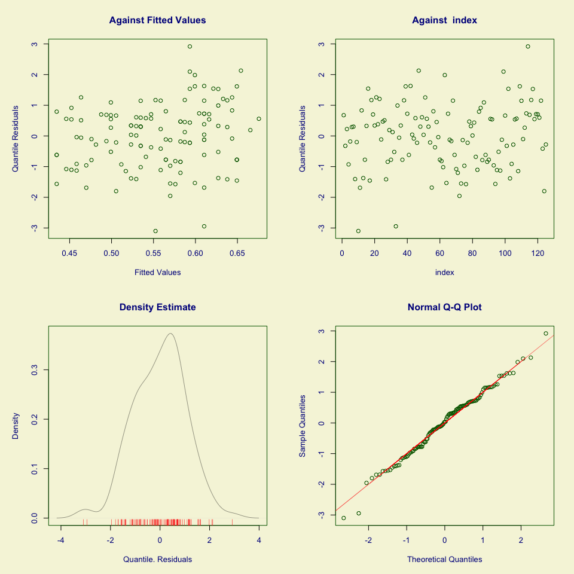
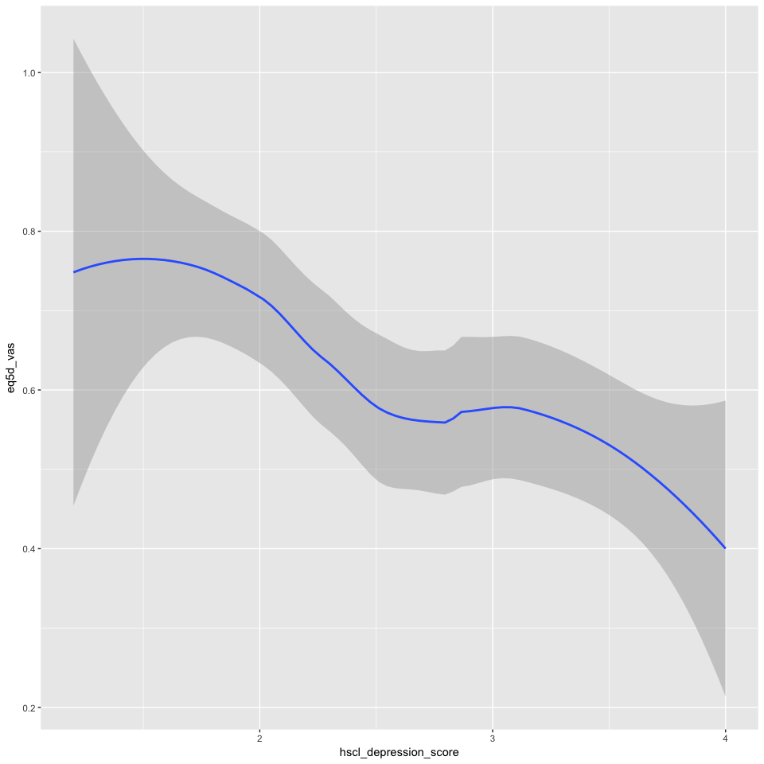

Two signs of neuropathy data only
=================================

Factors associated with having reduced quality of life in patients with painful HIV-SN
--------------------------------------------------------------------------------------

### Authors

Peter Kamerman, Antonia Wadley, Prinisha Pillay

**Date: January 15, 2017**

------------------------------------------------------------------------

Session setup
-------------

Load data
---------

``` r
data <- read_csv('./data/2Signs_qol-pain-intensity.csv')
```

Quick look
----------

``` r
dim(data)
```

    ## [1] 125   8

``` r
names(data)
```

    ## [1] "eq5d_vas"              "age"                   "other_pain_sites"     
    ## [4] "pain_intensity"        "sex"                   "education"            
    ## [7] "hscl_anxiety_score"    "hscl_depression_score"

``` r
head(data)
```

    ## # A tibble: 6 × 8
    ##   eq5d_vas   age other_pain_sites pain_intensity    sex education
    ##      <int> <int>            <chr>          <int>  <chr>     <int>
    ## 1       80    44              yes             10 female         5
    ## 2       50    46              yes             10   male         6
    ## 3       70    67              yes             10 female         4
    ## 4       30    47              yes             10 female         6
    ## 5       60    61              yes             10   male         5
    ## 6       80    48              yes              5   male         6
    ## # ... with 2 more variables: hscl_anxiety_score <dbl>,
    ## #   hscl_depression_score <dbl>

``` r
tail(data)
```

    ## # A tibble: 6 × 8
    ##   eq5d_vas   age other_pain_sites pain_intensity    sex education
    ##      <int> <int>            <chr>          <int>  <chr>     <int>
    ## 1       85    64              yes             10 female         3
    ## 2       80    55              yes             10 female         7
    ## 3      100    45              yes              5   male         5
    ## 4       50    24              yes             10 female         8
    ## 5       10    74              yes              8 female         2
    ## 6       50    63              yes             10 female         4
    ## # ... with 2 more variables: hscl_anxiety_score <dbl>,
    ## #   hscl_depression_score <dbl>

``` r
glimpse(data)
```

    ## Observations: 125
    ## Variables: 8
    ## $ eq5d_vas              <int> 80, 50, 70, 30, 60, 80, 70, 20, 60, 0, 1...
    ## $ age                   <int> 44, 46, 67, 47, 61, 48, 44, 48, 32, 40, ...
    ## $ other_pain_sites      <chr> "yes", "yes", "yes", "yes", "yes", "yes"...
    ## $ pain_intensity        <int> 10, 10, 10, 10, 10, 5, 7, 10, 5, 5, 10, ...
    ## $ sex                   <chr> "female", "male", "female", "female", "m...
    ## $ education             <int> 5, 6, 4, 6, 5, 6, 5, 6, 6, 5, 0, 3, 5, 4...
    ## $ hscl_anxiety_score    <dbl> 1.5, 2.9, 3.5, 3.6, 1.9, 1.1, 1.8, 2.4, ...
    ## $ hscl_depression_score <dbl> 3.27, 2.87, 2.60, 3.13, 2.33, 1.67, 2.87...

``` r
summary(data)
```

    ##     eq5d_vas           age        other_pain_sites   pain_intensity  
    ##  Min.   :  0.00   Min.   :21.00   Length:125         Min.   : 1.000  
    ##  1st Qu.: 40.00   1st Qu.:34.00   Class :character   1st Qu.: 5.000  
    ##  Median : 65.00   Median :43.00   Mode  :character   Median : 8.000  
    ##  Mean   : 61.82   Mean   :42.44                      Mean   : 7.056  
    ##  3rd Qu.: 80.00   3rd Qu.:49.00                      3rd Qu.:10.000  
    ##  Max.   :100.00   Max.   :74.00                      Max.   :10.000  
    ##      sex              education      hscl_anxiety_score
    ##  Length:125         Min.   : 0.000   Min.   :1.100     
    ##  Class :character   1st Qu.: 5.000   1st Qu.:2.100     
    ##  Mode  :character   Median : 6.000   Median :2.600     
    ##                     Mean   : 5.976   Mean   :2.721     
    ##                     3rd Qu.: 8.000   3rd Qu.:3.400     
    ##                     Max.   :10.000   Max.   :4.000     
    ##  hscl_depression_score
    ##  Min.   :1.200        
    ##  1st Qu.:2.000        
    ##  Median :2.530        
    ##  Mean   :2.607        
    ##  3rd Qu.:3.130        
    ##  Max.   :4.000

Process data
------------

``` r
data <- data[ , -3] # Remove 'other_pain_sites' - 
# all participants had painful sn and all had pain at other sites
data.gam <- data %>%
    mutate(eq5d_vas = eq5d_vas/100, # Convert 'eq5d_vas' to proportion
           pain_intensity = factor(pain_intensity, ordered = TRUE), # Convert 'pain_intensity' to an ordered factor
           sex = factor(sex)) %>% # Convert 'sex' to a factor
    filter(complete.cases(.)) # Retain complete cases only

# Check dimensions after removing incomplete cases
dim(data.gam)
```

    ## [1] 125   7

Build model
-----------

### Generalized Additive Model

*(with extended beta inflated distribution)*

``` r
# GAM on full model (all variables p<0.1 on univariate analysis: age, 
# NeP.pain, other.pains, sex, education).
# Use beta-inflated distribution [0, 1] for VAS data
# Select best model using generalized Akaike's information criterion (AIC).

# Model
mod.gam <- gamlss(eq5d_vas ~ 
                      pain_intensity +
                      age +
                      sex +
                      hscl_depression_score +
                      hscl_anxiety_score +
                      education, 
           data = data.gam,
           family = BEINF())
```

    ## GAMLSS-RS iteration 1: Global Deviance = 89.7863 
    ## GAMLSS-RS iteration 2: Global Deviance = 89.4625 
    ## GAMLSS-RS iteration 3: Global Deviance = 89.4622

``` r
# Model summary 
summary(mod.gam)
```

    ## ******************************************************************
    ## Family:  c("BEINF", "Beta Inflated") 
    ## 
    ## Call:  gamlss(formula = eq5d_vas ~ pain_intensity + age +  
    ##     sex + hscl_depression_score + hscl_anxiety_score +  
    ##     education, family = BEINF(), data = data.gam) 
    ## 
    ## Fitting method: RS() 
    ## 
    ## ------------------------------------------------------------------
    ## Mu link function:  logit
    ## Mu Coefficients:
    ##                        Estimate Std. Error t value Pr(>|t|)  
    ## (Intercept)            0.657635   0.787526   0.835   0.4055  
    ## pain_intensity.L       0.264598   0.426132   0.621   0.5360  
    ## pain_intensity.Q      -0.624516   0.454419  -1.374   0.1722  
    ## pain_intensity.C       0.726060   0.446810   1.625   0.1071  
    ## pain_intensity^4      -0.234490   0.385212  -0.609   0.5440  
    ## pain_intensity^5      -0.999060   0.457773  -2.182   0.0313 *
    ## pain_intensity^6       0.230685   0.389633   0.592   0.5551  
    ## pain_intensity^7       0.128836   0.373181   0.345   0.7306  
    ## pain_intensity^8      -0.697182   0.460669  -1.513   0.1331  
    ## pain_intensity^9       0.703012   0.415718   1.691   0.0937 .
    ## age                    0.009563   0.009714   0.984   0.3271  
    ## sexmale                0.166769   0.220229   0.757   0.4506  
    ## hscl_depression_score -0.198813   0.158633  -1.253   0.2128  
    ## hscl_anxiety_score    -0.144898   0.133971  -1.082   0.2819  
    ## education              0.028846   0.054653   0.528   0.5987  
    ## ---
    ## Signif. codes:  0 '***' 0.001 '**' 0.01 '*' 0.05 '.' 0.1 ' ' 1
    ## 
    ## ------------------------------------------------------------------
    ## Sigma link function:  logit
    ## Sigma Coefficients:
    ##             Estimate Std. Error t value Pr(>|t|)    
    ## (Intercept) -0.31063    0.09123  -3.405 0.000933 ***
    ## ---
    ## Signif. codes:  0 '***' 0.001 '**' 0.01 '*' 0.05 '.' 0.1 ' ' 1
    ## 
    ## ------------------------------------------------------------------
    ## Nu link function:  log 
    ## Nu Coefficients:
    ##             Estimate Std. Error t value Pr(>|t|)    
    ## (Intercept)   -3.932      0.714  -5.507 2.53e-07 ***
    ## ---
    ## Signif. codes:  0 '***' 0.001 '**' 0.01 '*' 0.05 '.' 0.1 ' ' 1
    ## 
    ## ------------------------------------------------------------------
    ## Tau link function:  log 
    ## Tau Coefficients:
    ##             Estimate Std. Error t value Pr(>|t|)    
    ## (Intercept)  -1.5805     0.2396  -6.595 1.66e-09 ***
    ## ---
    ## Signif. codes:  0 '***' 0.001 '**' 0.01 '*' 0.05 '.' 0.1 ' ' 1
    ## 
    ## ------------------------------------------------------------------
    ## No. of observations in the fit:  125 
    ## Degrees of Freedom for the fit:  18
    ##       Residual Deg. of Freedom:  107 
    ##                       at cycle:  3 
    ##  
    ## Global Deviance:     89.46221 
    ##             AIC:     125.4622 
    ##             SBC:     176.3719 
    ## ******************************************************************

``` r
# Use stepGAIC to select best models based on GAIC
step.gam <- stepGAIC(mod.gam)
```

    ## Distribution parameter:  mu 
    ## Start:  AIC= 125.46 
    ##  eq5d_vas ~ pain_intensity + age + sex + hscl_depression_score +  
    ##     hscl_anxiety_score + education 
    ## 
    ##                         Df    AIC
    ## - pain_intensity         9 117.34
    ## - education              1 123.74
    ## - sex                    1 124.04
    ## - age                    1 124.43
    ## - hscl_anxiety_score     1 124.61
    ## - hscl_depression_score  1 125.03
    ## <none>                     125.46
    ## 
    ## Step:  AIC= 117.34 
    ##  eq5d_vas ~ age + sex + hscl_depression_score + hscl_anxiety_score +  
    ##     education 
    ## 
    ##                         Df    AIC
    ## - education              1 115.34
    ## - sex                    1 115.44
    ## - age                    1 115.62
    ## - hscl_anxiety_score     1 115.81
    ## <none>                     117.34
    ## - hscl_depression_score  1 118.93
    ## 
    ## Step:  AIC= 115.34 
    ##  eq5d_vas ~ age + sex + hscl_depression_score + hscl_anxiety_score 
    ## 
    ##                         Df    AIC
    ## - sex                    1 113.45
    ## - age                    1 113.78
    ## - hscl_anxiety_score     1 113.81
    ## <none>                     115.34
    ## - hscl_depression_score  1 116.93
    ## 
    ## Step:  AIC= 113.45 
    ##  eq5d_vas ~ age + hscl_depression_score + hscl_anxiety_score 
    ## 
    ##                         Df    AIC
    ## - age                    1 111.91
    ## - hscl_anxiety_score     1 112.08
    ## <none>                     113.45
    ## - hscl_depression_score  1 114.94
    ## 
    ## Step:  AIC= 111.91 
    ##  eq5d_vas ~ hscl_depression_score + hscl_anxiety_score 
    ## 
    ##                         Df    AIC
    ## - hscl_anxiety_score     1 110.46
    ## <none>                     111.91
    ## - hscl_depression_score  1 113.75
    ## 
    ## Step:  AIC= 110.46 
    ##  eq5d_vas ~ hscl_depression_score 
    ## 
    ##                         Df    AIC
    ## <none>                     110.46
    ## - hscl_depression_score  1 116.66

``` r
step.gam$anova
```

    ## Stepwise Model Path 
    ## Analysis of Deviance Table
    ## 
    ## Initial
    ## mu
    ##  Model:
    ## eq5d_vas ~ pain_intensity + age + sex + hscl_depression_score + 
    ##     hscl_anxiety_score + education
    ## 
    ## Final
    ## mu
    ##  Model:
    ## eq5d_vas ~ hscl_depression_score
    ## 
    ## 
    ##                   Step Df    Deviance Resid. Df Resid. Dev      AIC
    ## 1                                           107   89.46221 125.4622
    ## 2     - pain_intensity  9 9.874721337       116   99.33693 117.3369
    ## 3          - education  1 0.001158636       117   99.33809 115.3381
    ## 4                - sex  1 0.112038763       118   99.45013 113.4501
    ## 5                - age  1 0.457273227       119   99.90741 111.9074
    ## 6 - hscl_anxiety_score  1 0.553888501       120  100.46129 110.4613

``` r
summary(step.gam)
```

    ## ******************************************************************
    ## Family:  c("BEINF", "Beta Inflated") 
    ## 
    ## Call:  gamlss(formula = eq5d_vas ~ hscl_depression_score,  
    ##     family = BEINF(), data = data.gam, trace = FALSE) 
    ## 
    ## Fitting method: RS() 
    ## 
    ## ------------------------------------------------------------------
    ## Mu link function:  logit
    ## Mu Coefficients:
    ##                       Estimate Std. Error t value Pr(>|t|)    
    ## (Intercept)             1.1609     0.3441   3.374 0.000998 ***
    ## hscl_depression_score  -0.3560     0.1226  -2.903 0.004402 ** 
    ## ---
    ## Signif. codes:  0 '***' 0.001 '**' 0.01 '*' 0.05 '.' 0.1 ' ' 1
    ## 
    ## ------------------------------------------------------------------
    ## Sigma link function:  logit
    ## Sigma Coefficients:
    ##             Estimate Std. Error t value Pr(>|t|)  
    ## (Intercept) -0.23337    0.09139  -2.554   0.0119 *
    ## ---
    ## Signif. codes:  0 '***' 0.001 '**' 0.01 '*' 0.05 '.' 0.1 ' ' 1
    ## 
    ## ------------------------------------------------------------------
    ## Nu link function:  log 
    ## Nu Coefficients:
    ##             Estimate Std. Error t value Pr(>|t|)    
    ## (Intercept)   -3.932      0.714  -5.507 2.11e-07 ***
    ## ---
    ## Signif. codes:  0 '***' 0.001 '**' 0.01 '*' 0.05 '.' 0.1 ' ' 1
    ## 
    ## ------------------------------------------------------------------
    ## Tau link function:  log 
    ## Tau Coefficients:
    ##             Estimate Std. Error t value Pr(>|t|)    
    ## (Intercept)  -1.5805     0.2396  -6.595  1.2e-09 ***
    ## ---
    ## Signif. codes:  0 '***' 0.001 '**' 0.01 '*' 0.05 '.' 0.1 ' ' 1
    ## 
    ## ------------------------------------------------------------------
    ## No. of observations in the fit:  125 
    ## Degrees of Freedom for the fit:  5
    ##       Residual Deg. of Freedom:  120 
    ##                       at cycle:  3 
    ##  
    ## Global Deviance:     100.4613 
    ##             AIC:     110.4613 
    ##             SBC:     124.6029 
    ## ******************************************************************

``` r
# OUTCOME: Final model retains hscl_depression_score

# Fit reduced model
mod.gam.new <- gamlss(eq5d_vas ~ 
                      hscl_depression_score,
           data = data.gam,
           family = BEINF())
```

    ## GAMLSS-RS iteration 1: Global Deviance = 100.5758 
    ## GAMLSS-RS iteration 2: Global Deviance = 100.4613 
    ## GAMLSS-RS iteration 3: Global Deviance = 100.4613

``` r
# Diagnostic plots
plot(mod.gam.new)
```



    ## ******************************************************************
    ##   Summary of the Randomised Quantile Residuals
    ##                            mean   =  -0.003712954 
    ##                        variance   =  1.090847 
    ##                coef. of skewness  =  -0.1718166 
    ##                coef. of kurtosis  =  3.099568 
    ## Filliben correlation coefficient  =  0.9947165 
    ## ******************************************************************

``` r
# Plot
library(ggplot2)
ggplot(data.gam, 
       aes(x = hscl_depression_score, y = eq5d_vas)) +
    geom_smooth()
```



Session information
-------------------

``` r
sessionInfo()
```

    ## R version 3.3.2 (2016-10-31)
    ## Platform: x86_64-apple-darwin13.4.0 (64-bit)
    ## Running under: macOS Sierra 10.12.2
    ## 
    ## locale:
    ## [1] en_GB.UTF-8/en_GB.UTF-8/en_GB.UTF-8/C/en_GB.UTF-8/en_GB.UTF-8
    ## 
    ## attached base packages:
    ## [1] parallel  methods   splines   stats     graphics  grDevices utils    
    ## [8] datasets  base     
    ## 
    ## other attached packages:
    ##  [1] gdtools_0.1.3     ggplot2_2.2.1     gamlss_5.0-1     
    ##  [4] nlme_3.1-128      gamlss.dist_5.0-0 MASS_7.3-45      
    ##  [7] gamlss.data_5.0-0 tidyr_0.6.1       dplyr_0.5.0      
    ## [10] readr_1.0.0       svglite_1.2.0     knitr_1.15.1     
    ## 
    ## loaded via a namespace (and not attached):
    ##  [1] Rcpp_0.12.9      magrittr_1.5     munsell_0.4.3    colorspace_1.3-2
    ##  [5] lattice_0.20-34  R6_2.2.0         plyr_1.8.4       stringr_1.1.0   
    ##  [9] tools_3.3.2      grid_3.3.2       gtable_0.2.0     DBI_0.5-1       
    ## [13] htmltools_0.3.5  lazyeval_0.2.0   survival_2.40-1  yaml_2.1.14     
    ## [17] assertthat_0.1   rprojroot_1.1    digest_0.6.11    tibble_1.2      
    ## [21] Matrix_1.2-7.1   evaluate_0.10    rmarkdown_1.3    labeling_0.3    
    ## [25] stringi_1.1.2    scales_0.4.1     backports_1.0.4
