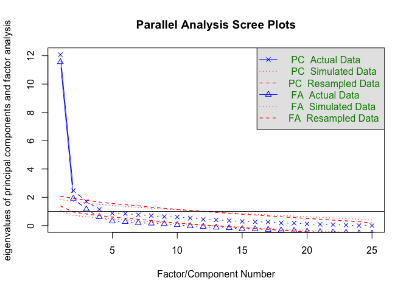

Load required packages and set chunk options
--------------------------------------------

### Import data

``` r
# Read csv
data <- read_csv('./data/factor-analysis.csv')
```

### Inspect

### Clean

``` r
# Convert ID to factor
data_clean <- data %>%
    select(-pain) %>%
    mutate(id = factor(id))
```

### Internal consistency

***Use polychoric correlation matrix because data are ordinal integers, and therefore Pearson's correlation matrix does not apply***

``` r
# Remove ID column
data_ic <- data_clean[ , -1]

# Anxiety subset
anx_ic <- data_ic %>%
    select(starts_with('anx'))
## Get a summary of the data
kable(describe(anx_ic))
```

|          |  vars|    n|      mean|        sd|  median|   trimmed|     mad|  min|  max|  range|        skew|    kurtosis|         se|
|----------|-----:|----:|---------:|---------:|-------:|---------:|-------:|----:|----:|------:|-----------:|-----------:|----------:|
| anx\_q1  |     1|  153|  2.633987|  1.306621|       3|  2.666667|  1.4826|    1|    4|      3|  -0.1510480|  -1.7236558|  0.1056340|
| anx\_q2  |     2|  153|  2.555556|  1.312335|       3|  2.569106|  1.4826|    1|    4|      3|  -0.0506965|  -1.7470205|  0.1060960|
| anx\_q3  |     3|  153|  2.503268|  1.288227|       2|  2.504065|  1.4826|    1|    4|      3|   0.0570238|  -1.7082473|  0.1041470|
| anx\_q4  |     4|  153|  2.470588|  1.328131|       2|  2.463415|  1.4826|    1|    4|      3|   0.0879826|  -1.7671934|  0.1073730|
| anx\_q5  |     5|  153|  2.281046|  1.373899|       2|  2.227642|  1.4826|    1|    4|      3|   0.2915801|  -1.7746191|  0.1110732|
| anx\_q6  |     6|  153|  2.045752|  1.309579|       1|  1.934959|  0.0000|    1|    4|      3|   0.6495588|  -1.3980737|  0.1058732|
| anx\_q7  |     7|  153|  2.594771|  1.258852|       2|  2.617886|  1.4826|    1|    4|      3|  -0.0163472|  -1.6766737|  0.1017722|
| anx\_q8  |     8|  153|  3.307189|  1.046806|       4|  3.495935|  0.0000|    1|    4|      3|  -1.1106989|  -0.3173448|  0.0846293|
| anx\_q9  |     9|  153|  1.993464|  1.290128|       1|  1.869919|  0.0000|    1|    4|      3|   0.7242946|  -1.2844438|  0.1043007|
| anx\_q10 |    10|  153|  2.869281|  1.228461|       3|  2.959350|  1.4826|    1|    4|      3|  -0.4925278|  -1.4060980|  0.0993152|

``` r
## Generate and view polychoric correlation matrix
anx_pc <- polychoric(anx_ic)
## Generate internal consistency coefficient alpha
anx_alpha <- alpha(anx_pc$rho)
### Summary stats
summary(anx_alpha)
```

    ## 
    ## Reliability analysis   
    ##  raw_alpha std.alpha G6(smc) average_r S/N
    ##       0.93      0.93    0.96      0.58  14

``` r
### Drop-one analysis
#### r.cor = Item whole correlation corrected for 
#### item overlap and scale reliability.
#### r.drop = Item whole correlation for this item 
#### against the scale without this item
anx_alpha$item.stats
```

    ##                 r     r.cor    r.drop
    ## anx_q1  0.8555657 0.8654556 0.8152670
    ## anx_q2  0.8321845 0.8407737 0.7862037
    ## anx_q3  0.7792951 0.7594384 0.7212809
    ## anx_q4  0.7489511 0.7156286 0.6845333
    ## anx_q5  0.7981610 0.7860941 0.7443104
    ## anx_q6  0.7756654 0.7664079 0.7168662
    ## anx_q7  0.8262418 0.8063500 0.7788526
    ## anx_q8  0.6955123 0.6658226 0.6206764
    ## anx_q9  0.7835061 0.7624903 0.7264090
    ## anx_q10 0.7958239 0.7676996 0.7414499

``` r
# Depression subset
dep_ic <- data_ic %>%
    select(starts_with('dep'))
## Get a summary of the data
kable(describe(dep_ic))
```

|          |  vars|    n|      mean|        sd|  median|   trimmed|     mad|  min|  max|  range|        skew|    kurtosis|         se|
|----------|-----:|----:|---------:|---------:|-------:|---------:|-------:|----:|----:|------:|-----------:|-----------:|----------:|
| dep\_q11 |     1|  153|  1.960784|  1.157824|       1|  1.829268|  0.0000|    1|    4|      3|   0.7578940|  -0.9838477|  0.0936046|
| dep\_q12 |     2|  153|  2.555556|  1.255980|       2|  2.569106|  1.4826|    1|    4|      3|   0.0235398|  -1.6643314|  0.1015400|
| dep\_q13 |     3|  153|  2.026144|  1.197298|       2|  1.910569|  1.4826|    1|    4|      3|   0.7498319|  -1.0391563|  0.0967958|
| dep\_q14 |     4|  153|  1.705882|  1.075336|       1|  1.512195|  0.0000|    1|    4|      3|   1.3244672|   0.2704422|  0.0869357|
| dep\_q15 |     5|  153|  1.862745|  1.130084|       1|  1.707317|  0.0000|    1|    4|      3|   1.0023276|  -0.5133251|  0.0913619|
| dep\_q16 |     6|  153|  2.718954|  1.253718|       2|  2.772358|  1.4826|    1|    4|      3|  -0.1597511|  -1.6701780|  0.1013571|
| dep\_q17 |     7|  153|  3.058823|  1.171118|       4|  3.195122|  0.0000|    1|    4|      3|  -0.6747515|  -1.1942915|  0.0946793|
| dep\_q18 |     8|  153|  1.705882|  1.099535|       1|  1.512195|  0.0000|    1|    4|      3|   1.3031339|   0.1314562|  0.0888922|
| dep\_q19 |     9|  153|  3.196078|  1.112482|       4|  3.365854|  0.0000|    1|    4|      3|  -0.8725710|  -0.8726435|  0.0899388|
| dep\_q20 |    10|  153|  1.803922|  1.241067|       1|  1.634146|  0.0000|    1|    4|      3|   1.0697596|  -0.6880957|  0.1003343|
| dep\_q21 |    11|  153|  2.581699|  1.285621|       2|  2.601626|  1.4826|    1|    4|      3|  -0.0231740|  -1.7153167|  0.1039363|
| dep\_q22 |    12|  153|  3.150327|  1.098871|       4|  3.308943|  0.0000|    1|    4|      3|  -0.7403041|  -1.0617198|  0.0888384|
| dep\_q23 |    13|  153|  2.692811|  1.242245|       2|  2.739837|  1.4826|    1|    4|      3|  -0.1241040|  -1.6548580|  0.1004295|
| dep\_q24 |    14|  153|  2.633987|  1.196220|       2|  2.666667|  1.4826|    1|    4|      3|  -0.0751100|  -1.5584012|  0.0967087|
| dep\_q25 |    15|  153|  3.045752|  1.166077|       4|  3.178862|  0.0000|    1|    4|      3|  -0.6570034|  -1.1986207|  0.0942717|

``` r
## Generate and view polychoric correlation matrix
dep_pc <- polychoric(dep_ic)
## Generate internal consistency coefficient alpha
dep_alpha <- alpha(dep_pc$rho)
### Summary stats
summary(dep_alpha)
```

    ## 
    ## Reliability analysis   
    ##  raw_alpha std.alpha G6(smc) average_r S/N
    ##       0.94      0.94    0.96       0.5  15

``` r
### Drop-one analysis
#### r.cor = Item whole correlation corrected for 
#### item overlap and scale reliability.
#### r.drop = Item whole correlation for this item 
#### against the scale without this item
dep_alpha$item.stats
```

    ##                 r     r.cor    r.drop
    ## dep_q11 0.6594288 0.6360493 0.6031340
    ## dep_q12 0.7307720 0.7114267 0.6838459
    ## dep_q13 0.7095820 0.6973341 0.6597454
    ## dep_q14 0.6489083 0.6283626 0.5913347
    ## dep_q15 0.7017786 0.6832057 0.6508975
    ## dep_q16 0.8217575 0.8151310 0.7885902
    ## dep_q17 0.8048935 0.8021669 0.7690192
    ## dep_q18 0.6422881 0.6120103 0.5839231
    ## dep_q19 0.6680910 0.6535567 0.6128687
    ## dep_q20 0.6629894 0.6353767 0.6071333
    ## dep_q21 0.7277454 0.7210102 0.6803969
    ## dep_q22 0.7494823 0.7381386 0.7052175
    ## dep_q23 0.8116184 0.8143972 0.7768150
    ## dep_q24 0.8139757 0.8089822 0.7795504
    ## dep_q25 0.8379362 0.8351529 0.8074341

``` r
# Total questionnaire
## Get a summary of the data
kable(describe(data_ic))
```

|          |  vars|    n|      mean|        sd|  median|   trimmed|     mad|  min|  max|  range|        skew|    kurtosis|         se|
|----------|-----:|----:|---------:|---------:|-------:|---------:|-------:|----:|----:|------:|-----------:|-----------:|----------:|
| anx\_q1  |     1|  153|  2.633987|  1.306621|       3|  2.666667|  1.4826|    1|    4|      3|  -0.1510480|  -1.7236558|  0.1056340|
| anx\_q2  |     2|  153|  2.555556|  1.312335|       3|  2.569106|  1.4826|    1|    4|      3|  -0.0506965|  -1.7470205|  0.1060960|
| anx\_q3  |     3|  153|  2.503268|  1.288227|       2|  2.504065|  1.4826|    1|    4|      3|   0.0570238|  -1.7082473|  0.1041470|
| anx\_q4  |     4|  153|  2.470588|  1.328131|       2|  2.463415|  1.4826|    1|    4|      3|   0.0879826|  -1.7671934|  0.1073730|
| anx\_q5  |     5|  153|  2.281046|  1.373899|       2|  2.227642|  1.4826|    1|    4|      3|   0.2915801|  -1.7746191|  0.1110732|
| anx\_q6  |     6|  153|  2.045752|  1.309579|       1|  1.934959|  0.0000|    1|    4|      3|   0.6495588|  -1.3980737|  0.1058732|
| anx\_q7  |     7|  153|  2.594771|  1.258852|       2|  2.617886|  1.4826|    1|    4|      3|  -0.0163472|  -1.6766737|  0.1017722|
| anx\_q8  |     8|  153|  3.307189|  1.046806|       4|  3.495935|  0.0000|    1|    4|      3|  -1.1106989|  -0.3173448|  0.0846293|
| anx\_q9  |     9|  153|  1.993464|  1.290128|       1|  1.869919|  0.0000|    1|    4|      3|   0.7242946|  -1.2844438|  0.1043007|
| anx\_q10 |    10|  153|  2.869281|  1.228461|       3|  2.959350|  1.4826|    1|    4|      3|  -0.4925278|  -1.4060980|  0.0993152|
| dep\_q11 |    11|  153|  1.960784|  1.157824|       1|  1.829268|  0.0000|    1|    4|      3|   0.7578940|  -0.9838477|  0.0936046|
| dep\_q12 |    12|  153|  2.555556|  1.255980|       2|  2.569106|  1.4826|    1|    4|      3|   0.0235398|  -1.6643314|  0.1015400|
| dep\_q13 |    13|  153|  2.026144|  1.197298|       2|  1.910569|  1.4826|    1|    4|      3|   0.7498319|  -1.0391563|  0.0967958|
| dep\_q14 |    14|  153|  1.705882|  1.075336|       1|  1.512195|  0.0000|    1|    4|      3|   1.3244672|   0.2704422|  0.0869357|
| dep\_q15 |    15|  153|  1.862745|  1.130084|       1|  1.707317|  0.0000|    1|    4|      3|   1.0023276|  -0.5133251|  0.0913619|
| dep\_q16 |    16|  153|  2.718954|  1.253718|       2|  2.772358|  1.4826|    1|    4|      3|  -0.1597511|  -1.6701780|  0.1013571|
| dep\_q17 |    17|  153|  3.058823|  1.171118|       4|  3.195122|  0.0000|    1|    4|      3|  -0.6747515|  -1.1942915|  0.0946793|
| dep\_q18 |    18|  153|  1.705882|  1.099535|       1|  1.512195|  0.0000|    1|    4|      3|   1.3031339|   0.1314562|  0.0888922|
| dep\_q19 |    19|  153|  3.196078|  1.112482|       4|  3.365854|  0.0000|    1|    4|      3|  -0.8725710|  -0.8726435|  0.0899388|
| dep\_q20 |    20|  153|  1.803922|  1.241067|       1|  1.634146|  0.0000|    1|    4|      3|   1.0697596|  -0.6880957|  0.1003343|
| dep\_q21 |    21|  153|  2.581699|  1.285621|       2|  2.601626|  1.4826|    1|    4|      3|  -0.0231740|  -1.7153167|  0.1039363|
| dep\_q22 |    22|  153|  3.150327|  1.098871|       4|  3.308943|  0.0000|    1|    4|      3|  -0.7403041|  -1.0617198|  0.0888384|
| dep\_q23 |    23|  153|  2.692811|  1.242245|       2|  2.739837|  1.4826|    1|    4|      3|  -0.1241040|  -1.6548580|  0.1004295|
| dep\_q24 |    24|  153|  2.633987|  1.196220|       2|  2.666667|  1.4826|    1|    4|      3|  -0.0751100|  -1.5584012|  0.0967087|
| dep\_q25 |    25|  153|  3.045752|  1.166077|       4|  3.178862|  0.0000|    1|    4|      3|  -0.6570034|  -1.1986207|  0.0942717|

``` r
## Generate and view polychoric correlation matrix
data_pc <- polychoric(data_ic)
## Generate internal consistency coefficient alpha
pander(summary(alpha(data_pc$rho)), 
       style='rmarkdown', 
       justify='left', 
       round = 2, 
       caption='HSCL25: summary data')
```

Reliability analysis
 raw\_alpha std.alpha G6(smc) average\_r S/N 0.95 0.95 1 0.46 21

| raw\_alpha | std.alpha | G6(smc) | average\_r | S/N   |
|:-----------|:----------|:--------|:-----------|:------|
| 0.95       | 0.95      | 1       | 0.46       | 20.99 |

### Factor analysis - initial

***Use polychoric correlation matrix because data are ordinal integers, and therefore Pearson's correlation matrix does not apply***

``` r
# Print parallel plots to estimate factor solution
fa.parallel(data_ic,
            fm='ml',
            cor='poly')
```



    ## Parallel analysis suggests that the number of factors =  4  and the number of components =  3

``` r
# Complete factor analysis - use maximum liklihood (ml) method
## Use nfactor = 4 based on fa.parallel plot
## Thereafter repeat analysis using 2 factors
## Test oblique rotation (Oblimin), assuming correlation between factors

### Oblimin: 4 factor
fa_4 <- fa.poly(data_ic,
                nfactors = 4,
                rotate ='oblimin',
                fm ='ml',
                cor = 'poly',
                global = F)
### Oblimin: 2 factor
fa_2 <- fa.poly(data_ic,
                nfactors = 2, 
                rotate ='oblimin',
                fm = 'ml',
                cor = 'poly',
                global = F)

# Interpret
## Oblimin: 4 factor (suggested)
fa.diagram(fa_4,
           cut = 0,
           digits = 3)
```


``` r
print(fa_4, 
      cut = 0,
      digits = 3)
```

    ## Factor Analysis using method =  ml
    ## Call: fa.poly(x = data_ic, nfactors = 4, rotate = "oblimin", fm = "ml", 
    ##     global = F, cor = "poly")
    ## 
    ##  Warning: A Heywood case was detected. 
    ## Standardized loadings (pattern matrix) based upon correlation matrix
    ##            ML2    ML1    ML4    ML3    h2    u2  com
    ## anx_q1  -0.061  0.909  0.030  0.100 0.891 0.109 1.04
    ## anx_q2   0.023  1.031 -0.003 -0.088 0.995 0.005 1.02
    ## anx_q3   0.268  0.302 -0.146  0.413 0.566 0.434 2.93
    ## anx_q4   0.209  0.084 -0.086  0.630 0.589 0.411 1.30
    ## anx_q5   0.177 -0.020  0.151  0.759 0.846 0.154 1.19
    ## anx_q6  -0.132  0.140  0.189  0.809 0.836 0.164 1.23
    ## anx_q7   0.194  0.451 -0.093  0.315 0.583 0.417 2.31
    ## anx_q8   0.174  0.327 -0.049  0.276 0.387 0.613 2.56
    ## anx_q9   0.009  0.665  0.032  0.148 0.592 0.408 1.10
    ## anx_q10  0.234  0.414 -0.056  0.319 0.599 0.401 2.57
    ## dep_q11  0.102  0.225  0.479  0.087 0.483 0.517 1.60
    ## dep_q12  0.341  0.282  0.425 -0.171 0.538 0.462 3.09
    ## dep_q13  0.184  0.094  0.524  0.107 0.533 0.467 1.41
    ## dep_q14 -0.081 -0.025  0.839  0.143 0.737 0.263 1.08
    ## dep_q15  0.238  0.030  0.483  0.123 0.505 0.495 1.62
    ## dep_q16  0.579 -0.042  0.245  0.206 0.682 0.318 1.64
    ## dep_q17  0.765  0.081  0.051 -0.002 0.693 0.307 1.03
    ## dep_q18  0.191  0.038  0.458  0.086 0.403 0.597 1.43
    ## dep_q19  0.713 -0.104  0.024  0.023 0.474 0.526 1.05
    ## dep_q20  0.241 -0.055  0.599 -0.033 0.506 0.494 1.34
    ## dep_q21  0.822 -0.016 -0.164  0.134 0.664 0.336 1.14
    ## dep_q22  0.757 -0.045  0.051  0.057 0.621 0.379 1.03
    ## dep_q23  0.811  0.050  0.011  0.049 0.752 0.248 1.02
    ## dep_q24  0.612  0.119  0.236  0.000 0.669 0.331 1.38
    ## dep_q25  0.874  0.085  0.079 -0.114 0.823 0.177 1.07
    ## 
    ##                         ML2   ML1   ML4   ML3
    ## SS loadings           6.036 3.816 3.011 3.101
    ## Proportion Var        0.241 0.153 0.120 0.124
    ## Cumulative Var        0.241 0.394 0.515 0.639
    ## Proportion Explained  0.378 0.239 0.189 0.194
    ## Cumulative Proportion 0.378 0.617 0.806 1.000
    ## 
    ##  With factor correlations of 
    ##       ML2   ML1   ML4   ML3
    ## ML2 1.000 0.500 0.470 0.463
    ## ML1 0.500 1.000 0.253 0.532
    ## ML4 0.470 0.253 1.000 0.381
    ## ML3 0.463 0.532 0.381 1.000
    ## 
    ## Mean item complexity =  1.5
    ## Test of the hypothesis that 4 factors are sufficient.
    ## 
    ## The degrees of freedom for the null model are  300  and the objective function was  47.391 with Chi Square of  6769.004
    ## The degrees of freedom for the model are 206  and the objective function was  28.48 
    ## 
    ## The root mean square of the residuals (RMSR) is  0.05 
    ## The df corrected root mean square of the residuals is  0.061 
    ## 
    ## The harmonic number of observations is  153 with the empirical chi square  231.02  with prob <  0.112 
    ## The total number of observations was  153  with Likelihood Chi Square =  3991.955  with prob <  0 
    ## 
    ## Tucker Lewis Index of factoring reliability =  0.1307
    ## RMSEA index =  0.1209  and the 90 % confidence intervals are  0.1209 0.356
    ## BIC =  2955.685
    ## Fit based upon off diagonal values = 0.989
    ## Measures of factor score adequacy             
    ##                                                  ML2   ML1   ML4   ML3
    ## Correlation of scores with factors             0.972 0.998 0.932 0.957
    ## Multiple R square of scores with factors       0.946 0.995 0.869 0.916
    ## Minimum correlation of possible factor scores  0.891 0.990 0.738 0.832

``` r
## Oblimin: 2 factor
fa.diagram(fa_2, 
           cut = 0,
           digits = 3)
```


``` r
print(fa_2,
      cut = 0,
      digits = 3)
```

    ## Factor Analysis using method =  ml
    ## Call: fa.poly(x = data_ic, nfactors = 2, rotate = "oblimin", fm = "ml", 
    ##     global = F, cor = "poly")
    ## 
    ##  Warning: A Heywood case was detected. 
    ## Standardized loadings (pattern matrix) based upon correlation matrix
    ##            ML2    ML1    h2     u2  com
    ## anx_q1  -0.075  1.004 0.926 0.0740 1.01
    ## anx_q2  -0.042  0.976 0.906 0.0937 1.00
    ## anx_q3   0.332  0.429 0.459 0.5408 1.88
    ## anx_q4   0.400  0.315 0.405 0.5949 1.89
    ## anx_q5   0.554  0.270 0.554 0.4463 1.45
    ## anx_q6   0.322  0.420 0.437 0.5633 1.87
    ## anx_q7   0.207  0.617 0.572 0.4279 1.22
    ## anx_q8   0.189  0.498 0.393 0.6071 1.28
    ## anx_q9   0.051  0.749 0.608 0.3923 1.01
    ## anx_q10  0.283  0.546 0.558 0.4424 1.50
    ## dep_q11  0.489  0.179 0.372 0.6284 1.26
    ## dep_q12  0.564  0.164 0.452 0.5476 1.17
    ## dep_q13  0.627  0.025 0.413 0.5873 1.00
    ## dep_q14  0.597 -0.083 0.305 0.6947 1.04
    ## dep_q15  0.677 -0.046 0.425 0.5750 1.01
    ## dep_q16  0.842 -0.026 0.685 0.3152 1.00
    ## dep_q17  0.785  0.037 0.651 0.3489 1.00
    ## dep_q18  0.562  0.006 0.320 0.6801 1.00
    ## dep_q19  0.729 -0.127 0.440 0.5597 1.06
    ## dep_q20  0.638 -0.113 0.336 0.6640 1.06
    ## dep_q21  0.732  0.028 0.560 0.4396 1.00
    ## dep_q22  0.794 -0.051 0.586 0.4138 1.01
    ## dep_q23  0.815  0.039 0.703 0.2974 1.00
    ## dep_q24  0.775  0.054 0.652 0.3483 1.01
    ## dep_q25  0.848  0.006 0.725 0.2753 1.00
    ## 
    ##                         ML2   ML1
    ## SS loadings           8.850 4.592
    ## Proportion Var        0.354 0.184
    ## Cumulative Var        0.354 0.538
    ## Proportion Explained  0.658 0.342
    ## Cumulative Proportion 0.658 1.000
    ## 
    ##  With factor correlations of 
    ##       ML2   ML1
    ## ML2 1.000 0.579
    ## ML1 0.579 1.000
    ## 
    ## Mean item complexity =  1.2
    ## Test of the hypothesis that 2 factors are sufficient.
    ## 
    ## The degrees of freedom for the null model are  300  and the objective function was  47.391 with Chi Square of  6769.004
    ## The degrees of freedom for the model are 251  and the objective function was  31.506 
    ## 
    ## The root mean square of the residuals (RMSR) is  0.082 
    ## The df corrected root mean square of the residuals is  0.09 
    ## 
    ## The harmonic number of observations is  153 with the empirical chi square  621.813  with prob <  2.01e-33 
    ## The total number of observations was  153  with Likelihood Chi Square =  4458.059  with prob <  0 
    ## 
    ## Tucker Lewis Index of factoring reliability =  0.215
    ## RMSEA index =  0.1103  and the 90 % confidence intervals are  0.1103 0.3395
    ## BIC =  3195.419
    ## Fit based upon off diagonal values = 0.97
    ## Measures of factor score adequacy             
    ##                                                  ML2   ML1
    ## Correlation of scores with factors             0.977 0.983
    ## Multiple R square of scores with factors       0.954 0.967
    ## Minimum correlation of possible factor scores  0.907 0.933

Session information
-------------------

``` r
sessionInfo()
```

    ## R version 3.3.2 (2016-10-31)
    ## Platform: x86_64-apple-darwin13.4.0 (64-bit)
    ## Running under: macOS Sierra 10.12.2
    ## 
    ## locale:
    ## [1] en_GB.UTF-8/en_GB.UTF-8/en_GB.UTF-8/C/en_GB.UTF-8/en_GB.UTF-8
    ## 
    ## attached base packages:
    ## [1] stats     graphics  grDevices utils     datasets  base     
    ## 
    ## other attached packages:
    ## [1] GPArotation_2014.11-1 psych_1.6.12          ggplot2_2.2.1        
    ## [4] tidyr_0.6.1           dplyr_0.5.0           knitr_1.15.1         
    ## [7] readr_1.0.0           pander_0.6.0         
    ## 
    ## loaded via a namespace (and not attached):
    ##  [1] Rcpp_0.12.9      magrittr_1.5     mnormt_1.5-5     munsell_0.4.3   
    ##  [5] colorspace_1.3-2 R6_2.2.0         highr_0.6        stringr_1.1.0   
    ##  [9] plyr_1.8.4       tools_3.3.2      parallel_3.3.2   grid_3.3.2      
    ## [13] gtable_0.2.0     DBI_0.5-1        htmltools_0.3.5  yaml_2.1.14     
    ## [17] lazyeval_0.2.0   assertthat_0.1   rprojroot_1.1    digest_0.6.11   
    ## [21] tibble_1.2       codetools_0.2-15 evaluate_0.10    rmarkdown_1.3   
    ## [25] stringi_1.1.2    methods_3.3.2    scales_0.4.1     backports_1.0.4 
    ## [29] foreign_0.8-67
