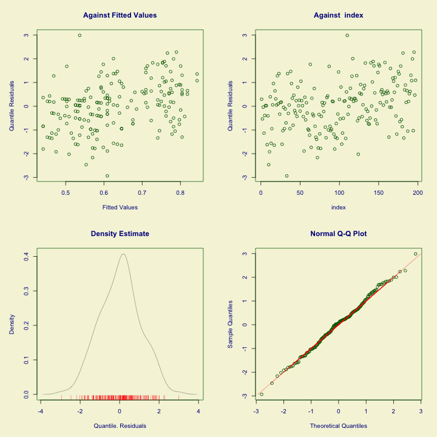
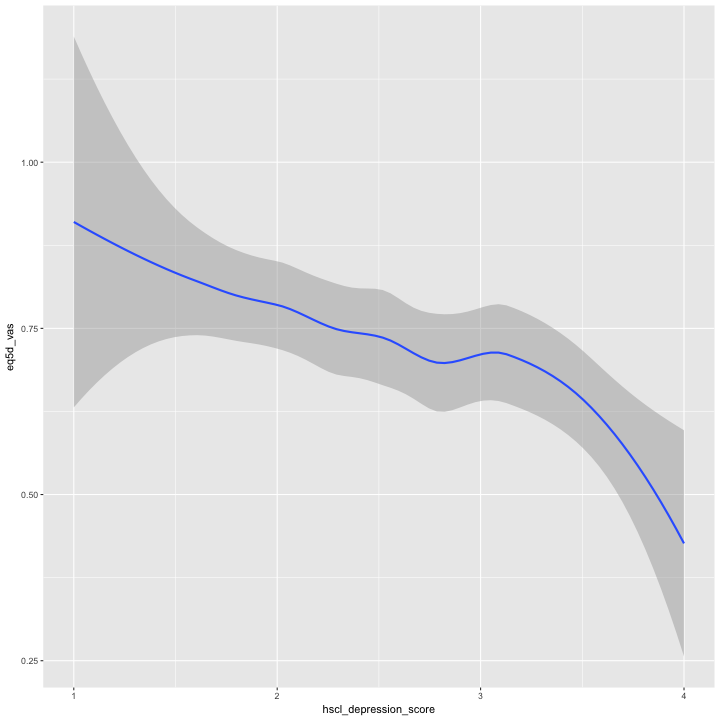
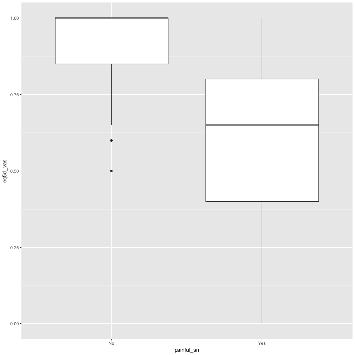

---
output:
  github_document:
    html_preview: false
---
# Two signs of neuropathy data only

## Factors associated with having reduced quality of life in patients with HIV-SN
_(painful or non-painful HIV-SN)_

### Authors
Peter Kamerman, Antonia Wadley, Prinisha Pillay

**Date: January 15, 2017**

***

## Session setup


## Load data

```r
data <- read_csv('./data/qol-pain-vs-no-pain.csv')
```

## Quick look

```r
dim(data)
```

```
## [1] 197   8
```

```r
names(data)
```

```
## [1] "eq5d_vas"              "age"                   "painful_sn"           
## [4] "other_pain_sites"      "sex"                   "education"            
## [7] "hscl_anxiety_score"    "hscl_depression_score"
```

```r
head(data)
```

```
## # A tibble: 6 × 8
##   eq5d_vas   age painful_sn other_pain_sites    sex education
##      <int> <int>      <chr>            <chr>  <chr>     <int>
## 1       80    44        Yes              yes female         5
## 2       50    46        Yes              yes   male         6
## 3       70    67        Yes              yes female         4
## 4       30    47        Yes              yes female         6
## 5       60    61        Yes              yes   male         5
## 6       80    48        Yes              yes   male         6
## # ... with 2 more variables: hscl_anxiety_score <dbl>,
## #   hscl_depression_score <dbl>
```

```r
tail(data)
```

```
## # A tibble: 6 × 8
##   eq5d_vas   age painful_sn other_pain_sites    sex education
##      <int> <int>      <chr>            <chr>  <chr>     <int>
## 1      100    56         No              yes   male         5
## 2      100    37         No               no female         6
## 3       60    45         No               no female         6
## 4      100    40         No               no female         8
## 5      100    55         No               no female         5
## 6      100    34         No               no female         7
## # ... with 2 more variables: hscl_anxiety_score <dbl>,
## #   hscl_depression_score <dbl>
```

```r
glimpse(data)
```

```
## Observations: 197
## Variables: 8
## $ eq5d_vas              <int> 80, 50, 70, 30, 60, 80, 70, 20, 60, 0, 1...
## $ age                   <int> 44, 46, 67, 47, 61, 48, 44, 48, 32, 40, ...
## $ painful_sn            <chr> "Yes", "Yes", "Yes", "Yes", "Yes", "Yes"...
## $ other_pain_sites      <chr> "yes", "yes", "yes", "yes", "yes", "yes"...
## $ sex                   <chr> "female", "male", "female", "female", "m...
## $ education             <int> 5, 6, 4, 6, 5, 6, 5, 6, 6, 5, 0, 3, 5, 4...
## $ hscl_anxiety_score    <dbl> 1.5, 2.9, 3.5, 3.6, 1.9, 1.1, 1.8, 2.4, ...
## $ hscl_depression_score <dbl> 3.27, 2.87, 2.60, 3.13, 2.33, 1.67, 2.87...
```

```r
summary(data)
```

```
##     eq5d_vas           age         painful_sn        other_pain_sites  
##  Min.   :  0.00   Min.   :20.00   Length:197         Length:197        
##  1st Qu.: 50.00   1st Qu.:35.00   Class :character   Class :character  
##  Median : 80.00   Median :42.00   Mode  :character   Mode  :character  
##  Mean   : 72.55   Mean   :43.23                                        
##  3rd Qu.:100.00   3rd Qu.:52.00                                        
##  Max.   :100.00   Max.   :74.00                                        
##      sex              education      hscl_anxiety_score
##  Length:197         Min.   : 0.000   Min.   :1.00      
##  Class :character   1st Qu.: 5.000   1st Qu.:2.10      
##  Mode  :character   Median : 6.000   Median :2.60      
##                     Mean   : 6.127   Mean   :2.72      
##                     3rd Qu.: 8.000   3rd Qu.:3.40      
##                     Max.   :10.000   Max.   :4.00      
##  hscl_depression_score
##  Min.   :1.000        
##  1st Qu.:2.000        
##  Median :2.530        
##  Mean   :2.584        
##  3rd Qu.:3.070        
##  Max.   :4.000
```

## Process data

```r
data.gam <- data %>%
    mutate(eq5d_vas = eq5d_vas/100, # Convert to a proportion
           painful_sn = factor(painful_sn), # Convert to a factor
           other_pain_sites = factor(other_pain_sites), # Convert to a factor
           sex = factor(sex)) %>% # Convert to a factor
    filter(complete.cases(.)) # Retain complete cases only

# Check dimensions after removing incomplete cases
dim(data.gam)
```

```
## [1] 197   8
```

## Build model
### Generalized Additive Model 
_(with extended beta inflated distribution)_

```r
# GAM on full model (all variables p<0.1 on univariate analysis: age, painful_sn, 
# other_pain_sites, sex, education, depression, anxiety).
# Use beta-inflated distribution [0, 1] for VAS data
# Select best model using generalized Akaike's information criterion (AIC).

# Model
mod.gam <- gamlss(eq5d_vas ~ 
                      painful_sn +
                      other_pain_sites +
                      age +
                      sex +
                      hscl_depression_score +
                      hscl_anxiety_score +
                      education, 
           data = data.gam,
           family = BEINF())
```

```
## GAMLSS-RS iteration 1: Global Deviance = 202.2598 
## GAMLSS-RS iteration 2: Global Deviance = 201.3574 
## GAMLSS-RS iteration 3: Global Deviance = 201.3548 
## GAMLSS-RS iteration 4: Global Deviance = 201.3548
```

```r
# Model summary 
summary(mod.gam)
```

```
## ******************************************************************
## Family:  c("BEINF", "Beta Inflated") 
## 
## Call:  gamlss(formula = eq5d_vas ~ painful_sn + other_pain_sites + age +  
##     sex + hscl_depression_score + hscl_anxiety_score + education,  
##     family = BEINF(), data = data.gam) 
## 
## Fitting method: RS() 
## 
## ------------------------------------------------------------------
## Mu link function:  logit
## Mu Coefficients:
##                        Estimate Std. Error t value Pr(>|t|)   
## (Intercept)            2.019464   0.765598   2.638  0.00904 **
## painful_snYes         -0.833296   0.405793  -2.054  0.04140 * 
## other_pain_sitesyes   -0.086110   0.440027  -0.196  0.84506   
## age                    0.001877   0.008758   0.214  0.83056   
## sexmale                0.053379   0.180806   0.295  0.76815   
## hscl_depression_score -0.298269   0.125112  -2.384  0.01811 * 
## hscl_anxiety_score    -0.059806   0.111319  -0.537  0.59173   
## education             -0.002123   0.049391  -0.043  0.96577   
## ---
## Signif. codes:  0 '***' 0.001 '**' 0.01 '*' 0.05 '.' 0.1 ' ' 1
## 
## ------------------------------------------------------------------
## Sigma link function:  logit
## Sigma Coefficients:
##             Estimate Std. Error t value Pr(>|t|)    
## (Intercept) -0.32154    0.07917  -4.062 7.05e-05 ***
## ---
## Signif. codes:  0 '***' 0.001 '**' 0.01 '*' 0.05 '.' 0.1 ' ' 1
## 
## ------------------------------------------------------------------
## Nu link function:  log 
## Nu Coefficients:
##             Estimate Std. Error t value Pr(>|t|)    
## (Intercept)  -4.1821     0.7107  -5.884 1.71e-08 ***
## ---
## Signif. codes:  0 '***' 0.001 '**' 0.01 '*' 0.05 '.' 0.1 ' ' 1
## 
## ------------------------------------------------------------------
## Tau link function:  log 
## Tau Coefficients:
##             Estimate Std. Error t value Pr(>|t|)    
## (Intercept)  -0.7163     0.1521  -4.709 4.71e-06 ***
## ---
## Signif. codes:  0 '***' 0.001 '**' 0.01 '*' 0.05 '.' 0.1 ' ' 1
## 
## ------------------------------------------------------------------
## No. of observations in the fit:  197 
## Degrees of Freedom for the fit:  11
##       Residual Deg. of Freedom:  186 
##                       at cycle:  4 
##  
## Global Deviance:     201.3548 
##             AIC:     223.3548 
##             SBC:     259.47 
## ******************************************************************
```

```r
# Use stepGAIC to select best models based on GAIC
step.gam <- stepGAIC(mod.gam)
```

```
## Distribution parameter:  mu 
## Start:  AIC= 223.35 
##  eq5d_vas ~ painful_sn + other_pain_sites + age + sex + hscl_depression_score +  
##     hscl_anxiety_score + education 
## 
## Model with term  painful_sn has failed 
## Model with term  other_pain_sites has failed 
## Model with term  age has failed 
## Model with term  sex has failed 
## Model with term  hscl_depression_score has failed 
## Model with term  hscl_anxiety_score has failed 
## Model with term  education has failed 
##                         Df    AIC
## <none>                     223.35
## - painful_sn                     
## - other_pain_sites               
## - age                            
## - sex                            
## - hscl_depression_score          
## - hscl_anxiety_score             
## - education
```

```r
step.gam$anova
```

```
## Stepwise Model Path 
## Analysis of Deviance Table
## 
## Initial
## mu
##  Model:
## eq5d_vas ~ painful_sn + other_pain_sites + age + sex + hscl_depression_score + 
##     hscl_anxiety_score + education
## 
## Final
## mu
##  Model:
## eq5d_vas ~ painful_sn + other_pain_sites + age + sex + hscl_depression_score + 
##     hscl_anxiety_score + education
## 
## 
##   Step Df Deviance Resid. Df Resid. Dev      AIC
## 1                        186   201.3548 223.3548
```

```r
summary(step.gam)
```

```
## ******************************************************************
## Family:  c("BEINF", "Beta Inflated") 
## 
## Call:  gamlss(formula = eq5d_vas ~ painful_sn + other_pain_sites + age +  
##     sex + hscl_depression_score + hscl_anxiety_score + education,  
##     family = BEINF(), data = data.gam) 
## 
## Fitting method: RS() 
## 
## ------------------------------------------------------------------
## Mu link function:  logit
## Mu Coefficients:
##                        Estimate Std. Error t value Pr(>|t|)   
## (Intercept)            2.019464   0.765598   2.638  0.00904 **
## painful_snYes         -0.833296   0.405793  -2.054  0.04140 * 
## other_pain_sitesyes   -0.086110   0.440027  -0.196  0.84506   
## age                    0.001877   0.008758   0.214  0.83056   
## sexmale                0.053379   0.180806   0.295  0.76815   
## hscl_depression_score -0.298269   0.125112  -2.384  0.01811 * 
## hscl_anxiety_score    -0.059806   0.111319  -0.537  0.59173   
## education             -0.002123   0.049391  -0.043  0.96577   
## ---
## Signif. codes:  0 '***' 0.001 '**' 0.01 '*' 0.05 '.' 0.1 ' ' 1
## 
## ------------------------------------------------------------------
## Sigma link function:  logit
## Sigma Coefficients:
##             Estimate Std. Error t value Pr(>|t|)    
## (Intercept) -0.32154    0.07917  -4.062 7.05e-05 ***
## ---
## Signif. codes:  0 '***' 0.001 '**' 0.01 '*' 0.05 '.' 0.1 ' ' 1
## 
## ------------------------------------------------------------------
## Nu link function:  log 
## Nu Coefficients:
##             Estimate Std. Error t value Pr(>|t|)    
## (Intercept)  -4.1821     0.7107  -5.884 1.71e-08 ***
## ---
## Signif. codes:  0 '***' 0.001 '**' 0.01 '*' 0.05 '.' 0.1 ' ' 1
## 
## ------------------------------------------------------------------
## Tau link function:  log 
## Tau Coefficients:
##             Estimate Std. Error t value Pr(>|t|)    
## (Intercept)  -0.7163     0.1521  -4.709 4.71e-06 ***
## ---
## Signif. codes:  0 '***' 0.001 '**' 0.01 '*' 0.05 '.' 0.1 ' ' 1
## 
## ------------------------------------------------------------------
## No. of observations in the fit:  197 
## Degrees of Freedom for the fit:  11
##       Residual Deg. of Freedom:  186 
##                       at cycle:  4 
##  
## Global Deviance:     201.3548 
##             AIC:     223.3548 
##             SBC:     259.47 
## ******************************************************************
```

```r
# OUTCOME: Final model retains hscl_depression_score

# Fit reduced model
mod.gam.new <- gamlss(eq5d_vas ~ 
                          painful_sn +
                          hscl_depression_score,
           data = data.gam,
           family = BEINF())
```

```
## GAMLSS-RS iteration 1: Global Deviance = 202.7184 
## GAMLSS-RS iteration 2: Global Deviance = 201.8527 
## GAMLSS-RS iteration 3: Global Deviance = 201.8503 
## GAMLSS-RS iteration 4: Global Deviance = 201.8503
```

```r
# Diagnostic plots
plot(mod.gam.new)
```



```
## ******************************************************************
## 	 Summary of the Randomised Quantile Residuals
##                            mean   =  0.02098439 
##                        variance   =  1.06395 
##                coef. of skewness  =  -0.005516109 
##                coef. of kurtosis  =  2.819203 
## Filliben correlation coefficient  =  0.9982065 
## ******************************************************************
```

```r
# OUTCOME: No pattern in residual vs fitted plot, 
# and residuals normally distributed

# Plot
library(ggplot2)
## hscl_depression_score
ggplot(data.gam, 
       aes(x = hscl_depression_score, y = eq5d_vas)) +
    geom_smooth()
```



```r
## OUTCOME: As depression score increases, QoL decreases.

## painful_sn
ggplot(data.gam, 
       aes(x = painful_sn, y = eq5d_vas)) +
    geom_boxplot()
```



```r
## OUTCOME: Presence of painful SN associated with 
## reduced QoL.
```

## Session information

```r
sessionInfo()
```

```
## R version 3.3.2 (2016-10-31)
## Platform: x86_64-apple-darwin13.4.0 (64-bit)
## Running under: macOS Sierra 10.12.2
## 
## locale:
## [1] en_GB.UTF-8/en_GB.UTF-8/en_GB.UTF-8/C/en_GB.UTF-8/en_GB.UTF-8
## 
## attached base packages:
## [1] parallel  methods   splines   stats     graphics  grDevices utils    
## [8] datasets  base     
## 
## other attached packages:
##  [1] ggplot2_2.2.1     gamlss_5.0-1      nlme_3.1-128     
##  [4] gamlss.dist_5.0-0 MASS_7.3-45       gamlss.data_5.0-0
##  [7] tidyr_0.6.1       dplyr_0.5.0       readr_1.0.0      
## [10] svglite_1.2.0     knitr_1.15.1     
## 
## loaded via a namespace (and not attached):
##  [1] Rcpp_0.12.9       magrittr_1.5      munsell_0.4.3    
##  [4] colorspace_1.3-2  lattice_0.20-34   R6_2.2.0         
##  [7] highr_0.6         plyr_1.8.4        stringr_1.1.0    
## [10] tools_3.3.2       grid_3.3.2        gtable_0.2.0     
## [13] R.oo_1.21.0       DBI_0.5-1         lazyeval_0.2.0   
## [16] survival_2.40-1   assertthat_0.1    tibble_1.2       
## [19] Matrix_1.2-7.1    ezknitr_0.6       R.utils_2.5.0    
## [22] evaluate_0.10     labeling_0.3      stringi_1.1.2    
## [25] scales_0.4.1      gdtools_0.1.3     R.methodsS3_1.7.1
```
