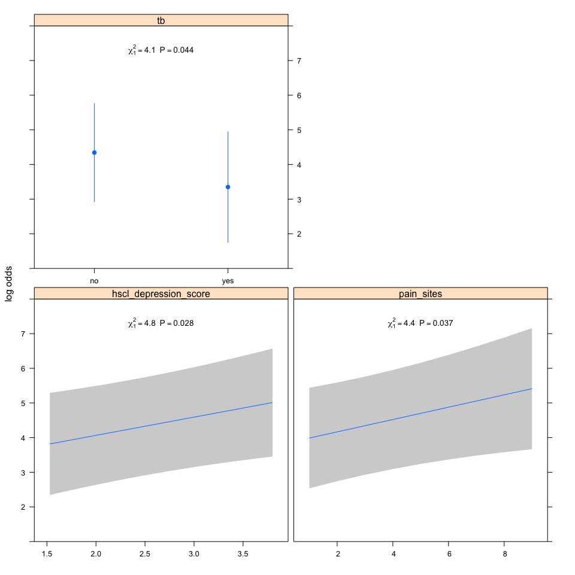

Factors associated with having greater pain in patients with painful HIV-SN
---------------------------------------------------------------------------

### Authors

Peter Kamerman, Antonia Wadley, Prinisha Pillay

**Date: March 04, 2016**

------------------------------------------------------------------------

Session setup
-------------

Load data
---------

``` r
data <- read_csv('./data/pain-intensity.csv')
```

Quick look
----------

``` r
dim(data)
```

    ## [1] 129   6

``` r
names(data)
```

    ## [1] "pain_intensity"        "pain_sites"            "hscl_depression_score"
    ## [4] "hscl_anxiety_score"    "pcs"                   "tb"

``` r
head(data)
```

    ## Source: local data frame [6 x 6]
    ## 
    ##   pain_intensity pain_sites hscl_depression_score hscl_anxiety_score   pcs
    ##            (int)      (int)                 (dbl)              (dbl) (dbl)
    ## 1             10          3                  3.27                1.5  2.77
    ## 2             10          8                  2.87                2.9  0.77
    ## 3             10          5                  2.60                3.5  4.00
    ## 4             10          4                  3.13                3.6  3.38
    ## 5             10          7                  2.33                1.9  0.92
    ## 6              5          3                  1.67                1.1  1.38
    ## Variables not shown: tb (chr)

``` r
tail(data)
```

    ## Source: local data frame [6 x 6]
    ## 
    ##   pain_intensity pain_sites hscl_depression_score hscl_anxiety_score   pcs
    ##            (int)      (int)                 (dbl)              (dbl) (dbl)
    ## 1             10          5                  2.73                3.1  3.69
    ## 2             10          3                  2.87                2.3  3.54
    ## 3              5          9                  2.00                1.7  1.77
    ## 4             10          8                  2.60                3.3  3.23
    ## 5              8          5                  3.20                2.6  1.85
    ## 6             10          4                  3.00                3.6  3.38
    ## Variables not shown: tb (chr)

``` r
glimpse(data)
```

    ## Observations: 129
    ## Variables: 6
    ## $ pain_intensity        (int) 10, 10, 10, 10, 10, 5, 7, 10, 5, 5, 10, ...
    ## $ pain_sites            (int) 3, 8, 5, 4, 7, 3, 7, 6, 7, 1, 3, 2, 9, 3...
    ## $ hscl_depression_score (dbl) 3.27, 2.87, 2.60, 3.13, 2.33, 1.67, 2.87...
    ## $ hscl_anxiety_score    (dbl) 1.5, 2.9, 3.5, 3.6, 1.9, 1.1, 1.8, 2.4, ...
    ## $ pcs                   (dbl) 2.77, 0.77, 4.00, 3.38, 0.92, 1.38, 2.85...
    ## $ tb                    (chr) "no", "no", "no", "yes", "no", "no", "ye...

``` r
summary(data)
```

    ##  pain_intensity     pain_sites    hscl_depression_score hscl_anxiety_score
    ##  Min.   : 1.000   Min.   :1.000   Min.   :1.200         Min.   :1.100     
    ##  1st Qu.: 5.000   1st Qu.:2.000   1st Qu.:2.000         1st Qu.:2.100     
    ##  Median : 7.000   Median :3.000   Median :2.530         Median :2.600     
    ##  Mean   : 6.984   Mean   :3.341   Mean   :2.616         Mean   :2.716     
    ##  3rd Qu.:10.000   3rd Qu.:4.000   3rd Qu.:3.130         3rd Qu.:3.400     
    ##  Max.   :10.000   Max.   :9.000   Max.   :4.000         Max.   :4.000     
    ##       pcs            tb           
    ##  Min.   :0.00   Length:129        
    ##  1st Qu.:1.69   Class :character  
    ##  Median :2.69   Mode  :character  
    ##  Mean   :2.39                     
    ##  3rd Qu.:3.23                     
    ##  Max.   :4.00

Process data
------------

``` r
data.olr <- data %>%
    mutate(pain_intensity = factor(pain_intensity, ordered = TRUE), # Convert 'pain_intensity' to an ordered factor
           tb = factor(tb)) %>% # Convert 'tb' to a factor
    filter(complete.cases(.)) # Retain complete cases only
```

Build model
-----------

### Ordinal logistic regression

``` r
# Ordinal logistic regression on full model (all variables p<0.1 on univariate analysis, 
# number of pain sites, mean depression score, mean anxiety score, PCS score, and 
# whether currently on treatment for TB).
# Pain intensity as an ordinal measure ("data" data.frame).
# Select best model using Akaike's information criterion (AIC).

# Model
## Use MASS::polr for this step because output is compatible with MuMIn
mod.olr <- polr(pain_intensity ~ pain_sites + 
               hscl_depression_score +
               hscl_anxiety_score +
               pcs +
               tb, 
           data = data.olr,
           Hess=T)
# Model summary 
summary(mod.olr)
```

    ## Call:
    ## polr(formula = pain_intensity ~ pain_sites + hscl_depression_score + 
    ##     hscl_anxiety_score + pcs + tb, data = data.olr, Hess = T)
    ## 
    ## Coefficients:
    ##                          Value Std. Error  t value
    ## pain_sites             0.16529    0.09046  1.82726
    ## hscl_depression_score  0.44835    0.28775  1.55814
    ## hscl_anxiety_score     0.01775    0.25155  0.07056
    ## pcs                    0.15242    0.16367  0.93128
    ## tbyes                 -0.86984    0.50951 -1.70721
    ## 
    ## Intercepts:
    ##      Value   Std. Error t value
    ## 1|2  -2.3225  0.9911    -2.3435
    ## 2|3  -0.5398  0.7585    -0.7117
    ## 3|4   0.1693  0.7371     0.2297
    ## 4|5   0.5187  0.7359     0.7048
    ## 5|6   1.5662  0.7505     2.0867
    ## 6|7   1.8497  0.7585     2.4385
    ## 7|8   2.0623  0.7661     2.6919
    ## 8|9   2.4486  0.7793     3.1422
    ## 9|10  2.5533  0.7822     3.2643
    ## 
    ## Residual Deviance: 471.0535 
    ## AIC: 499.0535

``` r
# Use "dredge" to select best models based on AIC
dredge.olr <- dredge(mod.olr, beta = FALSE, evaluate = TRUE, rank = "AIC")

# Build a model selection table
mod.olr.sel <- model.sel(dredge.olr)

# Subset those models that show an change in AIC 
# of 2 or less (not different from each other)
get.mod.olr <- get.models(mod.olr.sel, subset = delta < 2)
get.mod.olr
```

    ## $`23`
    ## Call:
    ## polr(formula = pain_intensity ~ hscl_depression_score + pain_sites + 
    ##     tb + 1, data = data.olr, Hess = T)
    ## 
    ## Coefficients:
    ## hscl_depression_score            pain_sites                 tbyes 
    ##             0.5256317             0.1780440            -0.9941034 
    ## 
    ## Intercepts:
    ##         1|2         2|3         3|4         4|5         5|6         6|7 
    ## -2.47939785 -0.69669849  0.01057285  0.35768052  1.39439558  1.67394562 
    ##         7|8         8|9        9|10 
    ##  1.88384649  2.26701891  2.37102115 
    ## 
    ## Residual Deviance: 471.9416 
    ## AIC: 495.9416 
    ## 
    ## $`31`
    ## Call:
    ## polr(formula = pain_intensity ~ hscl_depression_score + pain_sites + 
    ##     pcs + tb + 1, data = data.olr, Hess = T)
    ## 
    ## Coefficients:
    ## hscl_depression_score            pain_sites                   pcs 
    ##             0.4584674             0.1672213             0.1534304 
    ##                 tbyes 
    ##            -0.8686040 
    ## 
    ## Intercepts:
    ##        1|2        2|3        3|4        4|5        5|6        6|7 
    ## -2.3347903 -0.5521968  0.1570069  0.5065000  1.5536933  1.8371507 
    ##        7|8        8|9       9|10 
    ##  2.0498145  2.4360990  2.5407946 
    ## 
    ## Residual Deviance: 471.0585 
    ## AIC: 497.0585 
    ## 
    ## $`24`
    ## Call:
    ## polr(formula = pain_intensity ~ hscl_anxiety_score + hscl_depression_score + 
    ##     pain_sites + tb + 1, data = data.olr, Hess = T)
    ## 
    ## Coefficients:
    ##    hscl_anxiety_score hscl_depression_score            pain_sites 
    ##            0.03820901            0.50277810            0.17359347 
    ##                 tbyes 
    ##           -0.99495226 
    ## 
    ## Intercepts:
    ##         1|2         2|3         3|4         4|5         5|6         6|7 
    ## -2.45163552 -0.66861299  0.03843447  0.38528207  1.42277283  1.70250827 
    ##         7|8         8|9        9|10 
    ##  1.91233257  2.29558717  2.39967241 
    ## 
    ## Residual Deviance: 471.9184 
    ## AIC: 497.9184 
    ## 
    ## $`7`
    ## Call:
    ## polr(formula = pain_intensity ~ hscl_depression_score + pain_sites + 
    ##     1, data = data.olr, Hess = T)
    ## 
    ## Coefficients:
    ## hscl_depression_score            pain_sites 
    ##             0.5062935             0.1714637 
    ## 
    ## Intercepts:
    ##        1|2        2|3        3|4        4|5        5|6        6|7 
    ## -2.3681813 -0.5904006  0.1000815  0.4344169  1.4387467  1.7105103 
    ##        7|8        8|9       9|10 
    ##  1.9137151  2.2870235  2.3895613 
    ## 
    ## Residual Deviance: 475.925 
    ## AIC: 497.925 
    ## 
    ## $`15`
    ## Call:
    ## polr(formula = pain_intensity ~ hscl_depression_score + pain_sites + 
    ##     pcs + 1, data = data.olr, Hess = T)
    ## 
    ## Coefficients:
    ## hscl_depression_score            pain_sites                   pcs 
    ##             0.4071641             0.1575765             0.2234541 
    ## 
    ## Intercepts:
    ##        1|2        2|3        3|4        4|5        5|6        6|7 
    ## -2.1837910 -0.4064355  0.2896706  0.6297519  1.6534610  1.9318956 
    ##        7|8        8|9       9|10 
    ##  2.1399610  2.5192099  2.6229819 
    ## 
    ## Residual Deviance: 473.9344 
    ## AIC: 497.9344 
    ## 
    ## attr(,"rank")
    ## function (x) 
    ## do.call("rank", list(x))
    ## <environment: 0x7fb4c0ed6000>
    ## attr(,"rank")attr(,"call")
    ## AIC(x)
    ## attr(,"rank")attr(,"class")
    ## [1] "function"     "rankFunction"
    ## attr(,"beta")
    ## [1] "none"

``` r
# Average across the subsetted models
mod.avg.olr <- model.avg(get.mod.olr)
summary(mod.avg.olr)
```

    ## 
    ## Call:
    ## model.avg(object = get.mod.olr)
    ## 
    ## Component model call: 
    ## polr(formula = pain_intensity ~ <5 unique rhs>, data = data.olr, 
    ##      Hess = T)
    ## 
    ## Component models: 
    ##      df  logLik    AIC delta weight
    ## 235  12 -235.97 495.94  0.00   0.37
    ## 2345 13 -235.53 497.06  1.12   0.21
    ## 1235 13 -235.96 497.92  1.98   0.14
    ## 23   11 -237.96 497.93  1.98   0.14
    ## 234  12 -236.97 497.93  1.99   0.14
    ## 
    ## Term codes: 
    ##    hscl_anxiety_score hscl_depression_score            pain_sites 
    ##                     1                     2                     3 
    ##                   pcs                    tb 
    ##                     4                     5 
    ## 
    ## Model-averaged coefficients:  
    ## (full average) 
    ##                        Estimate Std. Error Adjusted SE z value Pr(>|z|)   
    ## hscl_depression_score  0.489183   0.251817    0.254385   1.923  0.05448 . 
    ## pain_sites             0.171396   0.086359    0.087258   1.964  0.04950 * 
    ## tbyes                 -0.693381   0.604204    0.607333   1.142  0.25359   
    ## 1|2                   -2.388705   0.976143    0.986258   2.422  0.01544 * 
    ## 2|3                   -0.607398   0.737860    0.745450   0.815  0.41518   
    ## 3|4                    0.096398   0.715134    0.722490   0.133  0.89386   
    ## 4|5                    0.441247   0.713551    0.720894   0.612  0.54048   
    ## 5|6                    1.474039   0.725571    0.733044   2.011  0.04434 * 
    ## 6|7                    1.753218   0.732875    0.740424   2.368  0.01789 * 
    ## 7|8                    1.962519   0.740276    0.747903   2.624  0.00869 **
    ## 8|9                    2.344463   0.753090    0.760852   3.081  0.00206 **
    ## 9|10                   2.448391   0.755875    0.763666   3.206  0.00135 **
    ## pcs                    0.063432   0.130225    0.130961   0.484  0.62813   
    ## hscl_anxiety_score     0.005297   0.094237    0.095211   0.056  0.95563   
    ##  
    ## (conditional average) 
    ##                       Estimate Std. Error Adjusted SE z value Pr(>|z|)   
    ## hscl_depression_score  0.48918    0.25182     0.25438   1.923  0.05448 . 
    ## pain_sites             0.17140    0.08636     0.08726   1.964  0.04950 * 
    ## tbyes                 -0.95734    0.50134     0.50653   1.890  0.05876 . 
    ## 1|2                   -2.38871    0.97614     0.98626   2.422  0.01544 * 
    ## 2|3                   -0.60740    0.73786     0.74545   0.815  0.41518   
    ## 3|4                    0.09640    0.71513     0.72249   0.133  0.89386   
    ## 4|5                    0.44125    0.71355     0.72089   0.612  0.54048   
    ## 5|6                    1.47404    0.72557     0.73304   2.011  0.04434 * 
    ## 6|7                    1.75322    0.73288     0.74042   2.368  0.01789 * 
    ## 7|8                    1.96252    0.74028     0.74790   2.624  0.00869 **
    ## 8|9                    2.34446    0.75309     0.76085   3.081  0.00206 **
    ## 9|10                   2.44839    0.75587     0.76367   3.206  0.00135 **
    ## pcs                    0.18090    0.16466     0.16632   1.088  0.27675   
    ## hscl_anxiety_score     0.03821    0.25059     0.25323   0.151  0.88007   
    ## ---
    ## Signif. codes:  0 '***' 0.001 '**' 0.01 '*' 0.05 '.' 0.1 ' ' 1
    ## 
    ## Relative variable importance: 
    ##                      hscl_depression_score pain_sites tb   pcs 
    ## Importance:          1.00                  1.00       0.72 0.35
    ## N containing models:    5                     5          3    2
    ##                      hscl_anxiety_score
    ## Importance:          0.14              
    ## N containing models:    1

``` r
# Made a priori choice to only take variables that occur in >50% of models
# OUTCOME: hscl_depression_score and pain_sites occur in all 5 models
# OUTCOME: Current treatment for tb found in 3/5 models
# OUTCOME: Take 'hscl_depression_score, pain_sites, tb through to 
# next stage of analysis

# New model
## Use rms::lrm for this stage because better fit 
## indicators than MASS::polr
attach(data.olr)
d <- datadist(hscl_depression_score, 
              pain_sites, 
              tb)
detach(data.olr)
options(datadist = "d")
mod.olr.new<-lrm(pain_intensity ~ hscl_depression_score +
                     pain_sites + 
                     tb, 
              data = data.olr, 
              x = TRUE, y = TRUE, 
              linear.predictors = TRUE)

# Model summary
mod.olr.new
```

    ## 
    ## Logistic Regression Model
    ## 
    ## lrm(formula = pain_intensity ~ hscl_depression_score + pain_sites + 
    ##     tb, data = data.olr, x = TRUE, y = TRUE, linear.predictors = TRUE)
    ## Frequencies of Responses
    ## 
    ##  1  2  3  4  5  6  7  8  9 10 
    ##  2  9  9  6 25  8  6 11  3 50 
    ## 
    ##                      Model Likelihood     Discrimination    Rank Discrim.    
    ##                         Ratio Test            Indexes          Indexes       
    ## Obs           129    LR chi2     12.25    R2       0.093    C       0.627    
    ## max |deriv| 6e-12    d.f.            3    g        0.663    Dxy     0.254    
    ##                      Pr(> chi2) 0.0066    gr       1.941    gamma   0.256    
    ##                                           gp       0.150    tau-a   0.201    
    ##                                           Brier    0.222                     
    ## 
    ##                       Coef    S.E.   Wald Z Pr(>|Z|)
    ## y>=2                   2.4794 0.9675  2.56  0.0104  
    ## y>=3                   0.6967 0.7259  0.96  0.3372  
    ## y>=4                  -0.0106 0.7023 -0.02  0.9880  
    ## y>=5                  -0.3577 0.7004 -0.51  0.6096  
    ## y>=6                  -1.3944 0.7110 -1.96  0.0498  
    ## y>=7                  -1.6739 0.7178 -2.33  0.0197  
    ## y>=8                  -1.8838 0.7249 -2.60  0.0094  
    ## y>=9                  -2.2670 0.7376 -3.07  0.0021  
    ## y>=10                 -2.3710 0.7403 -3.20  0.0014  
    ## hscl_depression_score  0.5256 0.2389  2.20  0.0278  
    ## pain_sites             0.1780 0.0852  2.09  0.0367  
    ## tb=yes                -0.9941 0.4933 -2.02  0.0439

``` r
summary(mod.olr.new)
```

    ##              Effects              Response : pain_intensity 
    ## 
    ##  Factor                Low High Diff. Effect   S.E.    Lower 0.95
    ##  hscl_depression_score 2   3.13 1.13   0.59396 0.26997  0.06483  
    ##   Odds Ratio           2   3.13 1.13   1.81120      NA  1.06700  
    ##  pain_sites            2   4.00 2.00   0.35609 0.17046  0.02199  
    ##   Odds Ratio           2   4.00 2.00   1.42770      NA  1.02220  
    ##  tb - yes:no           1   2.00   NA  -0.99410 0.49329 -1.96090  
    ##   Odds Ratio           1   2.00   NA   0.37006      NA  0.14073  
    ##  Upper 0.95
    ##   1.123100 
    ##   3.074400 
    ##   0.690180 
    ##   1.994100 
    ##  -0.027262 
    ##   0.973110

``` r
# Plot outcome with anova results
plot(Predict(mod.olr.new), 
     anova = anova(mod.olr.new),
     pval = TRUE)
```

<!-- -->

``` r
# OUTCOME: Model is significantly better than null model (p = 0.007), 
# OUTCOME: Poor predictive value: Nagelkerke R^2 = 0.09, C (AUROC) = 0.63
# OUTCOME: hscl_depression_score, pain_sites, and tb were all 
# independent risk factors
# OUTCOME: Increasing depression score => increased pain intensity
# OUTCOME: Increasing number of pain sites  => increased pain intenisty. 
# OUTCOME: Being treated for TB => reduced pain intensity

# Validate measures of fit using bootstrap sampling (B=999)
validate(mod.olr.new, 
         method = "boot", 
         B=999, 
         group = data.olr$pain_intensity)
```

    ##           index.orig training    test optimism index.corrected   n
    ## Dxy           0.2542   0.2838  0.2498   0.0339          0.2203 999
    ## R2            0.0928   0.1176  0.0800   0.0375          0.0552 999
    ## Intercept     0.0000   0.0000  0.0473  -0.0473          0.0473 999
    ## Slope         1.0000   1.0000  0.8718   0.1282          0.8718 999
    ## Emax          0.0000   0.0000  0.0385   0.0385          0.0385 999
    ## D             0.0872   0.1158  0.0737   0.0422          0.0451 999
    ## U            -0.0155  -0.0155 -2.3964   2.3808         -2.3964 999
    ## Q             0.1027   0.1314  2.4700  -2.3387          2.4414 999
    ## B             0.2219   0.2167  0.2253  -0.0086          0.2304 999
    ## g             0.6630   0.7339  0.6015   0.1325          0.5305 999
    ## gp            0.1504   0.1616  0.1371   0.0245          0.1258 999

``` r
# OUTCOME: see "index.corrected" for bootstrapped measures

# Test for multicolinearity using variance inflation factor (vif)
vif(mod.olr.new) # >4 is a problem
```

    ## hscl_depression_score            pain_sites                tb=yes 
    ##              1.008021              1.008342              1.004194

``` r
# OUTCOME: No evidence of multicolinearity between predictors
```

Session information
-------------------

``` r
sessionInfo()
```

    ## R version 3.2.3 (2015-12-10)
    ## Platform: x86_64-apple-darwin13.4.0 (64-bit)
    ## Running under: OS X 10.11.3 (El Capitan)
    ## 
    ## locale:
    ## [1] en_GB.UTF-8/en_GB.UTF-8/en_GB.UTF-8/C/en_GB.UTF-8/en_GB.UTF-8
    ## 
    ## attached base packages:
    ## [1] stats     graphics  grDevices utils     datasets  methods   base     
    ## 
    ## other attached packages:
    ##  [1] gdtools_0.0.7   rms_4.4-2       SparseM_1.7     Hmisc_3.17-2   
    ##  [5] ggplot2_2.1.0   Formula_1.2-1   survival_2.38-3 lattice_0.20-33
    ##  [9] MuMIn_1.15.6    MASS_7.3-45     tidyr_0.4.1     dplyr_0.4.3    
    ## [13] readr_0.2.2     svglite_1.1.0   knitr_1.12.3   
    ## 
    ## loaded via a namespace (and not attached):
    ##  [1] Rcpp_0.12.3         formatR_1.2.1       RColorBrewer_1.1-2 
    ##  [4] plyr_1.8.3          tools_3.2.3         rpart_4.1-10       
    ##  [7] digest_0.6.9        polspline_1.1.12    nlme_3.1-125       
    ## [10] evaluate_0.8        gtable_0.2.0        Matrix_1.2-3       
    ## [13] DBI_0.3.1           yaml_2.1.13         parallel_3.2.3     
    ## [16] mvtnorm_1.0-5       gridExtra_2.2.1     stringr_1.0.0      
    ## [19] cluster_2.0.3       MatrixModels_0.4-1  nnet_7.3-12        
    ## [22] stats4_3.2.3        grid_3.2.3          R6_2.1.2           
    ## [25] foreign_0.8-66      rmarkdown_0.9.5     multcomp_1.4-4     
    ## [28] TH.data_1.0-7       latticeExtra_0.6-28 magrittr_1.5       
    ## [31] codetools_0.2-14    scales_0.4.0        htmltools_0.3      
    ## [34] splines_3.2.3       assertthat_0.1      colorspace_1.2-6   
    ## [37] quantreg_5.21       sandwich_2.3-4      stringi_1.0-1      
    ## [40] acepack_1.3-3.3     lazyeval_0.1.10     munsell_0.4.3      
    ## [43] zoo_1.7-12
