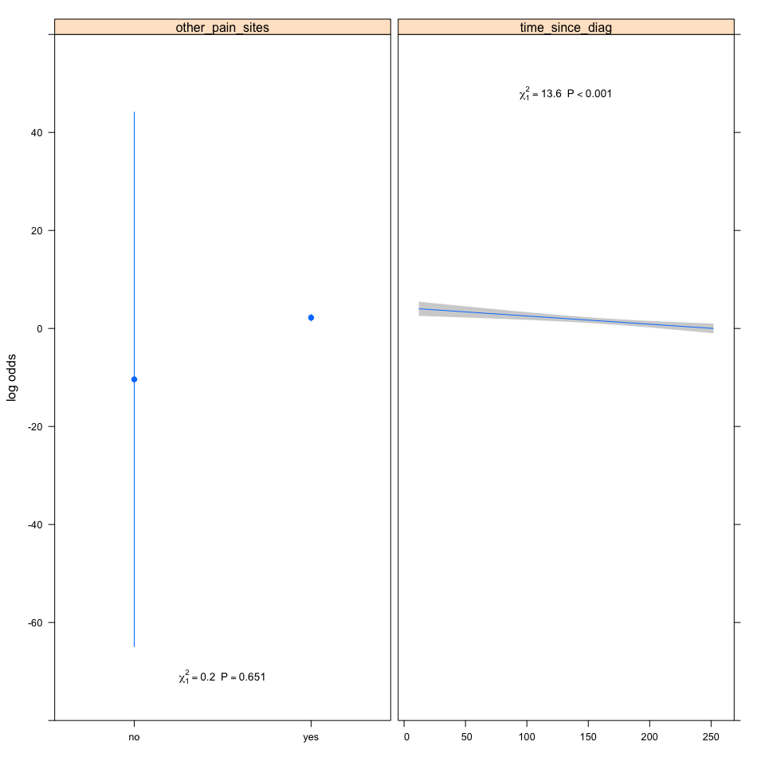

Factors associated with having pain in patients with HIV-SN
-----------------------------------------------------------

### Authors

Peter Kamerman, Antonia Wadley, Prinisha Pillay

**Date: March 10, 2016**

------------------------------------------------------------------------

Session setup
-------------

Load data
---------

``` r
data.lr <- read_csv('./data/pain-vs-no-pain.csv')
```

Quick look
----------

``` r
dim(data.lr)
```

    ## [1] 201   9

``` r
names(data.lr)
```

    ## [1] "painful_sn"       "height"           "mass"            
    ## [4] "age"              "time_since_diag"  "vitB12"          
    ## [7] "other_pain_sites" "current_cd4"      "sex"

``` r
head(data.lr)
```

    ## Source: local data frame [6 x 9]
    ## 
    ##   painful_sn height  mass   age time_since_diag vitB12 other_pain_sites
    ##        (chr)  (dbl) (dbl) (int)           (int)  (chr)            (chr)
    ## 1        yes  144.5  52.6    44              48     no              yes
    ## 2        yes  158.2  70.2    46             108     no              yes
    ## 3        yes  156.0  55.1    67              96     no              yes
    ## 4        yes  156.3  86.0    47             108     no              yes
    ## 5        yes  161.5  87.1    61             120     no              yes
    ## 6        yes  152.0  60.8    48              72     no              yes
    ## Variables not shown: current_cd4 (int), sex (chr)

``` r
tail(data.lr)
```

    ## Source: local data frame [6 x 9]
    ## 
    ##   painful_sn height  mass   age time_since_diag vitB12 other_pain_sites
    ##        (chr)  (dbl) (dbl) (int)           (int)  (chr)            (chr)
    ## 1         no  172.4  88.5    56              NA     no              yes
    ## 2         no     NA  69.8    37              NA     no               no
    ## 3         no     NA 110.0    45              NA     no               no
    ## 4         no     NA 104.9    40              NA     no               no
    ## 5         no     NA  58.5    55              NA     no               no
    ## 6         no     NA  62.9    34              NA     no               no
    ## Variables not shown: current_cd4 (int), sex (chr)

``` r
glimpse(data.lr)
```

    ## Observations: 201
    ## Variables: 9
    ## $ painful_sn       (chr) "yes", "yes", "yes", "yes", "yes", "yes", "ye...
    ## $ height           (dbl) 144.5, 158.2, 156.0, 156.3, 161.5, 152.0, 161...
    ## $ mass             (dbl) 52.6, 70.2, 55.1, 86.0, 87.1, 60.8, 78.0, 60....
    ## $ age              (int) 44, 46, 67, 47, 61, 48, 44, 48, 32, 40, 58, 4...
    ## $ time_since_diag  (int) 48, 108, 96, 108, 120, 72, 108, 108, 48, 96, ...
    ## $ vitB12           (chr) "no", "no", "no", "no", "no", "no", "no", "no...
    ## $ other_pain_sites (chr) "yes", "yes", "yes", "yes", "yes", "yes", "ye...
    ## $ current_cd4      (int) 343, 572, 826, 980, 206, 311, 742, 495, 231, ...
    ## $ sex              (chr) "female", "male", "female", "female", "male",...

``` r
summary(data.lr)
```

    ##   painful_sn            height           mass             age      
    ##  Length:201         Min.   :144.5   Min.   : 40.30   Min.   :20.0  
    ##  Class :character   1st Qu.:156.3   1st Qu.: 58.60   1st Qu.:35.0  
    ##  Mode  :character   Median :162.0   Median : 69.00   Median :42.0  
    ##                     Mean   :163.3   Mean   : 71.64   Mean   :43.1  
    ##                     3rd Qu.:169.1   3rd Qu.: 79.20   3rd Qu.:52.0  
    ##                     Max.   :190.5   Max.   :173.00   Max.   :74.0  
    ##                     NA's   :15                                     
    ##  time_since_diag    vitB12          other_pain_sites    current_cd4    
    ##  Min.   : 12.0   Length:201         Length:201         Min.   :  20.0  
    ##  1st Qu.: 72.0   Class :character   Class :character   1st Qu.: 253.0  
    ##  Median :120.0   Mode  :character   Mode  :character   Median : 414.0  
    ##  Mean   :119.9                                         Mean   : 480.1  
    ##  3rd Qu.:159.0                                         3rd Qu.: 661.0  
    ##  Max.   :264.0                                         Max.   :1606.0  
    ##  NA's   :41                                                            
    ##      sex           
    ##  Length:201        
    ##  Class :character  
    ##  Mode  :character  
    ##                    
    ##                    
    ##                    
    ## 

Process data
------------

``` r
data.lr <- data.lr[ , -c(4, 9)] # remove 'sex' and 'age' (p > 0.1 on univariate)
data.lr <- data.lr %>%
    mutate(painful_sn = factor(painful_sn), # Convert 'painful_sn' to a factor
           vitB12 = factor(vitB12), # Convert 'vitB12' to a factor
           other_pain_sites = factor(other_pain_sites)) %>% # Convert 'other_pain_sites' to a factor
    filter(complete.cases(.)) # Retain complete cases only

# Check dimensions after removing incomplete cases
dim(data.lr)
```

    ## [1] 160   7

Build model
-----------

### Logistic regression

``` r
# Logistic regression on full model (all variables p<0.1 on univariate analysis,
# time since HIV diagnosis, current CD4 T-cell count, presence of other pain sites, 
# vitamin B12 deficiency, mass, and height).
# Model to include interaction between time since HIV diagnosis 
# and current CD4 T-cell count.
# Select best model using Akaike's information criterion (AIC)

# Model
## Use MASS::polr for this step because output is compatible with MuMIn
mod.full <- glm(painful_sn ~
                    time_since_diag * current_cd4 +
                    other_pain_sites +
                    vitB12 +
                    mass +
                    height,
                data = data.lr, 
                family="binomial")
# Model summary 
summary(mod.full)
```

    ## 
    ## Call:
    ## glm(formula = painful_sn ~ time_since_diag * current_cd4 + other_pain_sites + 
    ##     vitB12 + mass + height, family = "binomial", data = data.lr)
    ## 
    ## Deviance Residuals: 
    ##      Min        1Q    Median        3Q       Max  
    ## -2.51893  -0.00006   0.24093   0.43964   1.37042  
    ## 
    ## Coefficients:
    ##                               Estimate Std. Error z value Pr(>|z|)
    ## (Intercept)                 -2.095e+01  1.618e+03  -0.013    0.990
    ## time_since_diag             -1.371e-02  8.689e-03  -1.578    0.115
    ## current_cd4                 -4.922e-04  2.333e-03  -0.211    0.833
    ## other_pain_sitesyes          2.177e+01  1.618e+03   0.013    0.989
    ## vitB12yes                   -1.423e-01  8.830e-01  -0.161    0.872
    ## mass                         2.128e-02  2.163e-02   0.984    0.325
    ## height                       1.298e-02  3.966e-02   0.327    0.743
    ## time_since_diag:current_cd4 -4.217e-06  1.400e-05  -0.301    0.763
    ## 
    ## (Dispersion parameter for binomial family taken to be 1)
    ## 
    ##     Null deviance: 205.917  on 159  degrees of freedom
    ## Residual deviance:  75.663  on 152  degrees of freedom
    ## AIC: 91.663
    ## 
    ## Number of Fisher Scoring iterations: 18

``` r
# Use "dredge" to select best models based on AIC
dredge.lr <- dredge(mod.full, beta = FALSE, evaluate = TRUE, rank = "AIC")

# Build a model selection table
mod.lr.sel <- model.sel(dredge.lr)

# Subset those models that show an change in AIC 
# of 2 or less (not different from each other)
get.mod.lr <- get.models(mod.lr.sel, subset = delta < 2)
get.mod.lr
```

    ## $`25`
    ## 
    ## Call:  glm(formula = painful_sn ~ other_pain_sites + time_since_diag + 
    ##     1, family = "binomial", data = data.lr)
    ## 
    ## Coefficients:
    ##         (Intercept)  other_pain_sitesyes      time_since_diag  
    ##           -17.51345             21.72887             -0.01674  
    ## 
    ## Degrees of Freedom: 159 Total (i.e. Null);  157 Residual
    ## Null Deviance:       205.9 
    ## Residual Deviance: 78.25     AIC: 84.25
    ## 
    ## $`26`
    ## 
    ## Call:  glm(formula = painful_sn ~ current_cd4 + other_pain_sites + time_since_diag + 
    ##     1, family = "binomial", data = data.lr)
    ## 
    ## Coefficients:
    ##         (Intercept)          current_cd4  other_pain_sitesyes  
    ##          -1.698e+01           -9.306e-04            2.169e+01  
    ##     time_since_diag  
    ##          -1.682e-02  
    ## 
    ## Degrees of Freedom: 159 Total (i.e. Null);  156 Residual
    ## Null Deviance:       205.9 
    ## Residual Deviance: 77.26     AIC: 85.26
    ## 
    ## $`29`
    ## 
    ## Call:  glm(formula = painful_sn ~ mass + other_pain_sites + time_since_diag + 
    ##     1, family = "binomial", data = data.lr)
    ## 
    ## Coefficients:
    ##         (Intercept)                 mass  other_pain_sitesyes  
    ##           -18.76133              0.01715             21.73361  
    ##     time_since_diag  
    ##            -0.01620  
    ## 
    ## Degrees of Freedom: 159 Total (i.e. Null);  156 Residual
    ## Null Deviance:       205.9 
    ## Residual Deviance: 77.41     AIC: 85.41
    ## 
    ## $`27`
    ## 
    ## Call:  glm(formula = painful_sn ~ height + other_pain_sites + time_since_diag + 
    ##     1, family = "binomial", data = data.lr)
    ## 
    ## Coefficients:
    ##         (Intercept)               height  other_pain_sitesyes  
    ##           -21.36863              0.02297             21.88834  
    ##     time_since_diag  
    ##            -0.01678  
    ## 
    ## Degrees of Freedom: 159 Total (i.e. Null);  156 Residual
    ## Null Deviance:       205.9 
    ## Residual Deviance: 77.88     AIC: 85.88
    ## 
    ## $`30`
    ## 
    ## Call:  glm(formula = painful_sn ~ current_cd4 + mass + other_pain_sites + 
    ##     time_since_diag + 1, family = "binomial", data = data.lr)
    ## 
    ## Coefficients:
    ##         (Intercept)          current_cd4                 mass  
    ##          -18.467389            -0.001167             0.021975  
    ## other_pain_sitesyes      time_since_diag  
    ##           21.699975            -0.016134  
    ## 
    ## Degrees of Freedom: 159 Total (i.e. Null);  155 Residual
    ## Null Deviance:       205.9 
    ## Residual Deviance: 75.91     AIC: 85.91
    ## 
    ## $`57`
    ## 
    ## Call:  glm(formula = painful_sn ~ other_pain_sites + time_since_diag + 
    ##     vitB12 + 1, family = "binomial", data = data.lr)
    ## 
    ## Coefficients:
    ##         (Intercept)  other_pain_sitesyes      time_since_diag  
    ##           -17.51001             21.71678             -0.01657  
    ##           vitB12yes  
    ##            -0.11452  
    ## 
    ## Degrees of Freedom: 159 Total (i.e. Null);  156 Residual
    ## Null Deviance:       205.9 
    ## Residual Deviance: 78.23     AIC: 86.23
    ## 
    ## attr(,"rank")
    ## function (x) 
    ## do.call("rank", list(x))
    ## <environment: 0x7f84e18d9aa0>
    ## attr(,"rank")attr(,"call")
    ## AIC(x)
    ## attr(,"rank")attr(,"class")
    ## [1] "function"     "rankFunction"
    ## attr(,"beta")
    ## [1] "none"

``` r
# Average across the subsetted models
mod.avg.lr <- model.avg(get.mod.lr)
summary(mod.avg.lr)
```

    ## 
    ## Call:
    ## model.avg(object = get.mod.lr)
    ## 
    ## Component model call: 
    ## glm(formula = painful_sn ~ <6 unique rhs>, family = binomial, data 
    ##      = data.lr)
    ## 
    ## Component models: 
    ##      df logLik   AIC delta weight
    ## 45    3 -39.13 84.25  0.00   0.29
    ## 145   4 -38.63 85.26  1.01   0.18
    ## 345   4 -38.70 85.41  1.15   0.16
    ## 245   4 -38.94 85.88  1.63   0.13
    ## 1345  5 -37.95 85.91  1.65   0.13
    ## 456   4 -39.12 86.23  1.98   0.11
    ## 
    ## Term codes: 
    ##      current_cd4           height             mass other_pain_sites 
    ##                1                2                3                4 
    ##  time_since_diag           vitB12 
    ##                5                6 
    ## 
    ## Model-averaged coefficients:  
    ## (full average) 
    ##                       Estimate Std. Error Adjusted SE z value Pr(>|z|)    
    ## (Intercept)         -1.825e+01  1.624e+03   1.637e+03   0.011 0.991105    
    ## other_pain_sitesyes  2.174e+01  1.624e+03   1.637e+03   0.013 0.989402    
    ## time_since_diag     -1.657e-02  4.601e-03   4.637e-03   3.574 0.000351 ***
    ## current_cd4         -3.138e-04  7.024e-04   7.054e-04   0.445 0.656377    
    ## mass                 5.631e-03  1.425e-02   1.432e-02   0.393 0.694118    
    ## height               2.978e-03  1.583e-02   1.592e-02   0.187 0.851649    
    ## vitB12yes           -1.245e-02  2.745e-01   2.766e-01   0.045 0.964112    
    ##  
    ## (conditional average) 
    ##                       Estimate Std. Error Adjusted SE z value Pr(>|z|)    
    ## (Intercept)         -1.825e+01  1.624e+03   1.637e+03   0.011 0.991105    
    ## other_pain_sitesyes  2.174e+01  1.624e+03   1.637e+03   0.013 0.989402    
    ## time_since_diag     -1.657e-02  4.601e-03   4.637e-03   3.574 0.000351 ***
    ## current_cd4         -1.030e-03  9.389e-04   9.462e-04   1.089 0.276297    
    ## mass                 1.926e-02  2.078e-02   2.094e-02   0.920 0.357770    
    ## height               2.297e-02  3.839e-02   3.869e-02   0.594 0.552643    
    ## vitB12yes           -1.145e-01  8.257e-01   8.322e-01   0.138 0.890537    
    ## ---
    ## Signif. codes:  0 '***' 0.001 '**' 0.01 '*' 0.05 '.' 0.1 ' ' 1
    ## 
    ## Relative variable importance: 
    ##                      other_pain_sites time_since_diag current_cd4 mass
    ## Importance:          1.00             1.00            0.30        0.29
    ## N containing models:    6                6               2           2
    ##                      height vitB12
    ## Importance:          0.13   0.11  
    ## N containing models:    1      1

``` r
# Made a priori choice to only take variables that occur in >50% of models
# OUTCOME: 'time_since_diag' and 'other_pain_sites' occur in all 6 models
# OUTCOME: 'time_since_diag' and 'other_pain_sites' through to 
# next stage of analysis.

# New model
## Use rms::lrm for this stage because better fit 
## indicators than MASS::polr
attach(data.lr)
d <- datadist(other_pain_sites, 
              time_since_diag)
detach(data.lr)
options(datadist = "d")
mod.lr.new<-lrm(painful_sn ~
                    other_pain_sites + 
                    time_since_diag, 
              data = data.lr, 
              x = TRUE, y = TRUE, 
              linear.predictors = TRUE)

# Model summary
mod.lr.new
```

    ## 
    ## Logistic Regression Model
    ## 
    ## lrm(formula = painful_sn ~ other_pain_sites + time_since_diag, 
    ##     data = data.lr, x = TRUE, y = TRUE, linear.predictors = TRUE)
    ##                     Model Likelihood     Discrimination    Rank Discrim.    
    ##                        Ratio Test            Indexes          Indexes       
    ## Obs         160    LR chi2     127.66    R2       0.759    C       0.933    
    ##  no          55    d.f.             2    g        5.619    Dxy     0.867    
    ##  yes        105    Pr(> chi2) <0.0001    gr     275.684    gamma   0.877    
    ## max |deriv| 0.1                          gp       0.398    tau-a   0.393    
    ##                                          Brier    0.071                     
    ## 
    ##                      Coef    S.E.    Wald Z Pr(>|Z|)
    ## Intercept            -8.3787 27.8255 -0.30  0.7633  
    ## other_pain_sites=yes 12.5941 27.8258  0.45  0.6508  
    ## time_since_diag      -0.0167  0.0045 -3.68  0.0002

``` r
summary(mod.lr.new)
```

    ##              Effects              Response : painful_sn 
    ## 
    ##  Factor                    Low High Diff. Effect      S.E.     Lower 0.95 
    ##  time_since_diag           72  159  87    -1.4560e+00  0.39552 -2.2312e+00
    ##   Odds Ratio               72  159  87     2.3316e-01       NA  1.0740e-01
    ##  other_pain_sites - no:yes  2    1  NA    -1.2594e+01 27.82600 -6.7132e+01
    ##   Odds Ratio                2    1  NA     3.3918e-06       NA  6.9999e-30
    ##  Upper 0.95 
    ##  -6.8081e-01
    ##   5.0621e-01
    ##   4.1943e+01
    ##   1.6435e+18

``` r
# Plot outcome with anova results
plot(Predict(mod.lr.new), 
     anova = anova(mod.lr.new),
     pval = TRUE)
```

<!-- -->

``` r
# OUTCOME: Model is significantly better than null model (p < 0.0001), 
# OUTCOME: Good: Nagelkerke R^2 = 0.76, C (AUROC) = 0.93
# OUTCOME: Only 'time_since_diag' was a significant, independent risk factor
# OUTCOME: Reduced risk of pain as time since diagnosis increased.

# Validate measures of fit using bootstrap sampling (B=999)
validate(mod.lr.new, 
         method = "boot", 
         B=999, 
         group = data.lr$pain_intensity)
```

    ##           index.orig training    test optimism index.corrected   n
    ## Dxy           0.8667   0.8689  0.8664   0.0025          0.8641 999
    ## R2            0.7594   0.7655  0.7592   0.0063          0.7531 999
    ## Intercept     0.0000   0.0000 -0.1554   0.1554         -0.1554 999
    ## Slope         1.0000   1.0000  1.0565  -0.0565          1.0565 999
    ## Emax          0.0000   0.0000  0.0421   0.0421          0.0421 999
    ## D             0.7916   0.8025  0.7913   0.0113          0.7804 999
    ## U            -0.0125  -0.0125  0.0029  -0.0154          0.0029 999
    ## Q             0.8041   0.8150  0.7884   0.0267          0.7775 999
    ## B             0.0713   0.0690  0.0732  -0.0042          0.0755 999
    ## g             5.6193   5.6500  5.8393  -0.1893          5.8086 999
    ## gp            0.3975   0.3960  0.3978  -0.0018          0.3993 999

``` r
# OUTCOME: see "index.corrected" for bootstrapped measures

# Test for multicolinearity using variance inflation factor (vif)
vif(mod.lr.new) # >4 is a problem
```

    ## other_pain_sites=yes      time_since_diag 
    ##              1.00013              1.00013

``` r
# OUTCOME: No evidence of multicolinearity between predictors
```

Session information
-------------------

``` r
sessionInfo()
```

    ## R version 3.2.3 (2015-12-10)
    ## Platform: x86_64-apple-darwin13.4.0 (64-bit)
    ## Running under: OS X 10.11.3 (El Capitan)
    ## 
    ## locale:
    ## [1] en_GB.UTF-8/en_GB.UTF-8/en_GB.UTF-8/C/en_GB.UTF-8/en_GB.UTF-8
    ## 
    ## attached base packages:
    ## [1] stats     graphics  grDevices utils     datasets  methods   base     
    ## 
    ## other attached packages:
    ##  [1] gdtools_0.0.7   rms_4.4-2       SparseM_1.7     Hmisc_3.17-2   
    ##  [5] ggplot2_2.1.0   Formula_1.2-1   survival_2.38-3 lattice_0.20-33
    ##  [9] MuMIn_1.15.6    MASS_7.3-45     tidyr_0.4.1     dplyr_0.4.3    
    ## [13] readr_0.2.2     svglite_1.1.0   knitr_1.12.3   
    ## 
    ## loaded via a namespace (and not attached):
    ##  [1] Rcpp_0.12.3         formatR_1.2.1       RColorBrewer_1.1-2 
    ##  [4] plyr_1.8.3          tools_3.2.3         rpart_4.1-10       
    ##  [7] digest_0.6.9        polspline_1.1.12    nlme_3.1-125       
    ## [10] evaluate_0.8        gtable_0.2.0        Matrix_1.2-3       
    ## [13] DBI_0.3.1           yaml_2.1.13         parallel_3.2.3     
    ## [16] mvtnorm_1.0-5       gridExtra_2.2.1     stringr_1.0.0      
    ## [19] cluster_2.0.3       MatrixModels_0.4-1  nnet_7.3-12        
    ## [22] stats4_3.2.3        grid_3.2.3          R6_2.1.2           
    ## [25] foreign_0.8-66      rmarkdown_0.9.5     multcomp_1.4-4     
    ## [28] TH.data_1.0-7       latticeExtra_0.6-28 magrittr_1.5       
    ## [31] codetools_0.2-14    scales_0.4.0        htmltools_0.3      
    ## [34] splines_3.2.3       assertthat_0.1      colorspace_1.2-6   
    ## [37] quantreg_5.21       sandwich_2.3-4      stringi_1.0-1      
    ## [40] acepack_1.3-3.3     lazyeval_0.1.10     munsell_0.4.3      
    ## [43] zoo_1.7-12
