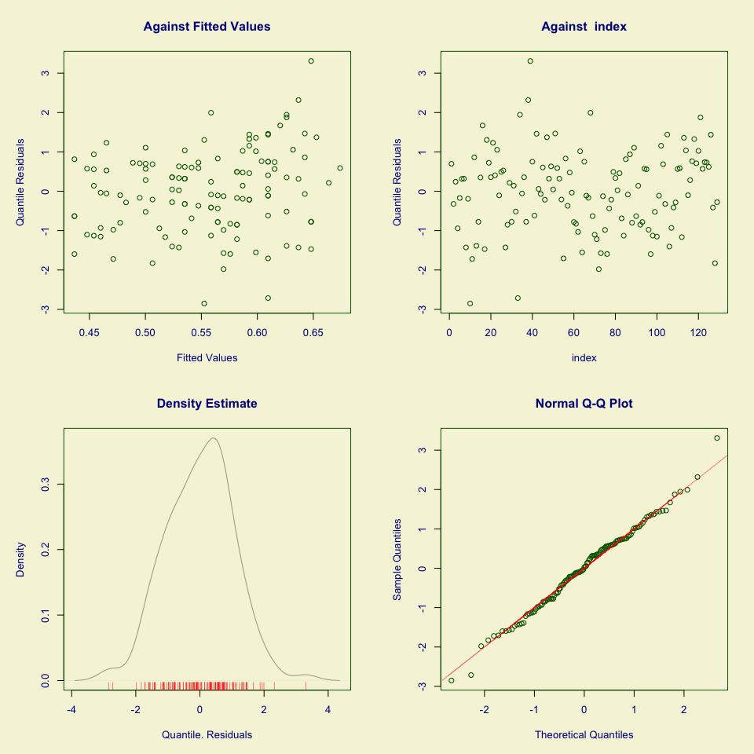
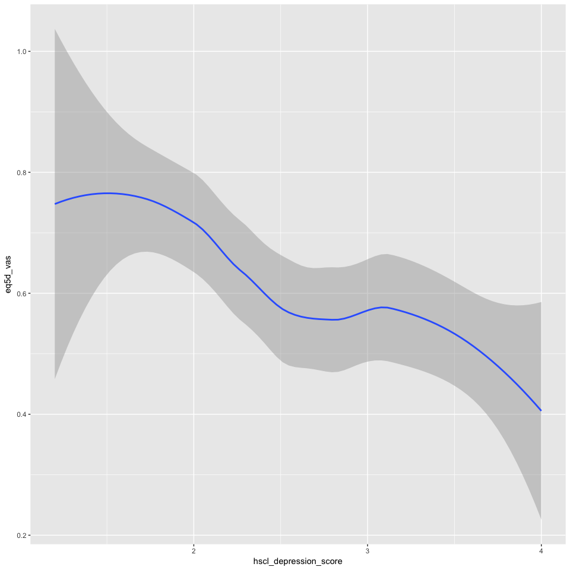

Factors associated with having reduced quality of life in patients with painful HIV-SN
--------------------------------------------------------------------------------------

### Authors

Peter Kamerman, Antonia Wadley, Prinisha Pillay

**Date: March 04, 2016**

------------------------------------------------------------------------

Session setup
-------------

Load data
---------

``` r
data <- read_csv('./data/qol-pain-intensity.csv')
```

Quick look
----------

``` r
dim(data)
```

    ## [1] 129   9

``` r
names(data)
```

    ## [1] "eq5d_vas"              "age"                   "painful_sn"           
    ## [4] "other_pain_sites"      "pain_intensity"        "sex"                  
    ## [7] "education"             "hscl_anxiety_score"    "hscl_depression_score"

``` r
head(data)
```

    ## Source: local data frame [6 x 9]
    ## 
    ##   eq5d_vas   age painful_sn other_pain_sites pain_intensity    sex
    ##      (int) (int)      (chr)            (chr)          (int)  (chr)
    ## 1       80    44        yes              yes             10 female
    ## 2       50    46        yes              yes             10   male
    ## 3       70    67        yes              yes             10 female
    ## 4       30    47        yes              yes             10 female
    ## 5       60    61        yes              yes             10   male
    ## 6       80    48        yes              yes              5   male
    ## Variables not shown: education (int), hscl_anxiety_score (dbl),
    ##   hscl_depression_score (dbl)

``` r
tail(data)
```

    ## Source: local data frame [6 x 9]
    ## 
    ##   eq5d_vas   age painful_sn other_pain_sites pain_intensity    sex
    ##      (int) (int)      (chr)            (chr)          (int)  (chr)
    ## 1       85    64        yes              yes             10 female
    ## 2       80    55        yes              yes             10 female
    ## 3      100    45        yes              yes              5   male
    ## 4       50    24        yes              yes             10 female
    ## 5       10    74        yes              yes              8 female
    ## 6       50    63        yes              yes             10 female
    ## Variables not shown: education (int), hscl_anxiety_score (dbl),
    ##   hscl_depression_score (dbl)

``` r
glimpse(data)
```

    ## Observations: 129
    ## Variables: 9
    ## $ eq5d_vas              (int) 80, 50, 70, 30, 60, 80, 70, 20, 60, 0, 1...
    ## $ age                   (int) 44, 46, 67, 47, 61, 48, 44, 48, 32, 40, ...
    ## $ painful_sn            (chr) "yes", "yes", "yes", "yes", "yes", "yes"...
    ## $ other_pain_sites      (chr) "yes", "yes", "yes", "yes", "yes", "yes"...
    ## $ pain_intensity        (int) 10, 10, 10, 10, 10, 5, 7, 10, 5, 5, 10, ...
    ## $ sex                   (chr) "female", "male", "female", "female", "m...
    ## $ education             (int) 5, 6, 4, 6, 5, 6, 5, 6, 6, 5, 0, 3, 5, 4...
    ## $ hscl_anxiety_score    (dbl) 1.5, 2.9, 3.5, 3.6, 1.9, 1.1, 1.8, 2.4, ...
    ## $ hscl_depression_score (dbl) 3.27, 2.87, 2.60, 3.13, 2.33, 1.67, 2.87...

``` r
summary(data)
```

    ##     eq5d_vas           age         painful_sn        other_pain_sites  
    ##  Min.   :  0.00   Min.   :21.00   Length:129         Length:129        
    ##  1st Qu.: 40.00   1st Qu.:34.00   Class :character   Class :character  
    ##  Median : 65.00   Median :42.00   Mode  :character   Mode  :character  
    ##  Mean   : 61.57   Mean   :42.27                                        
    ##  3rd Qu.: 80.00   3rd Qu.:49.00                                        
    ##  Max.   :100.00   Max.   :74.00                                        
    ##  pain_intensity       sex              education      hscl_anxiety_score
    ##  Min.   : 1.000   Length:129         Min.   : 0.000   Min.   :1.100     
    ##  1st Qu.: 5.000   Class :character   1st Qu.: 5.000   1st Qu.:2.100     
    ##  Median : 7.000   Mode  :character   Median : 6.000   Median :2.600     
    ##  Mean   : 6.984                      Mean   : 5.984   Mean   :2.716     
    ##  3rd Qu.:10.000                      3rd Qu.: 8.000   3rd Qu.:3.400     
    ##  Max.   :10.000                      Max.   :10.000   Max.   :4.000     
    ##  hscl_depression_score
    ##  Min.   :1.200        
    ##  1st Qu.:2.000        
    ##  Median :2.530        
    ##  Mean   :2.616        
    ##  3rd Qu.:3.130        
    ##  Max.   :4.000

Process data
------------

``` r
data <- data[ , -c(3, 4)] # Remove 'painful_sn', and 'other_pain_sites' - 
# all participants had painful sn and all had pain at other sites
data.gam <- data %>%
    mutate(eq5d_vas = eq5d_vas/100, # Convert 'eq5d_vas' to proportion
           pain_intensity = factor(pain_intensity, ordered = TRUE), # Convert 'pain_intensity' to an ordered factor
           sex = factor(sex)) %>% # Convert 'sex' to a factor
    filter(complete.cases(.)) # Retain complete cases only

# Check dimensions after removing incomplete cases
dim(data.gam)
```

    ## [1] 129   7

Build model
-----------

### Generalized Additive Model

*(with extended beta inflated distribution)*

``` r
# GAM on full model (all variables p<0.1 on univariate analysis: age, 
# NeP.pain, other.pains, sex, education).
# Use beta-inflated distribution [0, 1] for VAS data
# Select best model using generalized Akaike's information criterion (AIC).

# Model
mod.gam <- gamlss(eq5d_vas ~ 
                      pain_intensity +
                      age +
                      sex +
                      hscl_depression_score +
                      hscl_anxiety_score +
                      education, 
           data = data.gam,
           family = BEINF())
```

    ## GAMLSS-RS iteration 1: Global Deviance = 91.3339 
    ## GAMLSS-RS iteration 2: Global Deviance = 91.0341 
    ## GAMLSS-RS iteration 3: Global Deviance = 91.0339

``` r
# Model summary 
summary(mod.gam)
```

    ## *******************************************************************
    ## Family:  c("BEINF", "Beta Inflated") 
    ## 
    ## Call:  
    ## gamlss(formula = eq5d_vas ~ pain_intensity + age + sex + hscl_depression_score +  
    ##     hscl_anxiety_score + education, family = BEINF(), data = data.gam) 
    ## 
    ## Fitting method: RS() 
    ## 
    ## -------------------------------------------------------------------
    ## Mu link function:  logit
    ## Mu Coefficients:
    ##                        Estimate Std. Error t value Pr(>|t|)  
    ## (Intercept)            0.646082   0.776546   0.832    0.407  
    ## pain_intensity.L       0.293362   0.416207   0.705    0.482  
    ## pain_intensity.Q      -0.448115   0.437303  -1.025    0.308  
    ## pain_intensity.C       0.557080   0.419237   1.329    0.187  
    ## pain_intensity^4      -0.288907   0.380715  -0.759    0.450  
    ## pain_intensity^5      -0.737404   0.421479  -1.750    0.083 .
    ## pain_intensity^6       0.063600   0.373862   0.170    0.865  
    ## pain_intensity^7       0.030106   0.355511   0.085    0.933  
    ## pain_intensity^8      -0.431055   0.402599  -1.071    0.287  
    ## pain_intensity^9       0.479547   0.381354   1.257    0.211  
    ## age                    0.008706   0.009632   0.904    0.368  
    ## sexmale                0.100333   0.216412   0.464    0.644  
    ## hscl_depression_score -0.214371   0.157564  -1.361    0.176  
    ## hscl_anxiety_score    -0.118035   0.132408  -0.891    0.375  
    ## education              0.025373   0.053934   0.470    0.639  
    ## ---
    ## Signif. codes:  0 '***' 0.001 '**' 0.01 '*' 0.05 '.' 0.1 ' ' 1
    ## 
    ## -------------------------------------------------------------------
    ## Sigma link function:  logit
    ## Sigma Coefficients:
    ##             Estimate Std. Error t value Pr(>|t|)    
    ## (Intercept) -0.31019    0.08942  -3.469 0.000744 ***
    ## ---
    ## Signif. codes:  0 '***' 0.001 '**' 0.01 '*' 0.05 '.' 0.1 ' ' 1
    ## 
    ## -------------------------------------------------------------------
    ## Nu link function:  log 
    ## Nu Coefficients:
    ##             Estimate Std. Error t value Pr(>|t|)    
    ## (Intercept)  -3.9703     0.7137  -5.563 1.86e-07 ***
    ## ---
    ## Signif. codes:  0 '***' 0.001 '**' 0.01 '*' 0.05 '.' 0.1 ' ' 1
    ## 
    ## -------------------------------------------------------------------
    ## Tau link function:  log 
    ## Tau Coefficients:
    ##             Estimate Std. Error t value Pr(>|t|)    
    ## (Intercept)  -1.6189     0.2389  -6.778 6.15e-10 ***
    ## ---
    ## Signif. codes:  0 '***' 0.001 '**' 0.01 '*' 0.05 '.' 0.1 ' ' 1
    ## 
    ## -------------------------------------------------------------------
    ## No. of observations in the fit:  129 
    ## Degrees of Freedom for the fit:  18
    ##       Residual Deg. of Freedom:  111 
    ##                       at cycle:  3 
    ##  
    ## Global Deviance:     91.03392 
    ##             AIC:     127.0339 
    ##             SBC:     178.5105 
    ## *******************************************************************

``` r
# Use stepGAIC to select best models based on GAIC
step.gam <- stepGAIC(mod.gam)
```

    ## Distribution parameter:  mu 
    ## Start:  AIC= 127.03 
    ##  eq5d_vas ~ pain_intensity + age + sex + hscl_depression_score +  
    ##     hscl_anxiety_score + education 
    ## 
    ##                         Df    AIC
    ## - pain_intensity         9 115.83
    ## - sex                    1 125.25
    ## - education              1 125.25
    ## - hscl_anxiety_score     1 125.82
    ## - age                    1 125.85
    ## - hscl_depression_score  1 126.88
    ## <none>                     127.03
    ## 
    ## Step:  AIC= 115.83 
    ##  eq5d_vas ~ age + sex + hscl_depression_score + hscl_anxiety_score +  
    ##     education 
    ## 
    ##                         Df    AIC
    ## - education              1 113.84
    ## - sex                    1 113.91
    ## - age                    1 114.16
    ## - hscl_anxiety_score     1 114.25
    ## <none>                     115.83
    ## - hscl_depression_score  1 117.49
    ## 
    ## Step:  AIC= 113.84 
    ##  eq5d_vas ~ age + sex + hscl_depression_score + hscl_anxiety_score 
    ## 
    ##                         Df    AIC
    ## - sex                    1 111.91
    ## - hscl_anxiety_score     1 112.25
    ## - age                    1 112.33
    ## <none>                     113.84
    ## - hscl_depression_score  1 115.49
    ## 
    ## Step:  AIC= 111.91 
    ##  eq5d_vas ~ age + hscl_depression_score + hscl_anxiety_score 
    ## 
    ##                         Df    AIC
    ## - age                    1 110.42
    ## - hscl_anxiety_score     1 110.46
    ## <none>                     111.91
    ## - hscl_depression_score  1 113.50
    ## 
    ## Step:  AIC= 110.42 
    ##  eq5d_vas ~ hscl_depression_score + hscl_anxiety_score 
    ## 
    ##                         Df    AIC
    ## - hscl_anxiety_score     1 108.89
    ## <none>                     110.42
    ## - hscl_depression_score  1 112.40
    ## 
    ## Step:  AIC= 108.89 
    ##  eq5d_vas ~ hscl_depression_score 
    ## 
    ##                         Df    AIC
    ## <none>                     108.89
    ## - hscl_depression_score  1 115.23

``` r
step.gam$anova
```

    ## Stepwise Model Path 
    ## Analysis of Deviance Table
    ## 
    ## Initial
    ## mu
    ##  Model:
    ## eq5d_vas ~ pain_intensity + age + sex + hscl_depression_score + 
    ##     hscl_anxiety_score + education
    ## 
    ## Final
    ## mu
    ##  Model:
    ## eq5d_vas ~ hscl_depression_score
    ## 
    ## 
    ##                   Step Df    Deviance Resid. Df Resid. Dev      AIC
    ## 1                                           111   91.03392 127.0339
    ## 2     - pain_intensity  9 6.799637204       120   97.83355 115.8336
    ## 3          - education  1 0.002028398       121   97.83558 113.8356
    ## 4                - sex  1 0.078013143       122   97.91359 111.9136
    ## 5                - age  1 0.510309196       123   98.42390 110.4239
    ## 6 - hscl_anxiety_score  1 0.462711529       124   98.88662 108.8866

``` r
summary(step.gam)
```

    ## *******************************************************************
    ## Family:  c("BEINF", "Beta Inflated") 
    ## 
    ## Call:  
    ## gamlss(formula = eq5d_vas ~ hscl_depression_score, family = BEINF(),  
    ##     data = data.gam, trace = FALSE) 
    ## 
    ## Fitting method: RS() 
    ## 
    ## -------------------------------------------------------------------
    ## Mu link function:  logit
    ## Mu Coefficients:
    ##                       Estimate Std. Error t value Pr(>|t|)    
    ## (Intercept)             1.1463     0.3362   3.410 0.000878 ***
    ## hscl_depression_score  -0.3503     0.1196  -2.928 0.004064 ** 
    ## ---
    ## Signif. codes:  0 '***' 0.001 '**' 0.01 '*' 0.05 '.' 0.1 ' ' 1
    ## 
    ## -------------------------------------------------------------------
    ## Sigma link function:  logit
    ## Sigma Coefficients:
    ##             Estimate Std. Error t value Pr(>|t|)   
    ## (Intercept)  -0.2564     0.0895  -2.864  0.00491 **
    ## ---
    ## Signif. codes:  0 '***' 0.001 '**' 0.01 '*' 0.05 '.' 0.1 ' ' 1
    ## 
    ## -------------------------------------------------------------------
    ## Nu link function:  log 
    ## Nu Coefficients:
    ##             Estimate Std. Error t value Pr(>|t|)    
    ## (Intercept)  -3.9703     0.7137  -5.563 1.56e-07 ***
    ## ---
    ## Signif. codes:  0 '***' 0.001 '**' 0.01 '*' 0.05 '.' 0.1 ' ' 1
    ## 
    ## -------------------------------------------------------------------
    ## Tau link function:  log 
    ## Tau Coefficients:
    ##             Estimate Std. Error t value Pr(>|t|)    
    ## (Intercept)  -1.6189     0.2389  -6.778  4.4e-10 ***
    ## ---
    ## Signif. codes:  0 '***' 0.001 '**' 0.01 '*' 0.05 '.' 0.1 ' ' 1
    ## 
    ## -------------------------------------------------------------------
    ## No. of observations in the fit:  129 
    ## Degrees of Freedom for the fit:  5
    ##       Residual Deg. of Freedom:  124 
    ##                       at cycle:  3 
    ##  
    ## Global Deviance:     98.88662 
    ##             AIC:     108.8866 
    ##             SBC:     123.1857 
    ## *******************************************************************

``` r
# OUTCOME: Final model retains hscl_depression_score

# Fit reduced model
mod.gam.new <- gamlss(eq5d_vas ~ 
                      hscl_depression_score,
           data = data.gam,
           family = BEINF())
```

    ## GAMLSS-RS iteration 1: Global Deviance = 99.024 
    ## GAMLSS-RS iteration 2: Global Deviance = 98.8866 
    ## GAMLSS-RS iteration 3: Global Deviance = 98.8866

``` r
# Diagnostic plots
plot(mod.gam.new)
```

<!-- -->

    ## *******************************************************************
    ##   Summary of the Randomised Quantile Residuals
    ##                            mean   =  0.002144494 
    ##                        variance   =  1.081438 
    ##                coef. of skewness  =  -0.02123143 
    ##                coef. of kurtosis  =  3.150271 
    ## Filliben correlation coefficient  =  0.9957567 
    ## *******************************************************************

``` r
# Plot
library(ggplot2)
ggplot(data.gam, 
       aes(x = hscl_depression_score, y = eq5d_vas)) +
    geom_smooth()
```

<!-- -->

Session information
-------------------

``` r
sessionInfo()
```

    ## R version 3.2.3 (2015-12-10)
    ## Platform: x86_64-apple-darwin13.4.0 (64-bit)
    ## Running under: OS X 10.11.3 (El Capitan)
    ## 
    ## locale:
    ## [1] en_GB.UTF-8/en_GB.UTF-8/en_GB.UTF-8/C/en_GB.UTF-8/en_GB.UTF-8
    ## 
    ## attached base packages:
    ## [1] parallel  splines   stats     graphics  grDevices utils     datasets 
    ## [8] methods   base     
    ## 
    ## other attached packages:
    ##  [1] gdtools_0.0.7     ggplot2_2.1.0     gamlss_4.3-8     
    ##  [4] nlme_3.1-125      gamlss.dist_4.3-5 MASS_7.3-45      
    ##  [7] gamlss.data_4.3-2 tidyr_0.4.1       dplyr_0.4.3      
    ## [10] readr_0.2.2       svglite_1.1.0     knitr_1.12.3     
    ## 
    ## loaded via a namespace (and not attached):
    ##  [1] Rcpp_0.12.3      magrittr_1.5     munsell_0.4.3    colorspace_1.2-6
    ##  [5] lattice_0.20-33  R6_2.1.2         plyr_1.8.3       stringr_1.0.0   
    ##  [9] tools_3.2.3      grid_3.2.3       gtable_0.2.0     DBI_0.3.1       
    ## [13] htmltools_0.3    lazyeval_0.1.10  yaml_2.1.13      survival_2.38-3 
    ## [17] assertthat_0.1   digest_0.6.9     formatR_1.2.1    evaluate_0.8    
    ## [21] rmarkdown_0.9.5  labeling_0.3     stringi_1.0-1    scales_0.4.0
